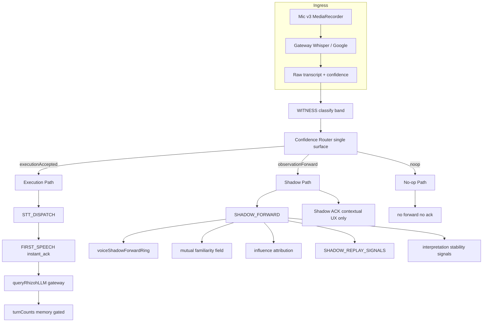

# Rhizoh Voice — Observational Cognition Map (T0 → T1)

**SPECFLOW:** `RESEARCH-ONLY` · **Authority:** observation + decision trace only — no execution graph changes.

Bu doküman “voice input engine” değil, **gözlemleyen biliş katmanı** haritasıdır. T0 monolith (`castle-t0-interface` / rhizoh.com) üzerindeki mevcut kod yoluyla uyumludur.

---

## 1. Tek cümle

**Input = konuşma · Output = karar + kayıt + shadow memory** (ürün cevabı yalnızca Execution Path’te).

---

## 2. Üç yol (path taxonomy)



| Path | Tetikleyici | Execution | Bellek / turn | UX ses |
|------|-------------|-----------|---------------|--------|
| **Execution** | `executionAccepted` + `voice_ok` | STT → LLM → gateway | turnCounts (gated) | instant_ack + LLM TTS |
| **Shadow** | `observationForward` | Yok | Ring + familiarity + attribution | Shadow ACK (modlu) |
| **No-op** | ambient / silent / junk | Yok | Yok | Yok |

---

## 3. Confidence Router (sanity + turn birleşik yüzey)

**Modül:** `voiceTranscriptConfidenceRouterV0.js`

Tek karar — çift log semantiği `rejectionLayer` ile korunur:

| `rejectionLayer` | Eski anlam | Örnek `reason` |
|------------------|------------|----------------|
| `execution` | Kabul | `voice_ok` |
| `sanity` | Kalite / artifact | `whisper_default_conf`, `whisper_artifact` |
| `interaction` | Metin OK, turn güveni düşük | `low_confidence` (< 0.62) |
| `noop` | Fiziksel / çöp | `audio_silent`, `junk` |

**Log ayrımı (epistemik trace):**

- `GATE_CONFIDENCE_ROUTER` — her transcript
- `GATE_ROUTER_SANITY_REJECT` — sanity katmanı
- `GATE_ROUTER_INTERACTION_REJECT` — interaction katmanı
- `STT_DISPATCH_BLOCKED` — execution durdu (LLM yok)

**Sabit:** Production turn eşiği **0.62** — router otomatik düşürmez.

---

## 4. Shadow katmanı (sistem hafızası)

| Bileşen | Dosya | Rol |
|---------|-------|-----|
| Shadow forward | `voiceTranscriptShadowForwardV0.js` | Reject → arşiv |
| **Shadow timeline** | `voiceShadowTimelineV0.js` | **Temporal cognition** — 5s faz pencereleri |
| Replay hook | `voiceShadowReplayHookV0.js` | Cluster + tuning **sinyali** (execution yok) |
| Interpretation stability | `voiceInterpretationStabilityV0.js` | Tekrarlayan pattern etiketi |
| Shadow ACK | `voiceShadowObservationAckV0.js` | UX only — modlu |

### 4b. Temporal cognition view (ring → timeline)

Ring = *ne* oldu; timeline = *ne zaman* oldu.

Örnek segment çıktısı:

| Pencere | `phaseLabel` | Anlam |
|---------|--------------|--------|
| `0s–5s` | `interaction_rejection_spike` | Turn gate baskın; gözlem var, execution yok |
| `5s–10s` | `confidence_stabilization` | Sanity + interaction karışık; eşik tutuluyor |
| `10s–15s` | `execution_emergence` | `STT_DISPATCH` — execution kanalı açıldı |

`trajectory.summary`: `observation_to_execution` | `interaction_friction_without_execution` | …

Log: `SHADOW_TIMELINE_PHASE` · Env: `VITE_RHIZOH_VOICE_TIMELINE_BUCKET_MS` (default `5000`)

**Konsol API:**

```js
window.__rhizoh.voiceShadowForwardRing      // spatial ring (legacy)
window.__rhizoh.voiceShadowTimeline         // temporal view (preferred)
window.__rhizoh.getVoiceShadowTimelineViewV0()
window.__rhizoh.shadowReplaySignals
window.__rhizoh.interpretationStability
window.__rhizoh.exportShadowVoiceAnalysisV0() // includes timeline + trajectory
```

---

## 5. Shadow ACK — bağlamsal modlar (UX)

| Mod | Ne zaman | Davranış |
|-----|----------|----------|
| `none` | `ambient`, `noop` | Sessiz — TV/ortam |
| `light` | `sanity` reject, `unknown` / `directed_candidate` | Hemen kısa TTS |
| `delayed` | `interaction` reject (`low_confidence`) | ~1.5s gecikme — “duydu ama karar bekliyor” |

Kapatma: `VITE_RHIZOH_VOICE_SHADOW_OBS_ACK=0`

---

## 6. Interpretation Stability Layer (T0.5)

**Amaç:** Aynı shadow pattern tekrar edince **etiket üret**, threshold / execution değiştirme.

| Çıktı | Anlam |
|-------|--------|
| `recurring_shadow_pattern` | Ring içinde reason+band+layer kümesi ≥ eşik |
| `learningDecision: none` | Bilinçli — static observer discipline |
| `stabilityTrend` | `emerging` \| `stable` \| `insufficient_data` |

Bu katman **ürün davranışını değiştirmez**; ops / founder review için.

---

## 7. T0 → T1 evrim (spec-only)

| T0 (bugün) | T1 (gelecek, execution kapalı) |
|------------|--------------------------------|
| Shadow ring + replay signals | Ops dashboard + export batch |
| Manual threshold review | **Human-signed** heuristic tuning |
| Shadow ACK modları | Per-session UX profile |
| Witness shadow counterfactual | A/B shadow vs actual gate |
| 0.62 execution firewall | Optional directed-only release flag |

**T1’de yasak (frozen core):** Shadow sinyalinin doğrudan `userTurnCount` veya LLM prompt authority’sine bağlanması.

---

## 8. Modül indeksi (runtime)

```
rhizoh/runtime/
  voiceTranscriptWitnessPipelineV0.js   # RAW → WITNESS → ROUTER → shadow finalize
  voiceTranscriptConfidenceRouterV0.js    # execution | observation | noop
  voiceTranscriptShadowForwardV0.js
  voiceShadowReplayHookV0.js
  voiceInterpretationStabilityV0.js
  voiceShadowObservationAckV0.js
  voiceEngineV3/voiceEngineOrchestratorV3.js
  AppRhizoh528.jsx                        # STT_DISPATCH gate + shadow ACK
```

---

## 9. Founder smoke checklist

1. Konuş → konsolda `GATE_CONFIDENCE_ROUTER` + `rejectionLayer`
2. Red → `SHADOW_FORWARD` + ring length artar
3. 4+ shadow → `SHADOW_REPLAY_SIGNALS`
4. Tekrar pattern → `INTERPRETATION_STABILITY`
5. `copy(window.__rhizoh.exportShadowVoiceAnalysisV0())` — JSON export
6. Execution path: yalnızca conf ≥ 0.62 veya `voice_ok` → `STT_DISPATCH`

---

*Son güncelleme: observational cognition stack v0 — dual-channel epistemic voice.*
