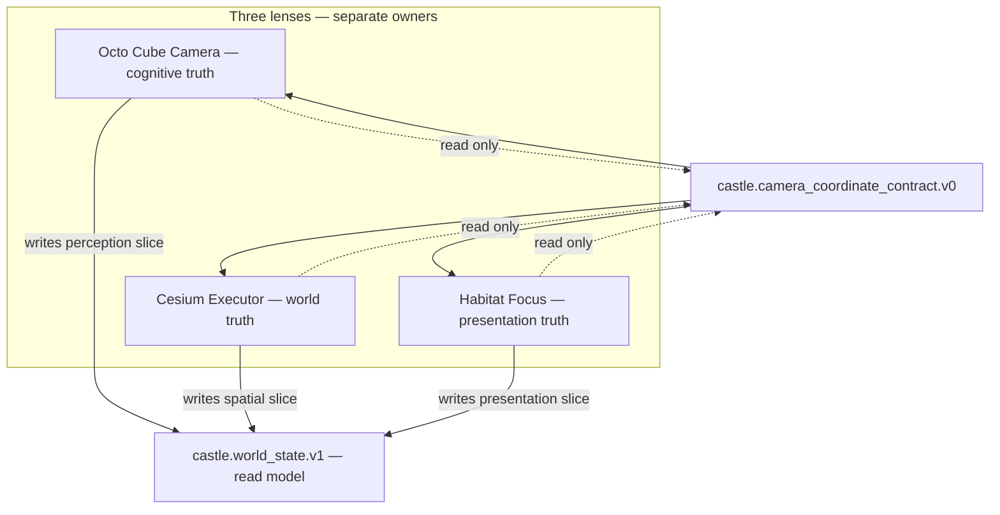

# Camera Unification Spec V1

**Specflow:** `RESEARCH-ONLY` — perception alignment (Phase 2). Does not merge camera authorities or alter frozen core.

**Status:** Design spec (post–Step 3 scatter cleanup).  
**Phase:** 2 — *Perception alignment* (not execution merge).

**Parents:**
- [`CASTLE_COGNITIVE_GRAPH_V1.md`](CASTLE_COGNITIVE_GRAPH_V1.md) — three reality centers → now three **lenses**
- [`CESIUM_EXECUTOR_SPEC_V1.md`](CESIUM_EXECUTOR_SPEC_V1.md) — Phase 1 complete (single spatial mutation sink)
- [`docs/OBSERVATION_FABRIC_V1.md`](OBSERVATION_FABRIC_V1.md) — observation ≠ execution

---

## 0. Honest snapshot (where we are)

### Phase 1 — done ✔

| Item | Status |
|------|--------|
| Spatial command execution | single sink (`cesiumCommandExecutorV0`) |
| Zoom / focus / fly routing | `routeCesiumCommandV0` only |
| Legacy `flyTo` scatter | CI forbidden (`stabilization:validate-cesium-executor-v0`) |
| Grammar | intent producer → router / tool module (no camera side-effects) |

### Phase 2 — problem statement

Execution is unified. **Perception is not.**

> One world exists, but **three viewpoints** can drift semantically:
> - Octo thinks in cube space
> - Cesium shows globe space
> - Habitat deforms screen space

**Camera is no longer a technical bug.** The risk is **semantic drift** — each lens implying a different “center of reality.”

---

## 1. Design principle (non-negotiable)

### Do not merge — align

| Wrong (Phase 1 trap) | Right (Phase 2) |
|----------------------|-----------------|
| One physical camera for all | Three cameras, **one coordinate contract** |
| Habitat drives Cesium | Habitat reads contract; never mutates spatial |
| Octo follows map flyTo | Octo reads perception slice only |
| Cesium reads Octo cube pose | Cesium reads spatial slice only |



**Invariant:** Lenses **align** through a shared read model; none is owner of another.

---

## 2. Three cameras — roles (frozen for V1)

### 2.1 Octo Cube Camera — *cognitive truth*

| Property | Value |
|----------|-------|
| **Module** | `octoCubeCentricCameraV1.js` |
| **Schema** | `castle.cube_centric_camera.v0` |
| **Frame** | Local THREE.js scene units (cube-centric) |
| **Owner** | `OctoConversationStageV1` (per mount) |
| **Computes** | lookAt on cognitive cube, FOV, motion drive |
| **Must not** | Read WGS84, call executor, react to habitat layout as authority |

Code truth: *"truth layer = cognitive cube; Octo is peripheral observer"*.

### 2.2 Cesium Executor Camera — *world truth*

| Property | Value |
|----------|-------|
| **Module** | `cesiumCommandExecutorV0.js` → `CesiumRealMapLayer` |
| **Schema** | `castle.cesium_executor.result.v0` |
| **Frame** | WGS84 (`lat`, `lon`, `height`) + `realityMode` |
| **Owner** | Executor (sole spatial mutation writer) |
| **Computes** | fly, zoom, focus castle, topology globe |
| **Must not** | Read cube pose, derive chat field state, read habitat z-index |

Read-only export: `getCameraGeo()` on layer API (observation / contract input).

### 2.3 Habitat Focus — *presentation truth*

| Property | Value |
|----------|-------|
| **Module** | `rhizohHabitatFocusModeV0.js` |
| **Schema** | `castle.habitat_focus.v0` (derived) |
| **Frame** | Screen layout (px height, opacity, z-index, scale) |
| **Owner** | Pure function of interaction + product surface inputs |
| **Computes** | UI geometry + perception **bias** (not perception truth) |
| **Must not** | Alter execution graph, call router, set Cesium camera |

Code truth: *"does not alter execution graph"*.

---

## 3. Coordinate contract — `castle.camera_coordinate_contract.v0`

Single **alignment frame** — not a fourth camera. A **snapshot** that all lenses can read to detect drift.

### 3.1 Contract object (normative sketch)

```json
{
  "schema": "castle.camera_coordinate_contract.v0",
  "correlationId": "align-…",
  "atMs": 1700000000000,
  "focus": {
    "habitatMode": "conversation",
    "productSurface": "world",
    "realityMode": "GLOBE",
    "worldMapTool": "globe"
  },
  "perception": {
    "frame": "cube_local",
    "cubeCentric": true,
    "fieldState": "LISTENING",
    "octoDrive": "listening",
    "cubeFocus": { "x": 0.0, "y": 0.12, "z": 0.14 },
    "mountId": "t0_shell_unified"
  },
  "spatial": {
    "frame": "wgs84",
    "ready": true,
    "geo": { "lat": 41.0082, "lon": 28.9784, "height": 5200 },
    "lastExecutorOp": "calibration_root",
    "lastExecutorOk": true,
    "realityMode": "REAL_MAP",
    "mapSurfaceActive": true
  },
  "presentation": {
    "frame": "screen_css",
    "octoHeightPx": 108,
    "octoHeightMaxPx": 124,
    "chatScale": 1,
    "chatZIndex": 72,
    "wheelOpacity": 0.22
  },
  "alignment": {
    "semanticDriftRisk": "low",
    "notes": []
  }
}
```

### 3.2 Frame definitions

| Frame ID | Units | Origin | Used by |
|----------|-------|--------|---------|
| `cube_local` | THREE scene meters (Octo stage) | Cognitive cube center | Octo camera |
| `wgs84` | degrees + ellipsoid height | Earth | Cesium executor |
| `screen_css` | px, opacity, z-index | Viewport | Habitat chrome |

**No automatic transform** from `cube_local` → `wgs84` in V1. Correlation is **logical** (same moment, same user session), not geodetic projection of the cube.

### 3.3 Who writes which slice

| Slice | Writer | Reader |
|-------|--------|--------|
| `focus` | Derived resolver (habitat + product + reality inputs) | All lenses (read) |
| `perception` | Octo stage tick / motion drive | Habitat (layout bias), Rhizoh inbox, debug |
| `spatial` | Cesium executor result + `getCameraGeo` poll | Habitat (strip visibility), observation |
| `presentation` | `resolveRhizohHabitatFocusVisualsV0` | UI chrome only |
| `alignment` | `computePerceptionAlignmentV0` (deterministic rules) | Debug, CI drift check (future) |

---

## 4. Alignment rules (conflict prevention)

### 4.1 Allowed data flow

```
USER INPUT
   → grammar / registry (intent only)
   → routeCesiumCommandV0 (spatial mutation)
   → executor → spatial slice update

fieldState / draft / reply
   → Octo motion drive (perception slice)
   → habitat focus DERIVATION (presentation slice)

focus.habitatMode
   → presentation visuals
   → Octo heightPx prop (layout input — not camera authority)
```

### 4.2 Forbidden cross-writes (extend CI in Phase 2.1)

| ID | Forbidden | Why |
|----|-----------|-----|
| `P2-F01` | `habitatFocus` → `routeCesiumCommandV0` | presentation ≠ execution |
| `P2-F02` | `aimCubeCentric*` ← Cesium geo | cognitive ≠ world |
| `P2-F03` | `routeCesiumCommandV0` ← Octo journal / inbox | observation ≠ execution |
| `P2-F04` | `octoHeightPx` → executor op | layout ≠ spatial |
| `P2-F05` | Single mount Octo state → another mount | mount isolation |

Phase 1 CI (`cesium-executor-forbidden-grep`) covers spatial scatter. Phase 2 adds **perception firewall** grep (separate script, same pattern).

### 4.3 Coexistence without conflict

| Situation | Expected behavior |
|-----------|-------------------|
| User in `conversation` + map visible underneath | Habitat shrinks chrome; Cesium may be idle/geo static; Octo cube active — **no executor call from habitat** |
| User says "yakınlaştır" | Registry → executor → spatial slice updates; Octo unchanged; habitat may re-derive mode |
| Octo discovery report to inbox | Rhizoh memory only; **zero** spatial side effect |
| `REAL_MAP` + `world` focus | presentation de-emphasizes chat; spatial slice authoritative for globe |

---

## 5. Semantic drift model

Drift = lenses implying incompatible “world center” without execution bug.

| Drift signal | Detection (V1 rules) | Severity |
|--------------|----------------------|----------|
| `habitatMode=conversation` but `lastExecutorOp=fly_to` within 500ms without user command | correlation gap | medium |
| `fieldState=IDLE` but `octoDrive=listening` | perception internal inconsistency | low |
| `spatial.ready=false` but UI `showMapStrip=true` + `realityMode=REAL_MAP` | presentation ahead of world | medium |
| Multiple Octo mounts with different `fieldState` | mount fragmentation | high |
| Executor `ok` but `geo` unchanged after `zoom_in` | spatial stale (observation) | low |

`alignment.semanticDriftRisk`: `low` | `medium` | `high` — deterministic function, **not** LLM oracle.

---

## 6. Topology diagram (target runtime)

```
         (perception truth)
              OCTO
           cube camera
                ↓
         perception slice
                ↓
(intent) → ROUTER → EXECUTOR → CESIUM
                ↑              ↓
           grammar only    spatial slice
                ↑
         HABITAT FOCUS
      (presentation only)
                ↓
         presentation slice
                ↓
    camera_coordinate_contract.v0
         (read-only merge)
```

**Rhizoh** reads all slices for inbox / continuity; **never** writes spatial or perception camera.

---

## 7. Implementation plan (Phase 2 — minimal)

No new product systems. One read-model composer + tests.

### Step 2.1 — Contract composer (read-only) ✔

| File | Role |
|------|------|
| `castleFlight/perceptionAlignmentSnapshotV0.js` | `buildPerceptionAlignmentSnapshotV0()`, drift guardrail, `publishPerceptionAlignmentSnapshotV0()` (debug only) |
| `castleFlight/__tests__/perceptionAlignmentSnapshotV0.test.js` | determinism, false-correlation guard, explanation layer |

Inputs (read-only):
- `getCesiumExecutorApiV0` / last executor result
- `window.__CASTLE_CESIUM__?.getCameraGeo?.()` (read)
- T0 `fieldState`, habitat inputs
- Octo runtime refs (optional mount id)

Output: frozen contract + `window.__CASTLE_PERCEPTION_ALIGNMENT__` debug mirror.

### Step 2.2 — Wire projections (no mutation)

| Consumer | Change |
|----------|--------|
| `RhizohT0ShellChromeV1` | publish `mountId` on Octo stage |
| `AppRhizoh528T0` | optional debug strip (dev only) |
| `rhizohCommandExecutionGraphV0` | link `correlationId` to contract |

### Step 2.3 — Perception firewall CI ✔

| Script | Rule |
|--------|------|
| `scripts/perception-alignment-forbidden-grep.mjs` | P2-F01…F05 patterns |
| `castleFlight/__tests__/perceptionAlignmentFirewallRegressionV0.test.js` | false-correlation + mount fragmentation regression |
| npm | `stabilization:validate-perception-alignment-v0` (also in `ci:enforce-client` + `validate-client-boundaries-quick`) |

### Step 2.4 — Defer (explicitly out of scope)

- Geodetic binding cube ↔ globe
- Single React camera component
- Merging Octo mounts
- Habitat-driven executor commands

### Step 3 — Perceptual fracture rendering (charter locked)

Charter: [`PERCEPTUAL_ALIGNMENT_RENDERING_V1.md`](PERCEPTUAL_ALIGNMENT_RENDERING_V1.md)

**One law:** UI never connects lenses — only renders synchrony breakdown (fracture surface, not dashboard).

- Step 3.1 — `perceptionFractureAtmosphereV0` (read-only texture tokens)
- Step 3.2 — Lens hooks (Habitat float, map parallax freeze, Octo phase desync)
- Step 3.3 — Defer: prod risk labels, geo overlay, companion drift dialogue

---

## 8. Relationship to `world_state.v1`

[`CASTLE_COGNITIVE_GRAPH_V1.md`](CASTLE_COGNITIVE_GRAPH_V1.md) §6.2 sketch maps cleanly:

| `world_state` field | Contract slice |
|---------------------|----------------|
| `interaction.*` | feeds `focus` + `perception.fieldState` |
| `focus.*` | `focus` block |
| `spatial.*` | `spatial` block |
| `perception.*` | `perception` block (no geo) |
| presentation (new) | `presentation` block |

`castle.camera_coordinate_contract.v0` is the **per-tick alignment view**; `world_state.v1` is the **session-level read model**. Composer may feed world state later; V1 keeps them separate to avoid authority creep.

---

## 9. Success criteria (Phase 2 done when)

1. Contract composes without any lens writing another lens’s slice  
2. Drift rules produce stable `semanticDriftRisk` in tests  
3. Perception firewall CI passes on main client src  
4. Manual: conversation mode + zoom command → spatial slice changes, perception slice independent, presentation re-derives from focus only  
5. No new `routeCesiumCommandV0` call sites outside router / tool module / migrated T0 paths (Phase 1 CI still green)

---

## 10. What we explicitly do not do

| Temptation | Why rejected |
|------------|--------------|
| “Unify cameras into one” | Collapses cognitive / world / UI truths; breaks observation fabric |
| Octo follows Cesium flyTo | Makes perception execution-dependent |
| Habitat triggers map on focus | Recreates pre–Step 3 scatter |
| LLM decides alignment | Non-deterministic; violates epistemic boundary |

---

## 11. Next artifacts (after this spec)

1. **Implementation PR** — `perceptionAlignmentSnapshotV0.js` + tests (Step 2.1)  
2. **Perception firewall CI** — Step 2.3  
3. **Visual evolution / companion intelligence** — only after contract is live in debug  

---

*Tag: `RESEARCH-ONLY`. Phase 1 seal: [`CESIUM_EXECUTOR_SPEC_V1.md`](CESIUM_EXECUTOR_SPEC_V1.md). Graph: [`CASTLE_COGNITIVE_GRAPH_V1.md`](CASTLE_COGNITIVE_GRAPH_V1.md).*
