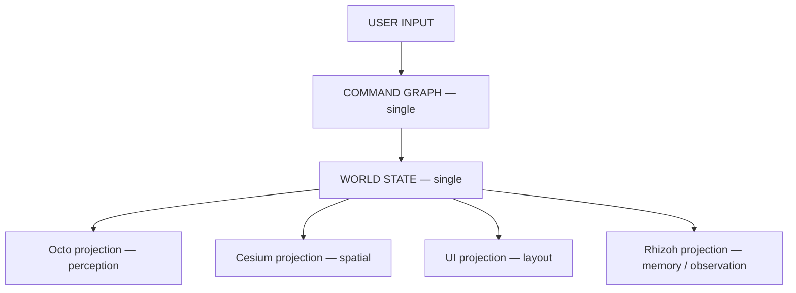
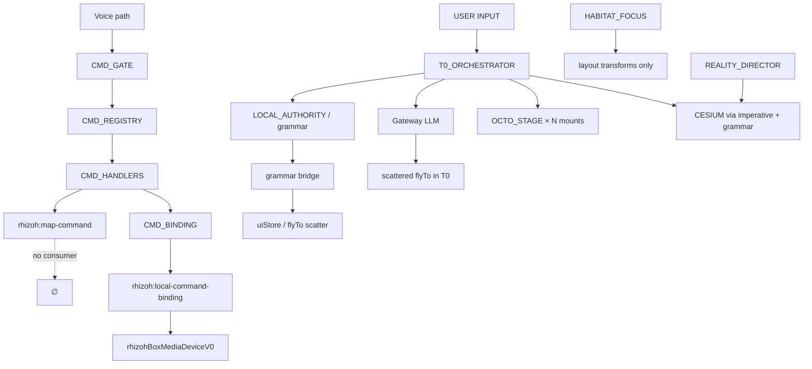
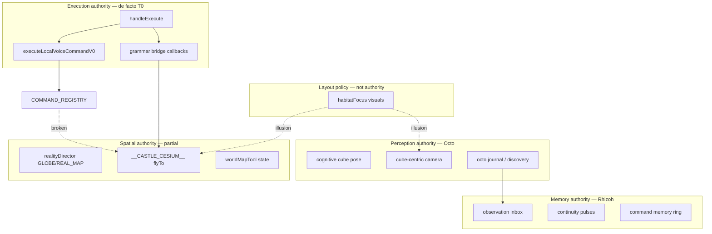

# Castle Cognitive Graph V1

**Specflow:** `RESEARCH-ONLY` — mental model + as-is system map. Does not alter frozen core (v562–v570) or grant execution authority to observers.

**Status:** Extraction snapshot (code-derived, 2026-06).  
**Purpose:** Single zihinsel model — *kod değil, graph*. Downstream: command wiring fix plan · authority merge plan · camera unification plan.

**Related:** [`docs/OBSERVATION_FABRIC_V1.md`](OBSERVATION_FABRIC_V1.md) · [`docs/WORLDSTATE_V0_SPEC.md`](WORLDSTATE_V0_SPEC.md) · [`docs/RHIZOH_MOCK_VS_REAL_BOUNDARY_MAP_V1.0.md`](RHIZOH_MOCK_VS_REAL_BOUNDARY_MAP_V1.0.md) · [`AGENTS.md`](../AGENTS.md)

---

## 0. Executive diagnosis

The system's problem is **not missing features**. The same world is computed by **four parallel physics engines**:

| Engine | What it computes | Authority claim |
|--------|------------------|-----------------|
| **Octo** | Cognitive cube, tentacle motion, cube-centric camera | Perception-local |
| **Cesium** | WGS84 camera, flyTo, map surface | Spatial-imperative (`__CASTLE_CESIUM__`) |
| **T0 orchestrator** | Field state, gateway, grammar, LLM scatter effects | Execution-aggregator (not a graph) |
| **Habitat focus** | Layout opacity, z-index, Octo height | Visual illusion (not execution) |

Until these collapse into **one graph + four projections**, every new command or camera tweak risks duplicating authority.

---

## 1. System graph overview

### 1.1 Target — single cognitive graph



**Invariant:** Observers and projections **never** hold execution authority. Interpretation ≠ execution ([`OBSERVATION_FABRIC_V1`](OBSERVATION_FABRIC_V1.md)).

### 1.2 Current — fragmented graph (as-is)



### 1.3 Projection layers (conceptual)

| Layer | Role | Must not |
|-------|------|----------|
| **Octo** | Perception engine — cube, motion, local camera | Own world truth |
| **Rhizoh** | State + interpretation + memory inbox | Dispatch spatial commands |
| **Spatial (Cesium)** | Geographic projection | Derive chat field state |
| **UI** | Render + input ingress | Compute flyTo or cube pose |

### 1.4 Entry shells (two product realities)

| Route | Flag | Shell | Primary graph ingress |
|-------|------|-------|----------------------|
| Default prod | `VITE_RHIZOH_SPATIAL_SHELL` unset | `AppRhizoh528T0` | `handleExecute` + `RhizohT0ShellChromeV1` |
| Spatial research | `VITE_RHIZOH_SPATIAL_SHELL=1` | `RhizohSpatialWorldShell` | `RhizohConversationDockV0` + spatial prefs |

Both mount `CesiumRealMapLayer` under different composition trees — **same spatial engine, different orchestrators**.

---

## 2. Node model (canonical truth nodes)

Nodes are **logical authorities**, not React components. File paths are SSOT anchors.

### 2.1 `OCTO` — perception engine

| Property | Value |
|----------|-------|
| **Primary file** | `apps/client/src/studio/OctoConversationStageV1.jsx` |
| **Camera** | `apps/client/src/studio/octoCubeCentricCameraV1.js` |
| **Crystal / cube** | `apps/client/src/studio/octoSpeakingCrystalV1.js` |
| **Observation out** | `apps/client/src/studio/octoObservationReportV0.js` → Rhizoh inbox (observation-only) |
| **Authority** | Perception-local WebGL scene per mount |
| **Mounts** | (1) `RhizohT0ShellChromeV1` unified + default branches · (2) `RhizohConversationDockV0` · (3) `OctoConversationLabPageV1` dev |

**Truth claim in code:** cube-centric camera — *"truth layer = cognitive cube; Octo is peripheral observer"* (`octoCubeCentricCameraV1.js`).

**Not truth:** geographic position, `realityMode`, habitat layout.

### 2.2 `RHIZOH` — state + interpretation layer

| Property | Value |
|----------|-------|
| **Aggregator** | `apps/client/src/AppRhizoh528T0.jsx` (~13k lines) |
| **Local vs remote gate** | `rhizohLocalActionAuthorityV0.js` |
| **Grammar** | `rhizohGrammarBridgeV0.js` → `rhizohGrammarConstitutionV0.js` |
| **Memory / inbox** | `octoObservationReportV0.js`, `rhizohObservationInboxCouplingV0.js`, `rhizohCommandMemoryV0.js` |
| **Continuity** | `t0ContinuitySurfaceStreamV0.js`, `rhizohFlowContinuityV0.js` |
| **Product binding log** | `rhizohProductBindingV0.js` — *"Phase 1: log only"* |
| **Authority** | Intent gate, observation inbox, continuity pulses — **not** unified command brain |

Rhizoh is simultaneously a little UI controller, a little memory, a little observer — **distributed**, not one role.

### 2.3 `CESIUM` — spatial projection layer

| Property | Value |
|----------|-------|
| **Primary file** | `apps/client/src/castleFlight/CesiumRealMapLayer.jsx` |
| **Imperative API** | `window.__CASTLE_CESIUM__` (`flyToCustom`, `flyToIstanbul`, `flyToBootstrapViewport`, …) |
| **Mode coordinator** | `apps/client/src/reality/realityDirector.js` |
| **Mode bus** | `apps/client/src/reality/realityEventBus.js` → `castle:reality-changed` |
| **Authority** | Partial spatial authority for `GLOBE` ↔ `REAL_MAP` + camera flyTo when invoked |

**Not wired:** registry `map_zoom_in` / `map_zoom_out` → Cesium (see §4).

### 2.4 `T0_ORCHESTRATOR` — execution ingress (de facto)

| Property | Value |
|----------|-------|
| **File** | `apps/client/src/AppRhizoh528T0.jsx` |
| **Input handler** | `handleExecute()` — grammar short-circuit → LLM path |
| **Spatial side effects** | `onOpenMapToolV0`, `onApplyWorldMapToolV0`, scattered `__CASTLE_CESIUM__` calls |
| **Shell chrome** | `RhizohT0ShellChromeV1.jsx` |
| **Authority** | De facto execution aggregator — **no declared graph contract** |

### 2.5 `COMMAND_REGISTRY` — declarative command SSOT

| Property | Value |
|----------|-------|
| **Registry** | `rhizohLocalCommandRegistryV0.js` — layers: `media` · `audio` · `map` · `world` · `camera` · `system` |
| **Handlers** | `rhizohLocalCommandHandlersV0.js` — dispatches `CustomEvent` per layer |
| **Binding** | `rhizohLocalCommandAppBindingV0.js` — resolves `cesium` / `camera` target, sets `pendingLocalCommandBinding` |
| **Gate** | `rhizohCommandGateV0.js` — confidence routing (voice-primary) |
| **Voice router** | `rhizohVoiceCommandRouterV0.js` → `executeLocalVoiceCommandV0` → `dispatchLocalCommandHandlerV0` |
| **Trace graph** | `rhizohCommandExecutionGraphV0.js` — **debug trace ring, not runtime bus** |

### 2.6 `HABITAT_FOCUS` — visual hierarchy policy

| Property | Value |
|----------|-------|
| **Resolver** | `rhizohHabitatFocusModeV0.js` |
| **Modes** | `conversation` · `navigation` · `world` |
| **Visuals** | `resolveRhizohHabitatFocusVisualsV0` — wheel opacity, chat scale, Octo height |
| **Explicit constraint** | *"does not alter execution graph"* (module header) |
| **Authority** | Layout/CSS only — **camera authority illusion** |

Inputs: `fieldState`, `hasReply`, `hasDraft`, `voiceListening`, `worldMapTool`, `productSurface`, `realityMode`.

---

## 3. Edge graph (as-is system)

### 3.1 Input edges

```
UserInput (text)
  → RhizohT0ShellChromeV1 (input row / send)
  → AppRhizoh528T0.handleExecute()
       ├─ resolveLocalActionAuthorityV0()     [OPEN_PANEL | OPEN_MAP_TOOL | ENTER_SURFACE | SET_INTENT]
       ├─ applyGrammarFromUtteranceV0()       [grammar bridge callbacks]
       └─ LLM gateway                         [remote interpretation]

UserInput (voice)
  → voice loop / STT
  → rhizohCommandGateV0.resolveCommandGateV0()
  → rhizohVoiceCommandRouterV0.routeVoiceInputV0()
  → executeLocalVoiceCommandV0()
       ├─ grammarLocal → emitLocalActionAuthorityV0()
       └─ registry canonical → dispatchLocalCommandHandlerV0()

UserInput (cap wheel / seeds)
  → emitProductBindingActionV0()              [log only]
  → setCmd / onSeedIntent                     [T0 local UI]
```

### 3.2 Cognitive edges (T0 → Octo)

```
RhizohT0ShellChromeV1
  → OctoConversationStageV1 props:
       fieldState, replyText, draftText, busy, submitPulse, height, heightMax
  → deriveOctoMotionDriveV1 / animateOcto*
  → updateOctoSpeakingCrystalV1
  → aimCubeCentricConversationCameraV1 / updateCubeCentricConversationCameraV1

Octo (async, observation)
  → discoverOctoObservationReportsV0(journal)
  → receiveOctoObservationInboxV0 / stepRhizohObservationInboxCouplingV0
  → Rhizoh memory (interpretation — not execution)
```

### 3.3 Spatial edges (T0 → Cesium)

**Path A — grammar / local authority (text):**
```
OPEN_MAP_TOOL grammar
  → onOpenMapToolV0
  → setRhizohProductSurfacePanelExclusiveV0("world")
  → uiStore.dispatch SET_PRODUCT_SURFACE
  → onApplyWorldMapToolV0
  → rhizohWorldMapToolV0
  → __CASTLE_CESIUM__.flyToCustom / flyToIstanbul
```

**Path B — registry + voice (deterministic):**
```
map_* canonical
  → mapSpatialCommandHandlerV0
  → rhizoh:map-command (CustomEvent)
  → applyLocalCommandAppBindingV0
  → rhizoh:local-command-binding
  → ❌ no Cesium listener (broken)
```

**Path C — LLM directive scatter (T0):**
```
handleExecute → gateway response
  → multiple imperative __CASTLE_CESIUM__ call sites in AppRhizoh528T0.jsx
  → no single edge catalog
```

**Path D — reality mode:**
```
setRealityMode() / reconcileMapSurfaceFromGateway
  → realityDirector
  → emitRealityTransition → castle:reality-changed
  → CesiumRealMapLayer active prop + mapSurfaceActive
```

### 3.4 Registry → handlers → events

| Layer | Handler | Event | Binding target |
|-------|---------|-------|----------------|
| `media` | `mediaCommandHandlerV0` | `rhizoh:media-command` | `media` |
| `audio` | `audioVoiceCommandHandlerV0` | `rhizoh:audio-command` | `tts` |
| `map` / `world` | `mapSpatialCommandHandlerV0` | `rhizoh:map-command` | `cesium` (declared, unwired) |
| `camera` | `cameraVisionCommandHandlerV0` | `rhizoh:camera-command` | `browser_media` |
| `system` | `systemCastleCommandHandlerV0` | `rhizoh:system-command` | `system` |
| all | aggregate | `rhizoh:voice-command` | mirror |

### 3.5 Parallel event buses (fragmentation index)

| Bus | Schema / event | Execution authority? | Primary consumers |
|-----|----------------|----------------------|-------------------|
| Reality nerve | `castle:reality-changed` | Partial (mode) | `RhizohSpatialWorldShell`, `RhizohRealityModeChromeV0`, `realityNerveListeners` |
| Map command | `rhizoh:map-command` | Fired, not consumed | **none** |
| Local binding | `rhizoh:local-command-binding` | Pending queue | `rhizohBoxMediaDeviceV0` (camera path) |
| Local action | `rhizoh:local-action` | Grammar emit | T0 callbacks (implicit) |
| Grammar | `rhizoh:grammar-resolution` | Side-effect via opts | none required |
| Product binding | `rhizoh:product-binding-v0` | Log only | observability |
| Command trace | `__CASTLE_COMMAND_EXECUTION_GRAPH__` | Debug ring | dev / voice instrumentation |
| Cesium global | `window.__CASTLE_CESIUM__` | Imperative | any caller |

---

## 4. Broken edges (critical)

Edges that exist in **declaration** or **partial wiring** but do not complete the cognitive loop.

| Edge ID | From | To | Status | Evidence |
|---------|------|-----|--------|----------|
| `E-ZOOM-IN` | `map_zoom_in` registry | Cesium zoom | **❌ broken** | Registry + binding set `cesium.op=zoom_in`; no `addEventListener("rhizoh:map-command")` in `CesiumRealMapLayer` or T0 |
| `E-ZOOM-OUT` | `map_zoom_out` | Cesium zoom | **❌ broken** | Same as above |
| `E-MAP-CENTER` | `map_center` | Cesium recenter | **❌ broken** | Binding declares op; no consumer |
| `E-MAP-FOLLOW` | `map_follow_player` | Cesium follow | **❌ broken** | Binding declares op; no consumer |
| `E-HF-OCTO-CAM` | `habitatFocusMode` | Octo cube camera | **❌ broken** | Habitat adjusts `octoHeightPx` only; no `aimCubeCentric` sync |
| `E-HF-CESIUM` | `habitatFocusMode` | Cesium camera | **❌ broken** | Layout z-index/opacity only |
| `E-CMD-GRAPH-EXEC` | `rhizohCommandExecutionGraphV0` | runtime dispatch | **❌ observability only** | Publishes trace ring; does not route commands |
| `E-OCTO-MOUNT-SYNC` | Octo mount A | Octo mount B | **❌ broken** | Independent THREE.Scene per mount; no shared cube state |
| `E-LLM-SCATTER` | LLM directive | spatial effect | **⚠ ungraphed** | Multiple flyTo sites in T0; not in registry or execution graph |
| `E-PRODUCT-BINDING` | `emitProductBindingActionV0` | world mutation | **❌ log only** | Module states Phase 1 log only |
| `E-SPATIAL-T0-SPLIT` | Spatial shell dock | T0 orchestrator state | **❌ parallel** | `useRhizohConversationDockV0` vs T0 `cmd` / `rhizohFieldState` |

### 4.1 Command duplication map (same intent, different edges)

| User intent | Path 1 | Path 2 | Path 3 |
|-------------|--------|--------|--------|
| Open map | grammar `OPEN_MAP_TOOL` | registry `map_open` | LLM narrative |
| Zoom in | registry `map_zoom_in` (broken) | — | imperative flyTo height tweak (scatter) |
| Focus conversation | derived `habitatFocusMode` | `fieldState` busy states | Octo `conversationHero` CSS |
| Enter world surface | grammar `ENTER_SURFACE` | `UnifiedProductShellBar` | cap wheel `emitProductBinding` |

---

## 5. Authority layers

### 5.1 Layer diagram



### 5.2 Authority matrix

| Concern | Current owner | Competing owner | Target owner (V1+) |
|---------|---------------|-----------------|-------------------|
| **Perception pose** | Octo cube camera (per mount) | — | Octo projection reads `WORLD_STATE.perception` |
| **Geographic camera** | `__CASTLE_CESIUM__` imperative | LLM scatter, `worldMapTool` | `WORLD_STATE.spatial` → Cesium projection |
| **Chat / field lifecycle** | T0 `rhizohFieldState` | Spatial dock `fieldState` | `WORLD_STATE.interaction` |
| **Mode (conversation / world)** | `habitatFocus` derived | `productSurface` + `realityMode` | `WORLD_STATE.focus` (single derived) |
| **Command dispatch** | T0 + voice router | registry handlers (orphan events) | `COMMAND_GRAPH` single ingress |
| **Observation** | Octo → Rhizoh inbox | product binding log | Rhizoh projection (read-only) |

### 5.3 What Rhizoh is (and is not)

| Role | Today | Target |
|------|-------|--------|
| UI controller | partial (T0 owns most) | UI projection only |
| Memory | yes (inbox, continuity, cmd memory) | memory projection |
| Observer | yes (octo reports, binding log) | observation projection |
| Orchestrator | appears yes, actually aggregator | **no** — graph node, not super-node |
| Execution authority | **must not** ([`OBSERVATION_FABRIC_V1`](OBSERVATION_FABRIC_V1.md)) | never |

---

## 6. Target architecture — one graph, four projections

### 6.1 Canonical flow

```
USER INPUT
   ↓
COMMAND GRAPH (single ingress + trace + dispatch)
   ↓
WORLD STATE (single snapshot — interaction · spatial · perception · memory)
   ↓
PROJECTIONS (read-only derivations):
   ├─ Octo      → cube pose, motion drive, local camera
   ├─ Cesium    → WGS84 camera, map surface active
   ├─ UI        → layout, chrome, input affordances
   └─ Rhizoh    → inbox, continuity, interpretation (no dispatch)
```

### 6.2 World state sketch (not implemented — target contract)

```json
{
  "schema": "castle.world_state.v1",
  "interaction": {
    "fieldState": "IDLE",
    "draft": "",
    "lastReply": null,
    "busy": false
  },
  "focus": {
    "mode": "navigation",
    "productSurface": "world",
    "realityMode": "GLOBE"
  },
  "spatial": {
    "mapSurfaceActive": false,
    "worldMapTool": "globe",
    "cameraIntent": null
  },
  "perception": {
    "octoDrive": "idle",
    "submitPulse": 0
  },
  "memory": {
    "continuitySeq": 0,
    "observationInboxSeq": 0
  }
}
```

Existing partial SSOT: [`docs/WORLDSTATE_V0_SPEC.md`](WORLDSTATE_V0_SPEC.md) — align migration to this schema, not a parallel doc.

### 6.3 Command graph sketch (not implemented — target contract)

```
ingress(text|voice|gesture)
  → normalize
  → match(registry | grammar | remote_llm)
  → record(trace)                    // rhizohCommandExecutionGraphV0 promoted to real trace
  → mutate(WORLD_STATE)              // single write surface
  → project(all layers)              // Octo, Cesium, UI, Rhizoh read snapshot
```

### 6.4 Projection binding table (target)

| World state field | Octo | Cesium | UI | Rhizoh |
|-------------------|------|--------|-----|--------|
| `interaction.fieldState` | motion drive | — | thought glow | continuity |
| `interaction.draft` | tentacle grab | — | input value | — |
| `focus.mode` | hero layout | strip visibility | wheel opacity | — |
| `spatial.cameraIntent` | — | flyTo / zoom | map strip | observation log |
| `perception.submitPulse` | crystal pulse | — | — | inbox trigger |
| `memory.observationInboxSeq` | — | — | — | render inbox |

---

## 7. Migration principle

**No new systems.** Edge consolidation only.

| Principle | Meaning |
|-----------|---------|
| **No new buses** | Collapse into one command ingress + one world snapshot; deprecate orphan events |
| **No new Octo** | Same `OctoConversationStageV1`; reads projection slice |
| **No new Cesium** | Same `CesiumRealMapLayer`; subscribes to `spatial` slice only |
| **Wire registry to Cesium** | Close `E-ZOOM-*`, `E-MAP-*` before adding commands |
| **Retire scatter flyTo** | Catalog LLM directive effects as graph edges; route through `spatial.cameraIntent` |
| **Demote habitat focus** | Pure function of `WORLD_STATE.focus`; never camera |
| **Promote execution graph** | `rhizohCommandExecutionGraphV0` traces real dispatches; still not authority |
| **Frozen core untouched** | v562–v570 `phase*.js` subgraph not in this migration |

### 7.1 Phased downstream (from this doc)

1. **Command wiring fix plan** — [`CESIUM_EXECUTOR_SPEC_V1.md`](CESIUM_EXECUTOR_SPEC_V1.md): close §4 broken edges; `CESIUM_COMMAND_ROUTER` → `CESIUM_EXECUTOR` → `CesiumRealMapLayer`  
2. **Authority merge plan** — `realityDirector` + `worldMapTool` + `habitatFocus` → `WORLD_STATE.focus` + `WORLD_STATE.spatial`  
3. **Camera unification plan** — [`CAMERA_UNIFICATION_SPEC_V1.md`](CAMERA_UNIFICATION_SPEC_V1.md): three lenses, one coordinate contract (no merge)  

### 7.2 Anti-patterns (do not do during migration)

- Adding a fifth event bus ("cognitive nerve") without removing six existing ones  
- Making Octo inbox reports trigger flyTo (observation → execution leak)  
- Mounting another `OctoConversationStageV1` without shared world state  
- Treating `habitatFocus` as camera authority  

---

## 8. File index (graph anchors)

| Node | Key files |
|------|-----------|
| Entry | `AppRhizoh528.jsx`, `AppRhizoh528LivingEntry.jsx` |
| T0 | `AppRhizoh528T0.jsx`, `RhizohT0ShellChromeV1.jsx` |
| Octo | `OctoConversationStageV1.jsx`, `octoCubeCentricCameraV1.js`, `octoSpeakingCrystalV1.js`, `octoObservationReportV0.js` |
| Spatial shell | `RhizohSpatialWorldShell.jsx`, `RhizohConversationDockV0.jsx` |
| Cesium | `CesiumRealMapLayer.jsx`, `realityDirector.js`, `realityEventBus.js` |
| Commands | `rhizohLocalCommandRegistryV0.js`, `rhizohLocalCommandHandlersV0.js`, `rhizohLocalCommandAppBindingV0.js`, `rhizohCommandGateV0.js`, `rhizohVoiceCommandRouterV0.js`, `rhizohCommandExecutionGraphV0.js` |
| Grammar | `rhizohGrammarBridgeV0.js`, `rhizohLocalActionAuthorityV0.js` |
| Focus | `rhizohHabitatFocusModeV0.js` |
| Memory / obs | `rhizohProductBindingV0.js`, `rhizohObservationInboxCouplingV0.js` |
| UI chrome | `UnifiedProductShellBar`, `CompanionDormancyOverlayV0.jsx` |

---

## 9. Closing invariant

> **Observation ≠ Execution.**  
> **Projection ≠ Authority.**  
> **One world — four lenses.**

This document is the lens catalog. Next artifacts derive from §4 (broken edges) and §5 (authority matrix) without expanding scope.

---

*Generated as SYSTEM GRAPH EXTRACTION V1. Tag: `RESEARCH-ONLY`. Review against code on each graph-affecting PR.*
