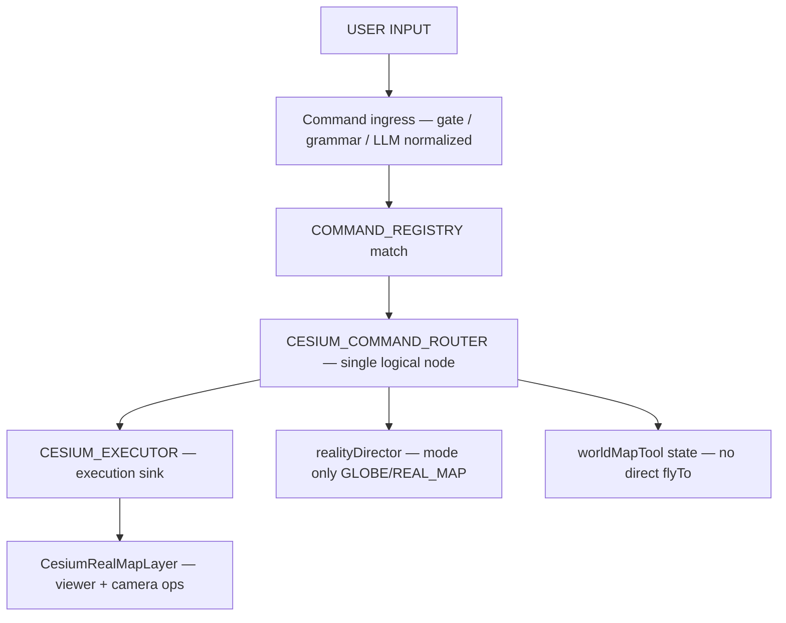

# Cesium Executor Spec V1

**Specflow:** `RESEARCH-ONLY` — command wiring fix plan (execution spine). Does not alter frozen core (v562–v570).

**Status:** Phase 1 **implemented** (executor + router + Step 3 scatter cleanup + CI guard).  
**Parent:** [`CASTLE_COGNITIVE_GRAPH_V1.md`](CASTLE_COGNITIVE_GRAPH_V1.md) §4 broken edges · §7 migration principle.  
**Phase 2:** [`CAMERA_UNIFICATION_SPEC_V1.md`](CAMERA_UNIFICATION_SPEC_V1.md) — perception alignment (no camera merge).

**Diagnosis:** The system is a *working system with a broken execution spine*. Registry and binding exist; **execution sink does not**. Zoom and spatial camera today leak through three unauthorized paths.

---

## 0. Root problem (one sentence)

```
map_zoom_in → registry ✓ → binding ✓ → ❌ CESIUM consumer ∅
```

**Command graph declares edges; nothing executes them.** Until this closes, camera split, habitat focus illusion, and authority merge are downstream symptoms.

---

## 1. Target topology

### 1.1 Single execution spine



### 1.2 Design decision (non-negotiable)

> **Cesium is no longer a UI component that callers poke.**  
> It is an **execution sink** reached only through `CESIUM_EXECUTOR`.

`window.__CASTLE_CESIUM__` becomes a **private implementation surface** of `CesiumRealMapLayer`, not a public spatial API.

### 1.3 Logical nodes (new — no new product systems)

| Node | Proposed module | Role |
|------|-----------------|------|
| `CESIUM_COMMAND_ROUTER` | `apps/client/src/castleFlight/cesiumCommandRouterV0.js` | Normalize all spatial intents → executor ops |
| `CESIUM_EXECUTOR` | `apps/client/src/castleFlight/cesiumCommandExecutorV0.js` | Sole writer to Cesium camera / map surface |
| `CESIUM_EVENT_BRIDGE` | installed from `CesiumRealMapLayer.jsx` on mount | Subscribe buses; delegate to executor |

These are **edge consolidation**, not a fifth reality center.

---

## 2. Event schema

### 2.1 Primary ingress — `rhizoh:map-command` (existing, wire consumer)

**Emitter:** `mapSpatialCommandHandlerV0` in `rhizohLocalCommandHandlersV0.js`  
**Event:** `rhizoh:map-command` (`RHIZOH_MAP_COMMAND_EVENT_V0`)

**Payload (today — unchanged):**

```json
{
  "canonical": "map_zoom_in",
  "action": "zoom_in",
  "layer": "map",
  "handler": "mapSpatialCommandHandlerV0",
  "atMs": 1700000000000
}
```

**Router must also accept** `rhizoh:local-command-binding` when `detail.target === "cesium"` (binding already emitted by same handler path).

### 2.2 Normalized executor request — `castle.cesium_executor.request.v0` (internal)

Produced by `CESIUM_COMMAND_ROUTER`; consumed only by `CESIUM_EXECUTOR`.

```json
{
  "schema": "castle.cesium_executor.request.v0",
  "op": "zoom_in",
  "source": "registry",
  "canonical": "map_zoom_in",
  "traceId": "TRC-…",
  "realityModeHint": null,
  "geo": null,
  "mapTool": null,
  "meta": {
    "ingress": "rhizoh:map-command",
    "atMs": 1700000000000
  }
}
```

| Field | Type | Required | Notes |
|-------|------|----------|-------|
| `schema` | string | yes | constant `castle.cesium_executor.request.v0` |
| `op` | string | yes | executor op catalog (§3.1) |
| `source` | string | yes | `registry` · `grammar` · `world_map_tool` · `reality_mode` · `llm_directive` · `observation` |
| `canonical` | string | no | registry canonical when known |
| `traceId` | string | no | links to `rhizohCommandExecutionGraphV0` |
| `realityModeHint` | `"GLOBE"` \| `"REAL_MAP"` | no | router may call `realityDirector` before camera op |
| `geo` | `{ lat, lon, alt? }` | no | for `fly_to` |
| `mapTool` | world map tool id | no | for `set_map_tool` |
| `meta` | object | yes | ingress audit |

### 2.3 Executor result — `castle.cesium_executor.result.v0` (internal)

```json
{
  "schema": "castle.cesium_executor.result.v0",
  "ok": true,
  "op": "zoom_in",
  "skipped": false,
  "skipReason": null,
  "deferred": false,
  "atMs": 1700000000001
}
```

Published to:

- `window.__CASTLE_CESIUM_EXECUTOR__` (debug ring, max 32)
- `rhizohCommandExecutionGraphV0` side-effect node when `traceId` present
- optional `castle:cesium-executor-result` DOM event (observability only — **not** a second ingress)

### 2.4 Grammar / world-map-tool ingress (secondary — same router)

These **do not** emit `rhizoh:map-command` today. Migration routes them through router API:

| Current caller | New call |
|----------------|----------|
| `applyRhizohWorldMapToolV0` | `routeCesiumCommandV0({ op: "set_map_tool", mapTool, source: "world_map_tool" })` |
| `onOpenMapToolV0` / grammar `OPEN_MAP_TOOL` | same |
| `RhizohRealityModeChromeV0` mode toggle | `routeCesiumCommandV0({ op: "set_reality_mode", realityModeHint, source: "reality_mode" })` |
| `worldFirstObservationV0` fly | `routeCesiumCommandV0({ op: "fly_to", geo, source: "observation" })` |
| LLM directive spatial effect | `routeCesiumCommandV0({ op: "fly_to", geo, source: "llm_directive", traceId })` |

**No new public event bus** for these — direct router function call.

---

## 3. Routing rules

### 3.1 Executor op catalog (V1 minimum)

| `op` | Registry canonical(s) | Executor behavior | `realityDirector` |
|------|-------------------------|-------------------|-------------------|
| `zoom_in` | `map_zoom_in` | camera height × 0.72 (clamped) | require `REAL_MAP` or auto-promote |
| `zoom_out` | `map_zoom_out` | camera height × 1.38 (clamped) | same |
| `center` | `map_center` | fly to calibration root viewport | same |
| `open` | `map_open` | `set_reality_mode REAL_MAP` + bootstrap viewport | yes |
| `close` | `map_close` | `set_reality_mode GLOBE` | yes |
| `follow` | `map_follow_player` | enable follow mode flag (stub ok V1) | yes |
| `show_locations` | `map_show_locations` | POI category visibility on | yes |
| `toggle_layers` | `map_toggle_layers` | cycle imagery profile | yes |
| `fly_to` | — (grammar/LLM/geo) | `flyToCustom(lat, lon, alt)` | yes if coords |
| `set_map_tool` | — (grammar) | `applyRhizohWorldMapToolV0` sans direct flyTo | yes |
| `set_reality_mode` | — (chrome) | `realityDirector.setRealityMode` + mode fly | yes |
| `focus_poi` | `castle_enter`, rooms | map to `focusCastle` / `focusPOI` | yes |
| `enter_castle` | `castle_enter` | `focusCastle` | yes |
| `topology_globe` | — | `flyToTopologyGlobe` | `GLOBE` |

**V1 scope:** implement `zoom_in`, `zoom_out`, `open`, `close`, `center`, `fly_to`, `set_map_tool`, `set_reality_mode` first. Stubs return `{ ok: true, skipped: true, skipReason: "v1_stub" }` for remaining ops.

### 3.2 Router decision table

```
ON rhizoh:map-command OR binding.target === "cesium":
  IF viewer not ready → queue in executor pending ring (max 1, merge-last)
  MAP action → op via §3.1
  CALL executeCesiumCommandV0(request)
  RECORD graph node if traceId

ON routeCesiumCommandV0(direct):
  SAME as above (single code path)

NEVER:
  call __CASTLE_CESIUM__ from outside executor
```

### 3.3 Readiness and flight coordination

Executor **must** respect existing coordinators:

- `realityDirector.notifyCesiumFlightStart/End` (via `trackedCameraFlyTo` in layer)
- `realityDirector` apex deferred queue when `isFlying`
- `mapSurfaceActive` + `realityMode` from `realityDirector.getState()` — skip or defer if op incompatible

```javascript
// Pseudocode — readiness gate
if (!cesiumApi.ready) return defer(request);
if (request.op requires REAL_MAP && state.realityMode !== "REAL_MAP") {
  await setRealityMode("REAL_MAP", { source: "cesium_executor" });
}
```

### 3.4 Zoom implementation note

`__CASTLE_CESIUM__` has **no `zoomIn` today**. Executor adds private helpers on the layer API object:

- `zoomByFactor(factor)` — read `getCameraGeo()`, multiply height, `trackedCameraFlyTo` same lat/lon
- keyboard path in `CesiumRealMapLayer` (`moveForward`/`moveBackward`) may later call same helper

---

## 4. Single source execution contract

### 4.1 Contract (normative)

1. **Only** `cesiumCommandExecutorV0.js` may invoke camera mutation methods on the Cesium viewer.
2. **Only** `cesiumCommandRouterV0.js` may call the executor (from events or direct normalized requests).
3. `realityDirector` remains mode authority; executor **requests** mode changes, never bypasses.
4. `applyRhizohWorldMapToolV0` may update tool **state** and imagery; **fly** moves to executor.
5. `rhizohCommandExecutionGraphV0` records traces; it does **not** dispatch.
6. Observation paths (`octoObservationReport`, product binding) **must not** call executor.

### 4.2 Public API surface after migration

| API | Status |
|-----|--------|
| `routeCesiumCommandV0(request)` | **public** — sole spatial command entry |
| `executeCesiumCommandV0(request)` | **internal** — executor only |
| `installCesiumCommandBridgeV0()` | called from `CesiumRealMapLayer` mount |
| `window.__CASTLE_CESIUM__.*flyTo*` | **deprecated** — dev-only warn shim in V1, removed V2 |
| `window.__CASTLE_CESIUM__.getCameraGeo` | **read-only** — allowed for observation |
| `window.__CASTLE_CESIUM__.setCategoryVisible` | migrate to executor `op` in V2 |

---

## 5. Forbidden paths (post-migration)

| ID | Forbidden pattern | Owner today | Action |
|----|-------------------|-------------|--------|
| `F-01` | `window.__CASTLE_CESIUM__.flyTo*` outside executor | `AppRhizoh528T0.jsx` (10+ sites), `rhizohWorldMapToolV0.js`, `worldFirstObservationV0.js`, `RhizohRealityModeChromeV0.jsx` | replace with `routeCesiumCommandV0` |
| `F-02` | `scheduleRhizohWorldMapFlyV0` direct flyTo | `rhizohWorldMapToolV0.js` | delete; executor handles fly after tool set |
| `F-03` | Grammar → flyTo side effect without router | `rhizohGrammarBridgeV0` → `onOpenMapTool` chain | `onOpenMapTool` → router only |
| `F-04` | `rhizoh:map-command` emit without consumer | handlers only | add bridge (this spec) |
| `F-05` | LLM response handler inline flyTo | `AppRhizoh528T0.jsx` scatter | normalize to `op: fly_to` |
| `F-06` | New `CustomEvent` bus for spatial ops | — | forbidden in V1 |
| `F-07` | Octo / habitat focus → Cesium camera | — | forbidden permanently |
| `F-08` | `applyLocalCommandAppBindingV0` as execution | binding is hint only | router listens to map-command OR binding, not binding alone long-term |

**CI aspiration (V1.1):** `npm run ops:cesium-executor-forbidden-grep` — grep for `__CASTLE_CESIUM__\.(flyTo|focus)` outside allowlist.

---

## 6. Migration diff (file-by-file)

### 6.1 New files

| File | Responsibility |
|------|----------------|
| `castleFlight/cesiumCommandRouterV0.js` | `routeCesiumCommandV0`, event demux, op mapping |
| `castleFlight/cesiumCommandExecutorV0.js` | `executeCesiumCommandV0`, readiness, zoom, fly |
| `castleFlight/__tests__/cesiumCommandExecutorV0.test.js` | zoom op, defer queue, readiness gate |
| `castleFlight/__tests__/cesiumCommandRouterV0.test.js` | registry payload → request mapping |

### 6.2 Modify

| File | Change |
|------|--------|
| `CesiumRealMapLayer.jsx` | On mount: `installCesiumCommandBridgeV0(api)`; add `zoomByFactor`; register internal api ref with executor; optional dev warn on deprecated direct flyTo |
| `rhizohLocalCommandHandlersV0.js` | no change V1 (already emits `rhizoh:map-command`) |
| `rhizohWorldMapToolV0.js` | Remove `scheduleRhizohWorldMapFlyV0`; after `setRealityMode`, call `routeCesiumCommandV0({ op: "set_map_tool", ... })` |
| `rhizohGrammarBridgeV0.js` | no flyTo; callbacks unchanged but downstream routes via router |
| `AppRhizoh528T0.jsx` | Replace all `__CASTLE_CESIUM__.flyTo*` with `routeCesiumCommandV0`; `onApplyWorldMapToolV0` unchanged surface, tool module handles router |
| `RhizohRealityModeChromeV0.jsx` | Mode toggle → `routeCesiumCommandV0({ op: "set_reality_mode" })` |
| `worldFirstObservationV0.js` | `flyToObservationCoordsV0` → router `fly_to` |
| `realityDirector.js` | optional: accept `source: "cesium_executor"` in transition meta |
| `rhizohCommandExecutionGraphV0.js` | record executor result as `phase: "cesium_exec"` node |
| `docs/CASTLE_COGNITIVE_GRAPH_V1.md` | mark `E-ZOOM-*` edges **wired** when done |

### 6.3 Do not modify (V1)

| File | Reason |
|------|--------|
| `ghost/phase*.js` | frozen core |
| `OctoConversationStageV1.jsx` | perception projection — out of scope |
| `rhizohHabitatFocusModeV0.js` | becomes true projection once execution spine fixed |
| `rhizohLocalCommandRegistryV0.js` | SSOT already correct |

### 6.4 `AppRhizoh528T0.jsx` scatter inventory (deprecate list)

Approximate `__CASTLE_CESIUM__` flyTo call sites to replace:

| Line region | Context |
|-------------|---------|
| ~1568–1570 | DSL bridge flyToCustom |
| ~1791 | flyToIstanbul |
| ~4000 | conditional flyToIstanbul |
| ~4642 | flyToIstanbul |
| ~5549–5550 | flyToCustom (broadcast/geo) |
| ~6830 | flyToIstanbul |
| ~8303 | flyToIstanbul |
| ~12229–12230 | flyToIstanbul boot |

Each becomes a typed `routeCesiumCommandV0` with `source` preserved for audit.

---

## 7. Micro-steps (implementation order)

### Step 1 — Define `CESIUM_EXECUTOR` logical layer

- [ ] Add `cesiumCommandExecutorV0.js` with schema constants, pending queue, `executeCesiumCommandV0`
- [ ] Add `zoom_in` / `zoom_out` / `center` ops against injected layer api
- [ ] Unit tests with mock api (no Cesium import in tests)

### Step 2 — Route `map_zoom_in` / `map_zoom_out`

- [ ] Add `cesiumCommandRouterV0.js` + `installCesiumCommandBridgeV0`
- [ ] Subscribe `rhizoh:map-command` in bridge installed from `CesiumRealMapLayer`
- [ ] Voice command `"zoom in"` → registry → handler → **executor** → visible camera change
- [ ] Graph trace node `cesium_exec`

### Step 3 — Deprecate direct `__CASTLE_CESIUM__` flyTo calls

- [ ] Migrate `rhizohWorldMapToolV0.js` (highest leverage — grammar path uses this)
- [ ] Migrate `RhizohRealityModeChromeV0.jsx`, `worldFirstObservationV0.js`
- [ ] Add dev `console.warn` shim on deprecated flyTo methods pointing to executor spec

### Step 4 — T0 grammar flyTo → executor only

- [ ] `AppRhizoh528T0.jsx` scatter replacement (batch by call site)
- [ ] LLM directive spatial normalization helper `normalizeLlmSpatialDirectiveV0` → `routeCesiumCommandV0`
- [ ] Forbidden grep script (optional CI)

**Stop condition for V1:** voice/text `"zoom in"` / `"yakınlaştır"` and grammar map open both traverse router; zero new direct flyTo in migrated files.

---

## 8. Relationship to downstream plans

| Downstream plan | Blocked until executor V1? | Why |
|-----------------|----------------------------|-----|
| Camera unification | **yes** | needs single spatial writer |
| Authority merge | **yes** | `WORLD_STATE.spatial` requires one mutation path |
| Spatial graph stabilization | **yes** | broken edges §4 in cognitive graph |
| Habitat focus cleanup | partial | auto-fixed when layout ≠ execution |

---

## 9. Observation fabric alignment

- Executor is **execution**, not interpretation.
- `castle:cesium-executor-result` is observability — subscribers may log, **must not** mutate camera.
- Octo inbox remains read-only relative to executor ([`OBSERVATION_FABRIC_V1.md`](OBSERVATION_FABRIC_V1.md)).

---

## 10. Honest snapshot

| Aspect | Today | After V1 |
|--------|-------|----------|
| Registry completeness | good | unchanged |
| Execution sink | **missing** | `CESIUM_EXECUTOR` |
| Zoom consistency | 3 leak paths | 1 router path |
| Cesium role | UI + imperative global | execution sink |
| Graph trace | debug only | trace includes `cesium_exec` |

---

## 11. Next artifacts (from this spec)

1. **Implementation PR** — Steps 1–2 only (minimal vertical slice: zoom)  
2. **Camera unification spec** — after Step 3 land  
3. **Authority merge spec** — `WORLD_STATE.spatial` write model  

---

*Tag: `RESEARCH-ONLY`. Parent graph: [`CASTLE_COGNITIVE_GRAPH_V1.md`](CASTLE_COGNITIVE_GRAPH_V1.md).*
