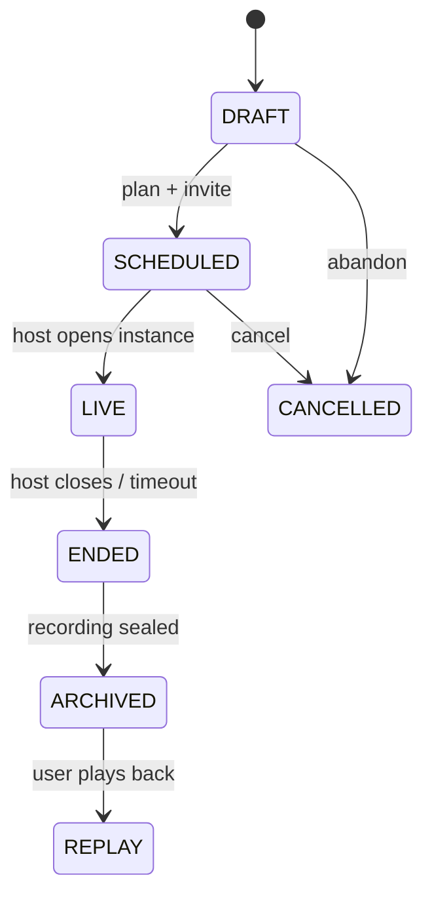

# Multi-Castle Social + Event Architecture V1

**Tag:** `RESEARCH-ONLY`  
**Status:** Social protocol spec — not production data-plane  
**Purpose:** Çoklu gerçeklik sosyal protokolü: kullanıcı yüzeyi · dört motor · event türleri · Octo/Rhizoh sınırları  
**Depends on:** [`CASTLE_COGNITIVE_GRAPH_V1.md`](CASTLE_COGNITIVE_GRAPH_V1.md) · [`CAMERA_UNIFICATION_SPEC_V1.md`](CAMERA_UNIFICATION_SPEC_V1.md) · [`PERCEPTUAL_PHYSICS_KERNEL_V2.md`](PERCEPTUAL_PHYSICS_KERNEL_V2.md) · [`OBSERVATION_FABRIC_V1.md`](OBSERVATION_FABRIC_V1.md) · [`SOVEREIGN_NETWORK_KERNEL_SPEC_V0.md`](SOVEREIGN_NETWORK_KERNEL_SPEC_V0.md) · [`RHIZOH_MULTI_INHABITANT_CO_PRESENCE_V0.md`](RHIZOH_MULTI_INHABITANT_CO_PRESENCE_V0.md)

**Phase gate:** Data-plane (WebRTC, shared world WAL, global invites) remains **off** until [`RHIZOH_ACTIVATION_READINESS_CHECKLIST_V1.0.md`](RHIZOH_ACTIVATION_READINESS_CHECKLIST_V1.0.md) signed READY. This doc defines **protocol + boundaries**, not go-live.

---

## 0. Executive frame

Users do not connect **to each other**. They connect **to a shared perception field** — a bounded event/world instance with social edges, spatial projection, and cognitive presence.

| Wrong product story | Correct protocol story |
|---------------------|------------------------|
| “Users join each other’s servers” | “Participants subscribe to the same L1 event instance” |
| “Rhizoh runs the session” | “Rhizoh mediates interaction context” |
| “Octo controls the map” | “Octo performs inside cube space; camera projects” |
| “UI shows session state” | “Fracture distorts synchrony feel (post-render only)” |

---

## 1. User-facing world (simple surface)

What a user should be able to do (product verbs — implementation phased):

| Domain | User verbs |
|--------|------------|
| **Social** | Invite friend to Castle · voice/video call · “visit” / “come” presence call |
| **Events** | Plan event · open live session / concert · RSVP · join as audience or guest |
| **Environments** | Enter another Castle · share a space · co-presence in common area |
| **Rhizoh** | Talk · ask for help · ask for situation commentary |
| **Octo** | Watch mode · “live entity” feel · reactive motion (not system control) |

User never sees: alignment engine · executor graph · fracture system · CI firewall.

---

## 2. Four engines (backend reality)

Social + event problems are solved by **four cooperating motors** — not one monolith.

```
┌──────────────────────────────────────────────────────────────┐
│ D) COGNITIVE — Rhizoh + Octo                                 │
│    interpretation · reactive performance · context injection │
├──────────────────────────────────────────────────────────────┤
│ C) SPATIAL SESSION — event world instance                   │
│    shared L1 space binding · per-participant projection      │
├──────────────────────────────────────────────────────────────┤
│ B) COMMUNICATION — streams + soft sync                       │
│    WebRTC A/V · session tokens · latency-aware presentation  │
├──────────────────────────────────────────────────────────────┤
│ A) SOCIAL GRAPH — castles · people · invites                 │
│    Castle-to-Castle graph · presence · handshake · RSVP edges│
└──────────────────────────────────────────────────────────────┘
                              ↓
              EXECUTION SPINE (frozen — never social-controlled)
              router · cesium executor · input graph · grammar
```

### A) Social Graph Layer

| Responsibility | Not responsible for |
|----------------|---------------------|
| Castle ↔ Castle edges | Spatial flyTo |
| Invitation + RSVP records | WebRTC media path |
| Presence state nodes | World WAL authority |
| Session handshake **intent** | Session master election |

**SSOT shape (L0/L1):** `castleId`, `participantId`, `inviteId`, `rsvpState`, `presenceEpoch` — per [`SOVEREIGN_NETWORK_KERNEL_SPEC_V0.md`](SOVEREIGN_NETWORK_KERNEL_SPEC_V0.md) L0 identity + L1 epistemic events.

### B) Communication Layer

| Responsibility | Not responsible for |
|----------------|---------------------|
| Audio/video stream transport | Execution commands |
| Shared session tokens (gateway-mediated) | Deriving `fieldState` from packet loss |
| Soft latency sync for **presentation** | Hard-locking cognitive truth to RTT |

**Soft aligned:** presentation may phase-lag; fracture layer may reflect desync — **never** routes spatial commands from stream metrics.

### C) Spatial Session Layer

| Responsibility | Not responsible for |
|----------------|---------------------|
| Spawn/bind **event world instance** | Merging Octo + Cesium cameras |
| Participant projection into same instance | Owning chat interpretation |
| Stage topology (concert, visit, circle) | Direct imperative `__CASTLE_CESIUM__` scatter |

**Critical:** Cesium + Octo appear together in the **same event scene** for the user, but **execution stays separate** — spatial mutations only via [`cesiumCommandExecutorV0`](../apps/client/src/castleFlight/cesiumCommandExecutorV0.js); Octo stays cube-space actor ([`CAMERA_UNIFICATION_SPEC_V1.md`](CAMERA_UNIFICATION_SPEC_V1.md)).

### D) Cognitive Layer

| Entity | Role | Forbidden |
|--------|------|-----------|
| **Rhizoh** | **Presence-session coordinator** · interaction interpreter · context routing (chat/voice/map/Octo) | Execution master · WAL writer · network transport owner |
| **Octo** | **Reactive presence** · state-driven projection field · field perturbation → visible motion | Spatial routing · input graph · direct audio→animation wire |

**Rhizoh orchestration clarified:** coordinates session container + projection sync — **not** execution graph ([`RHIZOH_COM_USER_EXPERIENCE_V1.md`](RHIZOH_COM_USER_EXPERIENCE_V1.md)).

**Octo clarified:** dual projection (cognitive state internal · spatial avatar = projection). Camera **reads** state; motion **is** state change rendered ([`OCTO_PRESENCE_FIELD_V1.md`](OCTO_PRESENCE_FIELD_V1.md)).

### Three V1 system split

| System | Doc |
|--------|-----|
| Session Graph | [`SESSION_GRAPH_V1.md`](SESSION_GRAPH_V1.md) |
| Octo Presence Field | [`OCTO_PRESENCE_FIELD_V1.md`](OCTO_PRESENCE_FIELD_V1.md) |
| Event System | [`EVENT_SYSTEM_V1.md`](EVENT_SYSTEM_V1.md) |

---

## 3. Octo camera projection (locked answer)

**Question:** “If we bind Octo area to camera, do we see natural motion?”

**Yes — with the actor/lens model (already cube-centric):**

| Wrong | Right |
|-------|-------|
| Octo camera = Octo controller | Octo = **scene actor** in cube space |
| Camera drives tentacle truth | Camera = **perception lens** that projects actor |
| One merged viewport truth | Align lenses; do not merge ([`CAMERA_UNIFICATION_SPEC_V1.md`](CAMERA_UNIFICATION_SPEC_V1.md)) |

```
Octo rig animates (cube space)
        ↓
cube-centric camera projects (local lens)
        ↓
user sees natural motion
        ↓
fracture may desync *feel* from spatial/wheel (post-render only)
```

**Event mode:** concert/visit does **not** reparent Octo under Cesium geo. Event context injects **performance cues** (intensity, beat, crowd scalar) — not WGS84 binding (deferred explicitly in camera spec).

---

## 4. Octo live / concert behavior

Octo as **reactive presence** — field perturbation model ([`OCTO_PRESENCE_FIELD_V1.md`](OCTO_PRESENCE_FIELD_V1.md)).

Audio/crowd does **not** wire directly to animation. Flow:

`perturbation → sharedFieldState (interpretive) → cognitive drive bias → projection motion → fracture texture`

Octo does not “hear” — the **alan** changes; state change **becomes** visible motion.

---

## 5. Rhizoh multi-user role (locked)

Rhizoh is **presence-session coordinator** (orchestration of **graph + projection sync**, not execution):

> **Multi-session awareness + interaction mediation + session container protocol**

| Rhizoh does | Rhizoh does not |
|-------------|-----------------|
| Track who is conversing with whom (interpretation) | Own WebRTC signaling |
| Surface which event is active for this participant | Spawn/kill world instances (that's Spatial Session + L0 ACL) |
| Route **context** to chat / voice / map / Octo panels | Control execution graph |
| Inject event context into dialogue memory | Issue spatial commands from inbox |

**Golden rules (inherit):**

- Observation may influence **interpretation**, never **execution** ([`OBSERVATION_FABRIC_V1.md`](OBSERVATION_FABRIC_V1.md))
- Agents interpret only ([`RHIZOH_MULTI_INHABITANT_CO_PRESENCE_V0.md`](RHIZOH_MULTI_INHABITANT_CO_PRESENCE_V0.md))

---

## 6. Three worlds (unified product, separated authority)

| World | Contains | Authority |
|-------|----------|-----------|
| **Social** | People · Castles · invites · RSVP | L0 graph + social edges |
| **Spatial** | Cesium map · event stage · camera projection | Executor spine only |
| **Cognitive** | Octo · Rhizoh · fracture · perception | Interpretation + post-render distortion |

Users experience **one** world. Engineering maintains **three** with strict membranes.

---

## 7. Event taxonomy (all types)

Events are classified on **five independent axes**. Any product event = a point in this space (not a flat enum).

### 7.1 Axis A — Participation scale

| ID | Scale | Description |
|----|-------|-------------|
| `EP_SOLO` | Solo | One Castle, one inhabitant — performance, rehearsal, diary |
| `EP_DUO` | Duo | Two Castles — call, duet, 1:1 visit |
| `EP_MULTI` | Multi | N Castles — concert, circle, watch party |

### 7.2 Axis B — Language mode

| ID | Mode | Presentation | Execution impact |
|----|------|--------------|------------------|
| `EL_MONO` | Single language | UI copy + Rhizoh reply in one locale | None |
| `EL_MULTI` | Multilingual | Per-participant UI locale; Rhizoh may code-switch in interpretation | None — language is presentation + memory tagging, not routing |

### 7.3 Axis C — Temporal mode

| ID | Mode | World instance | Octo mode |
|----|------|----------------|-----------|
| `ET_PLANNED` | Future scheduled | **Not spawned** — calendar L1 only | Dormant / poster presence |
| `ET_LIVE` | Happening now | **Active** shared instance | Reactive performer + observer |
| `ET_PAST` | Ended | **Archived** — replay envelope | Playback track or frozen observation |
| `ET_REPLAY` | Recording playback | Read-only instance binding | Motion from recording; no live audio ingress |

### 7.4 Axis D — Modality

| ID | Modality | Primary engines |
|----|----------|-----------------|
| `EM_TEXT` | Text session | Social + Cognitive |
| `EM_VOICE` | Voice | + Communication |
| `EM_VIDEO` | Video | + Communication |
| `EM_VISIT` | Castle visit | + Spatial Session |
| `EM_CONCERT` | Live performance | Spatial + Communication + Octo performer |
| `EM_WATCH` | Watch party / audience | Social + Spatial (shared focus, not shared executor) |

### 7.5 Axis E — Space binding

| ID | Space | Spatial note |
|----|-------|--------------|
| `ES_HOME` | Host Castle home | Default anchor — profile-backed |
| `ES_REMOTE` | Guest enters host Castle | Projection sync; no cross-tenant WAL without L0 gate |
| `ES_SHARED` | Neutral event instance | Concert hall / plaza — instance id ≠ any single home |

### 7.6 Example compositions

| User story | Tuple |
|------------|-------|
| Solo rehearsal | `EP_SOLO · EL_MONO · ET_LIVE · EM_CONCERT · ES_HOME` |
| Friend video call | `EP_DUO · EL_MULTI · ET_LIVE · EM_VIDEO · ES_REMOTE` |
| Scheduled concert poster | `EP_MULTI · EL_MULTI · ET_PLANNED · EM_CONCERT · ES_SHARED` |
| Live global concert | `EP_MULTI · EL_MULTI · ET_LIVE · EM_CONCERT · ES_SHARED` |
| Past concert replay | `EP_MULTI · EL_MONO · ET_REPLAY · EM_WATCH · ES_SHARED` |
| “Come visit” ping | `EP_DUO · EL_MONO · ET_LIVE · EM_VISIT · ES_REMOTE` |

---

## 8. Event lifecycle



| State | Social graph | Spatial session | Communication | Cognitive |
|-------|--------------|-----------------|---------------|-----------|
| `DRAFT` | optional invite list | none | none | Rhizoh planning copy only |
| `SCHEDULED` | RSVP edges active | none | none | reminders = L1 notification |
| `LIVE` | presence nodes | **instance bound** | streams on | Octo performer + Rhizoh mediator |
| `ENDED` | attendance sealed | instance detached | streams off | summary observation export |
| `ARCHIVED` | historical edge | read-only bind | none | replay envelope |
| `REPLAY` | same as archived | read-only projection | none | recorded Octo track |

**Rule:** `LIVE` is the **only** state that may bind an active shared world instance to multiple participants.

---

## 9. Session graph (protocol nodes)

```text
CastleNode           { castleId, ownerUid, homeAnchor? }
UserPresenceNode     { uid, castleId, epoch, mode: idle|in_event|in_call }
EventInstanceNode    { eventId, hostCastleId, axes tuple, lifecycleState }
WorldInstanceNode    { worldInstanceId, eventId, spaceBinding, acl }
ParticipationEdge    { fromUid, toEventId, role, rsvpState }
InviteEdge           { fromCastleId, toCastleId|toUid, inviteKind }
StreamBinding        { eventId, participantId, mediaKind, tokenRef }
```

**Roles (participation):**

| Role | Social | Spatial | Octo |
|------|--------|---------|------|
| `host` | create/close event | instance owner (L0) | performer optional |
| `performer` | stage member | stage anchor | **performer** |
| `guest` | invited visitor | projection guest | observer |
| `audience` | RSVP public | audience node | observer + crowd scalar feed |
| `moderator` | interpretation assist | no executor | no topology write |

---

## 10. Live concert topology (reference scene)

```
┌─────────────────────────────────────────────────────────┐
│  Shared Event Instance (ES_SHARED · ET_LIVE · EM_CONCERT) │
├─────────────────────────────────────────────────────────┤
│  Cesium        = stage / geography projection           │
│  Octo          = performer entity (cube space)          │
│  Users         = audience presence nodes                │
│  Rhizoh        = interaction layer (Q&A, commentary)    │
│  Voice/ambient = stream → OctoPerformanceFeedV0         │
├─────────────────────────────────────────────────────────┤
│  Octo: intensity → motion · rhythm → breathing camera   │
│  Crowd reaction scalar → phase drift (cognitive only)   │
│  Fracture: post-render desync if stream/map skew        │
└─────────────────────────────────────────────────────────┘
```

**Crowd scalar** is observation-derived (`causalClaim: false`) — may modulate Octo performance feel, never spatial executor.

---

## 11. Octo participation model

| Mode | When | Behavior |
|------|------|----------|
| `observer` | visit, watch, replay | Watch motion; no performance ingress |
| `performer` | concert, host solo live | Ambient + event feed modulates drive |
| `co_presence` | multi-inhabitant castle | Shared projection; [`RHIZOH_MULTI_INHABITANT_CO_PRESENCE_V0`](RHIZOH_MULTI_INHABITANT_CO_PRESENCE_V0.md) rules |

**Invariant:** `cube.topology` never agent-owned — event context may not write topology ([`cubeTopologyOwnershipInvariantV0`](../apps/client/src/studio/cubeTopologyOwnershipInvariantV0.js)).

---

## 12. Rhizoh routing rules (mediation, not control)

| Signal | Route to | Never route to |
|--------|----------|----------------|
| Active `eventId` | dialogue context · UI surface selection (presentation) | executor |
| Peer `presence` | chat target hint · copy | `fieldState` override |
| User utterance | grammar / gateway | spatial command without user intent path |
| Event phase (`LIVE`→`ENDED`) | memory + observation export | world instance teardown (that's host ACL + spatial session API) |

**Context packet (sketch):**

```text
RhizohSessionContextV0 {
  eventId?: string
  lifecycle: "DRAFT"|"SCHEDULED"|"LIVE"|"ENDED"|"ARCHIVED"|"REPLAY"
  participationRole?: "host"|"guest"|"audience"|"performer"
  peerPresence?: { castleId, uid }[]
  locale: string
  readOnly: true
}
```

---

## 13. Perception + fracture in social events

Social density does **not** merge lenses.

| Situation | Fracture behavior (passive A) |
|-----------|-------------------------------|
| Video + map both active | temporal desync texture — not “they are in sync” narrative |
| High stream latency | phase lag on presentation chrome only |
| Concert crowd + chat hero | false-correlation guard if spatial moves without user spatial source |

**Forbidden in events:** fracture → RSVP emphasis · fracture → “join now” CTA · fracture → routing.

---

## 14. Illegal couplings (social + event CI extensions)

Extends P2-F01…F05 and future PP-IL*:

| ID | Forbidden |
|----|-----------|
| `SE-IL01` | Event state → `routeCesiumCommandV0` without user grammar path |
| `SE-IL02` | Octo performance feed → executor / habitat focus |
| `SE-IL03` | Rhizoh context → session master / WAL write |
| `SE-IL04` | RSVP count → spatial mutation |
| `SE-IL05` | Stream latency → `fieldState` coercion |
| `SE-IL06` | Replay envelope → live Octo audio ingress without `ET_REPLAY` gate |
| `SE-IL07` | Multilingual copy → routing fork (locale ≠ execution branch) |

---

## 15. Implementation phasing (honest)

| Phase | Deliverable | Data-plane |
|-------|-------------|------------|
| **V1 spec (this doc)** | Protocol · taxonomy · boundaries | Off |
| **V1.1 client stubs** | Event axis types · lifecycle read-model · OctoPerformanceFeedV0 interface | Off |
| **V2 social graph** | Invite/RSVP L1 envelopes + Firestore rules | Controlled READY |
| **V3 communication** | Gateway WebRTC tokens | Controlled READY |
| **V4 spatial session** | Shared `worldInstanceId` bind + projection sync | Controlled READY |
| **V5 cognitive** | RhizohSessionContextV0 + Octo performer loop | Partial local now |

**Today (post–3.2):** execution unified · perception isolated · fracture post-render · co-presence research module exists — **no global multi-Castle WAL**.

---

## 16. Founder lock (summary)

> Users connect to a **shared perception field**, not to each other directly.  
> **Rhizoh** mediates context — never commands reality.  
> **Octo** performs — never executes.  
> **Camera** projects — never owns truth.  
> **Execution** produces spatial reality; **fracture** only distorts how synchronization feels.

---

## 17. Related docs

| Concern | Doc |
|---------|-----|
| Friend onboarding (research) | [`apps/client/docs/FRIEND_ZERO_FRICTION_ONBOARDING_V0.1.md`](../apps/client/docs/FRIEND_ZERO_FRICTION_ONBOARDING_V0.1.md) |
| Co-presence | [`RHIZOH_MULTI_INHABITANT_CO_PRESENCE_V0.md`](RHIZOH_MULTI_INHABITANT_CO_PRESENCE_V0.md) |
| Network planes | [`SOVEREIGN_NETWORK_KERNEL_SPEC_V0.md`](SOVEREIGN_NETWORK_KERNEL_SPEC_V0.md) |
| Executor spine | [`CESIUM_EXECUTOR_SPEC_V1.md`](CESIUM_EXECUTOR_SPEC_V1.md) |
| Perceptual physics | [`PERCEPTUAL_PHYSICS_KERNEL_V2.md`](PERCEPTUAL_PHYSICS_KERNEL_V2.md) |
