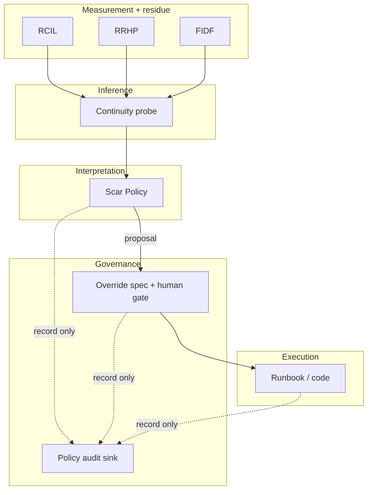

# Policy Audit Schema — V1 (governance observability)

**Durum:** `GOVERNANCE_SPEC` — **yorum → eylem** boru hattının gözlemlenebilirliği. **Yürütme motoru değildir**; RCIL, RRHP, continuity probe veya Scar Policy **bu kayıtlardan tetiklenmez**.  
**SPECFLOW:** `FUTURE-PROOF-ONLY` — şema ve olay sözlüğü kontratı; isteğe bağlı sink / telemetri ile doldurulur.

**Şema:** [schemas/policy-audit-v1.schema.json](schemas/policy-audit-v1.schema.json)  
**İlişkili:** [EPISTEMIC_SCAR_POLICY_V1.md](EPISTEMIC_SCAR_POLICY_V1.md) (§4 policy-to-action distance), [CONTINUITY_OVERRIDE_SPEC_V1.md](CONTINUITY_OVERRIDE_SPEC_V1.md), [FIELD_IMPRINT_DECAY_FIDF_V1.md](FIELD_IMPRINT_DECAY_FIDF_V1.md). Katman içi analiz: §8.7–§8.14 (ölçüm/manifold); **§8.15 ECPI** (… **§8.15.10.1**–**§8.15.10.7**: REAMLF, **MCCB**, **OSRIB**, **EODE**; **§8.15.10.8** EITG (DAG + **EOL**); **§8.15.10.9** belge sınırı); **§8.15.11+ yok**, **§8.16+ yok**.

---

## 1. Controlled Epistemic Stack (referans isimlendirme)

Aşağıdaki sıra **bilgi akışı** içindir; **hiçbir üst katman doğrudan execution’a bağlanmaz**.

| Katman | Rol |
|--------|-----|
| **Measurement** | FIDF, RCIL ölçüm yüzeyi, RRHP kalıcı özet |
| **Inference** | Continuity probe, drift sınıfları, güven bantları |
| **Interpretation** | Epistemic Scar Policy (yorum / öneri) |
| **Governance** | Continuity override spec, insan kapısı, onay |
| **Execution** | Runbook, kod değişikliği, operasyonel eylem |

**Kural:** `epistemic influence ≠ execution authority`. Audit, bu kuralın **zaman içinde bozulup bozulmadığını** ölçer; kuralı **uygulamaz**.

---

## 2. Ne ölçülür (V1 metrikleri)

| Soru | Kaynak |
|------|--------|
| Kaç Scar önerisi **formalize** edildi? | `scar.suggestion.recorded` sayısı |
| Kaç tanesi **override / governance zincirine** girdi? | `governance.chain.entered` |
| Kaç tanesi **onay** aldı? | `governance.approval.recorded` |
| Kaç tanesi **runbook**’a bağlandı? | `governance.runbook.linked` |
| Kaç zincir **eylem tamamlandı** veya **terk** edildi? | `governance.action.completed` / `governance.chain.abandoned` |
| Öneri → eylem **gecikmesi**? | Olaylarda `latencyFromSuggestionMs` veya rollup `medianLatencySuggestionToActionMs` |
| **Explicit approval rate** | Rollup: `explicitApprovalRate` (= onay / zincire giriş, tanımlıysa) |

**Stalled:** zincir `entered` oldu ama terminal (`action.completed` | `chain.abandoned`) görülmediği süre — operasyonel tanım ürün tarafında (OPEN); rollup’ta `chainsWithNoProgress` alanı raporlama için ayrılmıştır.

---

## 3. Olay türleri (`type`)

Sıra tipik yaşam döngüsünü yansıtır; zorunlu değildir (ör. doğrudan `chain.abandoned` mümkün).

1. `scar.suggestion.recorded` — yorum katmanında kayıtlı öneri (policy sürümü `policyRef` ile).
2. `governance.chain.entered` — öneri, override / onay sürecine **bilinçli** taşındı.
3. `governance.approval.recorded` — **açık** onay (sessiz varsayılan değil; bkz. Scar §4.2–3).
4. `governance.runbook.linked` — versiyonlu runbook veya ticket referansı bağlandı.
5. `governance.action.completed` — execution katmanında tamamlanan eylem (kod/deploy/el ile adım).
6. `governance.chain.abandoned` — zincir kasıtlı kapatıldı; eylem yok.

`actorKind`: `human` | `system_process` — ikincisi yalnızca **tanık** (ör. CI “onay kaydı oluşturuldu”) içindir; **auto-apply** anlamına gelmez.

---

## 4. Sink sözleşmesi (event hook — tasarlanmış arayüz)

Uygulama isteğe bağlı olarak şu yüzeyi sağlayabilir:

```text
recordPolicyAuditEvent(event: PolicyAuditEventV1): void
```

**Zorunlu özellikler:**

- Varsayılan uygulama **no-op** olabilir.
- **Asla** RCIL ingest, RRHP yazma veya probe sonucunu değiştirmez; **senkron yolda exception fırlatmaz** (gözlem, execution’ı düşürmemeli).
- PII taşımaz; `correlationId` / `chainId` teknik korelasyon içindir.

İleride: aynı olayların `RhizohEventEnvelope` ile sarılması (OPEN) — şu an ayrı şema.

---

## 5. Rollup (`PolicyAuditRollupV1`)

Toplu rapor **türetilmiş** kayıttır (depo / BI / haftalık export). Olay akışının yerine geçmez.

---

## 6. Sınır

- Bu şema **anlam üretmez**; yalnızca **hangi aşamadan geçildiğini** kaydeder.
- Frozen core (v562–v570) ve otomatik faz davranışı ile **bağlantısı yoktur**.

---

## 7. Passive → Delayed → Active governance (transition map)

**Alt ölçüm hattı:** RCIL / RRHP / FIDF **ölçüm ve kalıntı (residue) üretmeye devam eder**; üstteki kontrat katmanı bunun yerine geçmez — yalnızca **yorum → yönetişim → eylem** sınırını ve izlenebilirliği tanımlar.

### 7.1 Üç mod (bilinçli ayrım)

| Mod | Audit rolü | Execution ile ilişki | Bu repoda (V1) |
|-----|------------|----------------------|----------------|
| **Passive governance** | Kayıt + rollup; no-op kabul | **Kanca yok**; eylem yalnız runbook/kod + insan onayı | **Hedef** — bu belgede §4 sink sözleşmesi |
| **Delayed governance loop** | Desen → **yeni öneri** veya **yumuşak sürtünme** (ör. dashboard’da ek adım, eğitim, WIP limiti) | Hâlâ **otomatik enforcement yok**; RCIL/RRHP’yi audit tetiklemez | **Açık charter** + insan ürün kararı gerekir |
| **Active governance** | Ölçülen desen doğrudan **politika uygulama** veya runtime kilidi | Execution **audit’ten** veya skordan **koşullu tetiklenir** | **V1 dışı**; ayrı güvenlik / hukuk / sürüm (ör. v571+ benzeri) paketi olmadan genişletilmemeli |

**Gerilim noktası (bilinçli):** “Audit yalnız gözlem mi kalacak, yoksa gecikmeli **kontrol sinyali** mi?” — Passive ile Delayed arasındaki çizgi, sistemin **epistemik yönetişim substratı** mı yoksa **kendini düzenleyen kapalı döngü** mü olacağını belirler. Delayed’a geçerken bile **audit → RCIL ingest / RRHP merge** doğrudan bağ **yasak** kalır ([EPISTEMIC_SCAR_POLICY_V1.md](EPISTEMIC_SCAR_POLICY_V1.md) §4.2 ile uyumlu).

**Risk (dürüst not):** Audit katmanı zenginleşir, execution tarafı **hareketsiz** kalırsa ürün “çok açıklayan, az yapan” hissi verebilir. Mitigasyon: audit **zorunlu değil** ve **execution path’e hook değil** (§4); eylem hızı runbook ve ekip kapasitesinden gelir, kayıttan değil.

### 7.2 Katmanlar ve yasak kenarlar (tek diyagram)

Aşağıda **tek yönlü bilgi** (ölçüm → çıkarım → yorum) ve **yalnızca kayıt** (audit) ile **yürütme** ayrılır. **Kırmızı çizgi:** audit veya Scar’dan doğrudan execution veya ölçüm mutasyonu yok.



**Okuma:** `PROBE --> SCAR` çıkarım çıktısı yorum katmanına **girdi** olarak gider; Scar’ın çıktısı governance’a **öneri** olarak gider; **yalnız** `OVERRIDE --> RUN` eylemi üretir. `AUDIT` tüm ilgili aşamalardan **noktalı** ok ile beslenir; ölçüm alt grafına **geri ok yoktur** (passive V1).

---

## 8. Geri bakış garantisi; semantik zaman; Delayed soft friction

### 8.1 Audit = gözlem yüzeyi, kontrol döngüsü değil

- **Garanti:** Policy audit **geri besleme hattı değildir**; yalnızca **geri bakış** hattıdır — yani ölçüm / projection / kuyruk / probe **audit kaydına göre güncellenmez**.
- §7’deki Passive / Delayed / Active ayrımı, sistemin “**ne yapabilir**” sınırından çok “**yorum ne zaman operasyonel alaka kazanır**” (insan + override + runbook zinciri) sınırını tarif eder; bu da **ölçüm → otomatik governance** refleksini ve **log = kontrol sinyali** epistemik kaymasını keser.

### 8.2 Semantik zaman (okuma modeli — motor değil)

| Katman | Zaman rolü (anlatı) |
|--------|---------------------|
| **RCIL** | Olayların **şimdisi** (trace / ingest) |
| **RRHP** | Operasyonel **iz** (minimal projection) |
| **FIDF** | Sönüm / boşluk **ölçüm alanı** |
| **Probe** | Çıkarımın **anlık** özeti |
| **Scar** | **Yorum** (anlam önerisi) |
| **Audit §7** | Yönetişim modlarının **meta-zamanlama haritası** (ne passive kaldı, ne delayed tartışılıyor) |

Bu tablo **çalışma zamanı zamanlayıcısı değildir**; ekip ve denetim için **ortak dil**dir.

### 8.3 Delayed mod: “soft friction” — sinyal tabanı ve **üretmeme** (abstain)

**Amaç:** “Yorum var, müdahale yok” — sürtünme yalnızca **insanın kararını bilinçlendirir**; hiçbir **state yazımı** veya **kuyruk tetiklemez**.

**Sürtünme üretimine izin verilen girdiler (salt okunur; UI / açıklama katmanı):**

- Probe **drift sınıfları** ve `primaryDriftClass` (zaten insan okumasına açık özet).
- **Confidence band** — yalnızca “ek bilgi / ek tıklama” için; **band tek başına** zorlayıcı UX üretmek için kullanılmamalı ([CONTINUITY_OVERRIDE_SPEC_V1.md](CONTINUITY_OVERRIDE_SPEC_V1.md) ile uyumlu: band yeterli değildir).
- İnsan süreci metrikleri: audit rollup’ta **stalled zincir** sayısı vb. (yine salt gösterim).

**Kesin yasak (Delayed dahil):**

- Audit veya rollup’tan **RCIL ingest sırası / filtre** türetmek.
- **RRHP** merge / slice’ı sürtünmeden **otomatik** değiştirmek.
- Bir sonraki probe koşusu için **çıktıyı** audit’e göre **yeniden yazmak** veya “ikinci bir gerçek” üretmek.
- Sürtünmeyi **açık onay** veya **override** yerine geçirmek (“tıkladı = onaylandı” yanılsaması).

**Soft friction üretilmemeli (abstain) — örnek koşullar:**

| Koşul | Gerekçe |
|-------|---------|
| `confidence.aggregate === null` (withhold) | Üst baskı; band ile **ikame etme** |
| `fingerprintComparable === false` / `non_comparable` ağırlığı | Karşılaştırma yokken **normatif sürtünme** üretme |
| Scar / override henüz **dokümante edilmemiş** öneri | “Soft” ile **fiili politika** sızıntısı riski |
| Ürün **kill switch** veya yüksek yanlış pozitif oranı | Sürtünme tüketimi güveni eritir |

### 8.4 Soft friction desen kataloğu (V1 — taslak)

| Desen | Etki alanı | İzinli | Not |
|--------|------------|--------|-----|
| Ek açıklama paneli / “neden bu öneri?” | UI | Evet | State yok |
| Onay öncesi bilinçli tıklama (ack) | UI | Evet | **Onay değildir**; ayrı kayıt |
| “Zincir X gün stalled” rozeti | Observability | Evet | RCIL/RRHP tetiklemez |
| İnsan sürecinde soğuma süresi (çift tıklama koruması) | **Süreç tasarımı** | Tartışmalı | Kod **queue yazmaz** |

Tam desen listesi ve ürün ölçütleri **OPEN** — burada yalnızca sınır ve abstain kuralları sabittir.

### 8.5 Silent suppression — yorumun **görünmez** kalması (ergonomi + güven)

**Risk:** Soft friction kataloğu büyüdükçe **açık execution olmadan** bile “yorum yoğunluğu” **örtük politika yüzeyi**ne dönüşebilir (**governance ergonomics drift**). Bu, teknik bug değil; **davranış yönlendirmesi** riskidir.

**İlke (V1):** Sürtünmenin **varsayılanı görünmemektir** — yorum **yalnızca** açıkça tanımlı koşullarda ve **sınırlı yoğunlukta** gösterilir; aksi halde **sessiz baskılama** (silent suppression) uygulanır. §8.3 abstain “üretme”; bu alt bölüm “**üretildi ama gösterme** / hiç üretme” ayrımını tamamlar.

**Sessiz baskılama uygulanmalı (örnek — ürün parametreleri OPEN):**

| Kural | Amaç |
|-------|------|
| **Soğuma / tekrar** | Aynı `chainId` veya aynı öneri için son X saatte/gün içinde sürtünme zaten gösterildiyse **yeniden gösterme** (alarm yorgunluğu). |
| **Yetkisiz rol** | Governance charter’ı olmayan görüntüleyici rollerde **normatif sürtünme yok** — yalnız nötr özet veya hiçbir şey. |
| **Sinyal yetersizliği** | Yalnızca `confidence.band` var; `driftClasses` / dokümante öneri yoksa **zorlayıcı panel yok** (band ile ikame yok — [CONTINUITY_OVERRIDE_SPEC_V1.md](CONTINUITY_OVERRIDE_SPEC_V1.md)). |
| **Odak / kesinti modu** | Kullanıcı veya org “DND / derin çalışma” bayrağı (OPEN) — sürtünme **ertelenir**, kuyruk veya state’e yazılmaz. |
| **Olay dondurması** | Incident / legal hold süresince yeni sürtünme yüzeyi **açılmaz** (mevcut zincirler salt okunur). |
| **Yoğunluk tavanı** | Oturum veya gün başına **en fazla N** aktif sürtünme yüzeyi (N ürün tarafında OPEN) — aşımda kalanlar **kasıtlı olarak gösterilmez** (liste yerine “daha fazla var” nötr linki opsiyonel). |
| **İnsan tercihi** | “Bu sınıf uyarıyı 7 gün gösterme” gibi **açık** kullanıcı/org seçimi — kayıt **insan kaynaklı** olmalı; sistem tek başına “seni doğru yola sokma” moduna girmemeli. |

**Abstain (§8.3) ile fark:** Abstain = epistemik olarak **yorum üretme** (güven yok, karşılaştırma yok). Silent suppression = epistemik olarak üretim **tartışmalı olsa bile** UX / güven / ergonomi için **görünürlüğü kapatma**. İkisi birlikte şunu korur: **önce filtre, sonra yorum, sonra (seyrek) öneri** — ve çoğu zamanda **hiç yorum yok**.

**Denetim:** Sessiz baskılanan her olay için (isteğe bağlı) `policyRef` + `suppressionReason` enum’u audit sink’e düşürülebilir — **yine salt kayıt**; RCIL/RRHP/probe’u tetiklemez (§4).

### 8.6 Visibility budget model — üretim ≠ algı (execution’a dokunmadan)

Bu alt bölüm **yürütme veya routing tanımlamaz**; yalnızca §8.5 ile birlikte **görünürlük ekonomisi** için ortak dil ve **türetilmiş gözlem** alanları verir. Sayısal eşikler **OPEN** (ürün / org charter).

#### 8.6.1 Üç yüzey (özet)

| Katman | Soru | Bu belgedeki yer |
|--------|------|------------------|
| **Generation** | Ne üretildi? | RCIL / RRHP / FIDF + Scar önerisi (üretim kuralları değişmez) |
| **Exposure** | Ne **gösterilecek**, ne zaman, hangi bağlamda? | §8.3–8.5; **cevap “hepsi değil”** |
| **Governance perception** | İnsan / ekip **neyi gördü**? | Audit kaydı + nötr özetler; **algı kontrolü ≠ üretim kontrolü** |

**Non-visible state:** Üretim ve (isteğe bağlı) log vardır; **epistemik yüzey** (normatif sürtünme) kapalı olabilir — trace flood ve yorum gürültüsünü düşürür; kullanıcı algısını stabilize etmek için kasıtlıdır, **gizli execution değildir**.

#### 8.6.2 Bütçe ve yoğunluk (kavramsal — motor değil)

- **Görünürlük bütçesi `B`:** oturum veya takvim penceresi başına gösterilebilecek **sürtünme birimi** üst sınırı (birim tanımı ürün: kart, banner, modal… — OPEN). §8.5 tablosundaki “**N** tavan” ile aynı ailededir.
- **`V_vis`, `V_sup`:** aynı pencerede exposure kararı sonrası sırasıyla gösterilen ve baskılanan birim sayıları.
- **Baskılama yoğunluğu `rho` (gözlem örneği):** `rho = V_sup / max(1, V_vis + V_sup)`. Yüksek `rho` tek başına “kötü” değildir; **ergonomi / güven** seçimini yansıtır; **RCIL/RRHP’ye geri beslenmez**.

#### 8.6.3 Drift korelasyonu (salt analitik)

- Amaç: Hangi **`driftClasses`** karışımlarında **hangi `suppressionReason`** kodları sık çıkıyor — **BI / denetim** içindir.
- **Yasak:** Bu korelasyon probe ağırlıklarını, Scar metnini veya kuyruk önceliğini **otomatik güncellemez** (geri bakış; §8.1).

#### 8.6.4 “Bias field” riski (ince not)

Suppression + öneri birlikte, kullanıcıda **sistem davranışını dolaylı yönlendiriyormuş** hissi yaratabilir. Sınırlar: suppression **yalnız görünürlük**; öneri **bağlayıcı değil**; audit **passive** (§4, §8.1). Şüphe halinde **bütçe düşür** veya **sessizlik** — ek sürtünme ekleme.

#### 8.6.5 Epistemik zamanlama (okuma)

**Attention-scheduled epistemic system** ifadesi burada **metafor**: bilgi yüzeyinin **ne zaman** açılacağını ürün bilinçli seçer; bu, yeni bir **event loop motoru** veya faz zinciri değildir (frozen core ile ilişkisiz).

### 8.7 Visibility drift detection — `rho` zaman serisi + suppression entropy (yalnız analiz)

**Amaç:** §8.6’daki **görünürlük ekonomisinin** zaman içinde istemeden **anlatı şekillendirici** (unintended narrative shaping) hale gelip gelmediğini **okumak** — örn. aynı sınıf uyarılar sürekli baskılanıyorsa ekip “önemsiz” sanabilir; **üretim durmaz**, **veri silinmez**, yalnızca **yüzey** kapanmış olabilir.

**Bu alt bölüm yürütmez:** Çıktılar **BI / denetim / çeyrek review** içindir; `rho` veya entropy’ye göre **B bütçesini**, sürtünme kurallarını, probe/Scar/RCIL/RRHP’yi **otomatik güncelleme yok** (§8.6.3 ile aynı aile).

#### 8.7.1 `rho` zaman serisi

- Pencere başına (ör. gün / hafta) §8.6.2’deki `rho` değerini `rho_t` olarak kaydet (audit rollup veya harici depo — OPEN).
- **Okuma:** uzun süre **sabit yüksek** `rho` → “çoğu şey gizleniyor” hipotezi; **sabit sıfıra yakın** → sürtünme doygunluğu / yorgunluk riski. İkisi de tek başına karar vermez; **insan yorumu** gerekir.

#### 8.7.2 Suppression entropy (kavramsal)

- Aynı pencerede `suppressionReason` (veya eşdeğer kod) dağılımı üzerinden **çeşitlilik** ölçüsü — örneğin kategoriler `i` için oran `p_i`, Shannon benzeri `H = - Σ p_i log p_i` (taban ve normalize OPEN).
- **Düşük `H`:** neredeyse tek sebepten baskılama → kural seti veya UX **tek tipe kilitlenmiş** olabilir (inceleme konusu).
- **Yüksek `H`:** sebepler dağınık — iyi veya kötü değildir; **kalibrasyon** insan işidir.

#### 8.7.3 Anlatı çarpıklığı (narrative skew) — elden geçirme listesi (V1)

İnsan reviewer için örnek sorular (otomasyon yok):

- Uzun süredir **hiç görünmeyen** `driftClasses` hâlâ üretimde mi? (Evet ise: bilinçli sessizlik mi, ihmal mi?)
- Aynı rol / org biriminde `rho` diğerlerinden **sapıyor** mu?
- `V_sup` artarken **incident / legal** dönemi dışında mı?

#### 8.7.4 Mevcut korumalarla birlikte okuma

**Baskılama ≠ silme**, **audit izi**, **generation devam** — üçlü §8.5–8.6 ile birlikte “görünmüyor = yok” yanılgısını kısmen kırar; yine de **uzun vadeli epistemik UX** riski kalır; §8.7 bunu **ölçülebilir** kılar, **çözümü otomatikleştirmez**.

### 8.8 Interpretation disagreement model — Scar / probe / audit ayrışması (yalnız epistemik katman)

**Amaç:** [Scar Policy](EPISTEMIC_SCAR_POLICY_V1.md) çıktısı, [probe / continuity](CONTINUITY_OVERRIDE_SPEC_V1.md) özeti ve **audit zinciri** (§3 olayları) arasında **aynı olay hakkında farklı “okuma”** olup olmadığını **etiketlemek** — **tek bir doğruluk skoru üretmez**; **karar motoru değildir**.

**Non-goals (kilit):** Ayrışma tespiti **probe ağırlığı**, Scar metni, RCIL/RRHP, `B` bütçesi veya sürtünme kurallarını **otomatik güncellemez**. §8.7’deki **“analytics → implicit authority perception”** riski burada da geçerli: çıktılar **non-actionable analytics** olarak etiketlenir; “sağlık puanı” veya “doğru/yanlış davranış” tek skalası **yok** (OPEN bile olsa tek sayıya indirgeme önerilmez).

#### 8.8.1 Zincirle ayrımlar (hatırlatma)

Aşağıdaki eşanlamlı değildir; ayrışma modeli **katmanlar arası** gerilimi okur:

**Ölçüm ≠ yorum ≠ görünürlük ≠ yönetişim ≠ yürütme** — [FIDF](FIELD_IMPRINT_DECAY_FIDF_V1.md) / RCIL / RRHP ölçüm ve iz; Scar yorum; §8.5–8.6 exposure; override + insan kapısı yönetişim; runbook/kod yürütme.

#### 8.8.2 Örnek ayrışma sinyalleri (türetilmiş — OPEN taksonomi)

| Gerilim (örnek) | Okuma (yürütme değil) |
|-----------------|------------------------|
| Scar `human_gate` / yüksek significance iken probe `confidence.band` “sakin” ve `driftClasses` hafif | İnsan: yorum mu ağırlıklı, ölçüm mü eksik, dokümantasyon mu uyumsuz? |
| `scar.suggestion.recorded` sık, `governance.chain.entered` seyrek | Süreç boşluğu veya bilinçli görmezden gelme; **otomatik tetik yok** |
| Probe `aggregate === null` (withhold) iken Scar metni yine üretildi | Süreç hatası şüphesi — **Scar üretim kapısı** insan sürecinde gözden geçirilmeli (§8.3 abstain) |
| `governance.approval.recorded` yüksek, `governance.action.completed` düşük | Yönetişim borcu / runbook tıkanıklığı; **kuyruk önceliği değiştirme yok** |
| §8.7’de `rho` ve Scar öneri hacmi **ters korelasyon** gösteriyor | Anlatı / ergonomi gerilimi — **BI + review** |

Tam liste ve alan adları **OPEN**; burada yalnızca **sınır** ve **yasak** sabittir.

#### 8.8.3 Yasak (§8.7 ile aynı aile)

- “Ayrışma tespit edildi → **sistem davranışı değişti**” yok.
- Ayrışma → **otomatik UX** (daha fazla sürtünme / daha az gösterim) **yok**.
- Tek skaler “uyumluluk skoru” ile **otomatik raporlama kararı** **yok**.

#### 8.8.4 Reviewer için soru örnekleri

- Bu üç çıktı **aynı correlationId / chainId** için birlikte okundu mu?
- Scar metni, probe’un **withhold** ettiği eksende mi iddia üretiyor?
- Audit, override spec’teki **mod matrisi** ile aynı dili mi kullanıyor?

#### 8.8.5 §8.7 ile ilişki

- §8.7: **görünürlük dinamiği** (`rho_t`, `H`). §8.8: **yorum / ölçüm / kayıt** arası **anlam gerilimi**. §8.9: aynı gerilimin **zamanda stabilize / drift / salınım** karakteri. Üçü **birleştirilerek** yalnızca **insan okuması** ve charter güncellemesi beslenir; **runtime motoru beslenmez**.

### 8.9 Disagreement persistence model — zamanda stabilize / drift / salınım (çözüm yok)

**Amaç:** §8.8’de etiketlenen **ayrışmaların** zaman içinde **nasıl bir dinamik** gösterdiğini gözlemlemek — sistemin **dinamik karakter haritası** (metafor); **hiçbir çatışmayı çözmez**, katman ağırlığı veya doğruluk **üretmez**.

**Okunan soru:** “Bu gerilim **kalıcı mı**, **kayarak mı** değişiyor, **iki uç arasında mı salınıyor**?” — Cevap **yalnızca türetilmiş sınıflama + zaman serisi**; **eylem önerisi değildir**.

#### 8.9.1 Üç karakter (tanım — eşikler OPEN)

| Karakter | Okuma (özet) |
|----------|----------------|
| **Stabilize** | Aynı ayrışma **imzası** (hangi katman çifti, hangi tür gerilim — OPEN kodlama) ardışık pencerelerde **tekrar eder**; “sürekli aynı fark” hipotezi. |
| **Drift** | Baskın gerilim **kayar** (ör. Scar–probe baskınken → audit–Scar baskın); **süreç veya bağlam** değişimi şüphesi — **otomatik kök neden yok**. |
| **Oscillation** | Baskın taraf veya gerilim **işareti** pencereler arasında **sık flip** yapar (OPEN: flip oranı / periyot). “Kararsız sistem” değil, **çok görünümlü gerilimin zamansal şekli** olarak okunmalıdır. |

İmzalar ve pencere uzunluğu **ürün / denetim** tarafında OPEN; bu belge **algoritma zorunluluğu** koymaz.

#### 8.9.2 Girdiler ve çıktılar

- **Girdi:** §8.8 tablosundan türetilen **etiketli ayrışma olayları** ve (varsa) `correlationId` / `chainId` / zaman damgası.
- **Çıktı:** Pencere başına “stabilize | drift | oscillation | unknown” **etiketi** ve isteğe bağlı **gözlemsel** metrikler (ör. aynı imzanın sürdüğü gün sayısı, flip sayısı) — **BI / review**; **runtime’a yazılmaz**.

#### 8.9.3 Yasak (§8.8.3 ile uyumlu)

- Ayrışma dinamiği → **otomatik çözüm**, **otomatik katman yeniden ağırlıklandırma**, **probe/Scar/RCIL/RRHP güncelleme** yok.
- “Stabilize = iyi / oscillation = kötü” gibi **tek eksenli ahlak skoru** yok.

#### 8.9.4 Algı riski: “kararsız sistem” okuması

**interpretation divergence → perceived authority drift:** Çok görünümlülük, dışarıdan **güvensizlik** sanılabilir. Sınırlar: **tek doğruluk iddiası yok** (§8.8); burada da **tek karakter skoru yok**; iletişimde “fark = hata değil, **gözlemlenen durum**” vurgusu **insan süreci**dir — sistem otomatik mesaj üretmez.

#### 8.9.5 §8.7–8.8 ile birlikte

- §8.7: **görünürlük** zamanı. §8.8: **yorumlar arası mesafe**. §8.9: **o mesafenin zamanda şekli**. §8.10: **düğümler arası iz korelasyonu**. §8.11: **yankı sönümü** (neden yok). §8.12: **CIEM** topoğrafyası. §8.13: **MOGB** (yük / eşzamanlılık). §8.14: **ORCI** (refleks kirlenmesi riski) — sekizi **non-actionable analytics**. **§8.15 ECPI:** kapanış yasağı **aksiyomları** + **§8.15.6** tutarlılık + **§8.15.7** OSIPM + **§8.15.8** A-OSIPM + **§8.15.9** C-CEASM + **§8.15.10** REAMLF / **MCCB** (§8.15.10.4) / **OSRIB** (§8.15.10.5) / **EODE** (§8.15.10.7) / **EITG** (§8.15.10.8: DAG + **EOL** hatırlatması); **§8.15.10.9** belge alt-sınırı — metrik değil. Birleşik tablo yalnız **charter ve eğitim**; **§8.15.11+ yok**, **§8.16+ yok**.

### 8.10 Cross-node disagreement propagation — “field ecology” **salt okuma** (yürütme yok)

**Amaç:** Tek bir **düğüm** (node) içindeki Scar–probe–audit ayrışması (§8.8) ve onun **zamansal karakteri** (§8.9), **diğer düğümlerde** aynı veya benzer imzalarla **ne ölçüde ve hangi gecikmeyle** birlikte görülüyor — **yayılımı gözlemler**; **neden** veya **çözüm** üretmez. Bu, üretimde **fizik alan motoru** veya **ortak bilinç** iddiası **değildir**; yalnızca **çok düğümlü epistemik okuma** (metafor: *field ecology*) içindir.

**Düğüm (`nodeId`):** Tenant, org birimi, bölge, oturum kohortu, replica kimliği vb. — tanım **OPEN**; aynı `nodeId` içinde §8.8–8.9 zaten tanımlıdır.

#### 8.10.1 Ne “yayılım” sayılır (gözlem — kausal iddia yok)

| Gözlem (örnek) | İzinli çıkarım | İzin **olmayan** çıkarım |
|----------------|----------------|--------------------------|
| İmza `S` önce `nodeId=A`’da, sonra lag `Δ` ile `B`’de | “**Birlikte görülme** + gecikme dağılımı” (BI) | “`A`, `B`’yi **neden** tetikledi” (kausal kanıt yok) |
| Aynı pencerede `k` düğümde aynı gerilim sınıfı | “**Yaygınlık** / fan-out” istatistiği | “**Global doğruluk**” veya “filonun düşüncesi” |
| Düğümler arası `rho_t` / §8.9 karakteri korelasyonu | Desen **raporu** | Düğümler arası **otomatik politika senkronu** |

Korelasyon ve lag **hipotez üretir**; hipotez doğrulama **insan / deney** sürecidir.

#### 8.10.2 Yasak (§8.8–8.9 ailesinin genişlemesi)

- Bir düğümdeki ayrışma → başka düğümde **Scar metnini**, **probe ağırlığını**, **RCIL routing** veya **RRHP merge** kuralını **otomatik** değiştirmek.
- “Yayılım tespit edildi → **global çözüm** / **tek merkezden düzeltme**” **yok**.
- Düğüm kümesi için **kimlik / kişilik / niyet** çıkarımı (**pseudo-character attribution**) — yasak okuma; §8.9.4 riskinin **popülasyon düzeyi** varyantıdır.

#### 8.10.3 §8.8 + §8.9 + §8.10

- §8.8: tek olayda **kim ne dedi**. §8.9: tek düğümde **zaman içi karakter**. §8.10: **düğümler arası birlikte görünüm** — üçü birleşince **temporal disagreement topology** (§8.9) çoklu gözlem noktasına **genişler**; yine **çözüm yok**, **tek gerçeklik yok**.

#### 8.10.4 Uygulama notu

Çok düğümlü rollup için `nodeId` + zaman penceresi + §8.8 imzası + §8.9 etiketi alanları **harici BI** veya isteğe bağlı audit genişletmesinde OPEN; JSON şeması zorunlu tutulmaz (bu belge sınırı tanımlar). **Yankının zamanda zayıflaması:** §8.11.

### 8.11 Epistemic resonance decay (ERDL) — “field dynamics” **kontrolsüz** gözlem

**Amaç:** §8.10’daki **lag-coupled epistemic correlation** (yankı / birlikte görünüm) göstergelerinin, **zaman pencereleri ilerledikçe** nasıl **zayıfladığını veya sebat ettiğini** ölçmek — **diffusion modeli değil**, **propagation engine değil**; **neden** katmanı **yok** (mekanizma iddiası üretilmez).

**ERDL:** Bu belgede **kısaltma**dır; **evrensel fizik yasa**sı veya **tekil parametre seti** iddiası **değildir** — tüm eşikler ve tanımlar **OPEN** / org başına charter.

#### 8.11.1 “Rezonans / sönüm” neyi sayar (gözlem)

- **Rezonans (metafor):** Belirli bir §8.8 **imzası** için §8.10’un ölçtüğü **birlikte görünme gücü** (ör. fan-out `k`, tipik lag kümesi, eşikli birlikte görülme oranı — tam tanım OPEN).
- **Sönüm (decay):** Ardışık pencerelerde bu gücün **istatistiksel olarak azalması**; artıyorsa veya sabit kalıyorsa **“sönüm yok / gürültü–sebat karışımı”** — yorum **insan / BI** içindir; **tek eksen iyi/kötü yok** (§8.9.3 ile aynı aile).

Örnek **metrik adayları** (zorunlu değil): birlikte görülme oranında **e-folding süresi**; `k`’nın medyanındaki trend; lag dağılımının **genişlemesi**. Hepsi **türetilmiş zaman serisi**; runtime’a yazılmaz.

#### 8.11.2 “Neden söndü?” — **cevap yok**

Bu katman **açıklama üretmez**: ağ topolojisi, insan süreci, ürün değişikliği, örnekleme bias’ı vb. **ayırt edilmez** — ERDL yalnızca **gözlenen sönüm eğrisi / olmama** hakkında konuşur. Kök neden **insan veya dış araştırma** işidir.

#### 8.11.3 Yasak

- Sönüm veya sebat → **otomatik politika**, düğüm **ağırlığı**, alarm **eşiği**, Scar / probe / RCIL / RRHP **mutasyonu** **yok**.
- Sönümü **“sistem uyudu / öğrendi”** gibi **bilinç veya kimlik** metaforlarına bağlamak — **yasak okuma** (§8.10.2 ile uyumlu).
- **Consensus operator** yok: sönüm, düğümleri **tek gerçeğe** birleştirmez.

#### 8.11.4 Algı riski

**Spatial-temporal correlation → implicit governance inference:** Eğri “sistem böyle davranıyor” şeklinde **kişilik veya norm** sanılmamalıdır; yalnızca **korele gözlemin zamanda incelmesi**dir.

#### 8.11.5 §8.10 ile ilişki

- §8.10: **epistemic echo landscape** (düğümler arası **iz**). §8.11: aynı izin **zamanda genlik / kapsam kaybı** — **field dynamics without field control**; **observability ≠ controllability**. §8.12: bu izlerin **diğer katman gerilimleriyle birlikte görünen bağlantı deseni** (topoğrafya); **çözümleme yok**.

### 8.12 CIEM — Cross-layer inconsistency entanglement map (topoğrafya — **çözünmez**)

**CIEM** (*cross-layer inconsistency entanglement map*): Scar, probe, audit, görünürlük (§8.5–8.6), görünürlük analitiği (§8.7), ayrışma (§8.8), zamansal karakter (§8.9), düğümler arası iz (§8.10), sönüm (§8.11) katmanlarından gelen **etiketli gerilimlerin** birbirleriyle **birlikte ne sıklıkta görüldüğünü** haritalayan **salt okuma** katmanıdır.

**Entanglement:** **Metafor**dır — kuantum dolanıklık, ortak bilinç veya **fiziksel bağ** iddiası **değildir**. Burada yalnızca **koşullu birlikte görünüm** / **ko-occurrence** (ve isteğe bağlı gecikme farkı) — **kausal ağ değil**, **koordinasyon protokolü değil**.

#### 8.12.1 Harita ne üretir?

- **Köşeler (OPEN taksonomi):** Örn. “Scar–probe ayrışması sınıfı X”, “yüksek `rho`”, “§8.9 oscillation”, “§8.10 fan-out düşüşü”, “§8.11 sönüm hızlandı” gibi **önceden etiketlenmiş** okumalar.
- **Kenarlar (örnek):** “X varken Y sık birlikte” — **destek / güven aralığı** insan veya BI tarafında OPEN; **otomatik anlam üretimi yok**.

Çıktı: **multi-layer epistemic topoğrafya** — “hangi gerilimler **aynı dönemde** bir arada görünüyor?”; **tek düğümde collapse** veya **global tutarlılık** üretmez.

#### 8.12.2 Yasak

- Haritadan **tek gerçeklik**, **öncelik skoru**, **otomatik alarm eşiği** veya **katman ağırlığı** türetmek.
- Topoğrafyayı **“sistem kişiliği / öğrenme / unutma öyküsü”**ne bağlamak — §8.11.3 ile aynı aile (**decay pattern → perceived lifecycle narrative**).
- CIEM → RCIL / RRHP / probe / Scar **mutasyonu** veya **execution** **yok**.

#### 8.12.3 “Çözünmez” ne demek?

CIEM **çelişkiyi çözmez**; **hangi çelişkilerin aynı anda “bağlı göründüğünü”** kaydeder. **Collapse operator** yok: harita, durumları **tek duruma indirgemez**.

#### 8.12.4 Algı riski

**Topoğrafya → üst anlatı:** İnsan ekip haritaya bakıp “sistem şunu yapıyor” deme eğiliminde olabilir; teknik sınır: **görünürlük ve korelasyon**; **niyet / kimlik / politika** yok.

#### 8.12.5 §8.7–§8.11 ile birlikte

- §8.7–§8.11: eksen eksen **ölçüm**. §8.12: eksenler **arası** **birlikte görünüm deseni** — **non-collapsing epistemic observability lattice** üzerinde **tam topoğrafya okuması** (metafor); yine **yürütme yok**, **consensus yok**. **Gözlem yığınının kendisi:** §8.13 (MOGB), §8.14 (ORCI).

### 8.13 MOGB — Meta-observability governance boundary (gözlemın gözlemi — **kontrol değil**)

**MOGB** (*meta-observability governance boundary*): §8.7–§8.12’nin ürettiği **paneller, haritalar, seriler ve eğitim yüzeylerinin** — bir arada veya sık dönüşümlü kullanıldığında — **insan veya ekipte “sistem modeli / niyet / doğruluk” yorumu** üretme baskısını **ne ölçüde artırabileceğini** **tarif eden** (metafor: *epistemik sınır algısı*) **salt okuma** çerçevesidir. **Inference closure** eklemez; **yeni skor motoru** değildir.

#### 8.13.1 Örnek gözlemler (hepsi OPEN / ürün–süreç)

- Oturum başına **eşzamanlı** açık §8.5–8.12 yüzeyi sayısı (kart, graf, rapor).
- CIEM + ERDL + §8.9’un **tek akışta** birleştirilme sıklığı (BI tasarımı).
- Reviewer başına **dönemsel** inceleme yükü; kalitatif “aşırı yoğun” işareti (anket / retro).

#### 8.13.2 Yasak

- MOGB → §8.5–8.12’yi **otomatik kapatma**, **throttle**, **sadeleştirme** (gözlemi gözlemle **yönetmek** = kontrol yüzeyi).
- MOGB → RCIL / RRHP / probe / Scar / **execution** veya **deploy kapısı** **yok**.
- MOGB tek sayısalla **KPI gate** (ör. eşik altında yayın yok) **yok**.

#### 8.13.3 İzinli kullanım

- **Charter / eğitim / retro:** “Bu dönemde hangi yüzeyler birlikte açılıyor; eğitimde **daha az eşzamanlı katman** anlatılsın mı?” — **insan kararı**; yürütme yine [policy-to-action](EPISTEMIC_SCAR_POLICY_V1.md) zincirinde.

#### 8.13.4 Algı riski

**Manifold visualization → implicit system model** (§8.12.4’ün üst basamağı): MOGB bunu **adlandırır**; **görünürlüğü zorla azaltmaz** — aksi halde meta-katman **yeni normatif sürtünme** üretir.

#### 8.13.5 Regres sınırı (MOGB özelinde)

**MOGB-on-MOGB** yok: §8.13’ün üstüne **rekürsif** “bir başka MOGB” tanımlanmaz. Gözlemler arası **anlatımsal çapraz okuma** riski **ayrı eksende** §8.14 (ORCI) ile tarif edilir; ORCI, MOGB’nin **üst metası değildir** (tek atlama; §8.14.3). **Analitik son:** §8.14.5; **aksiyom son:** §8.15 (ECPI). **§8.16+** yok.

### 8.14 ORCI — Observer reflex contamination index (gözlem–gözlem refleksi — **düzeltme yok**)

**ORCI** (*observer reflex contamination index*): §8.7–§8.12 çıktılarının (ve eğitim/BI metninde §8.13 okumalarının) birbirini **açıklayıcı / nedensel dilde** besleme eğiliminin **gözlemsel yoğunluğu** (indeks — tanım ve ölçek **OPEN**). **Metafor:** *reflex contamination* = gözlem katmanları arasında **hikâye zinciri** oluşması; bu **yeni veri doğruluğu üretmez**.

#### 8.14.1 Ne sayılır? (örnek — hepsi OPEN)

- Panellerde veya kılavuzda **yasak kausal çerçeve** ipuçları (ör. “bu yüzden”, “X **nedeniyle** Y”) — yalnız tarama / sayım; **otomatik düzeltme yok**.
- Tek sayfada **kaç farklı §8 katmanı** birbirine anlatı olarak bağlanmış (insan etiketi veya zayıf metin kuralı — OPEN).
- **MOGB ile çapraz:** Yüksek eşzamanlı yüzey + çok refleks cümlesi → **yüksek ORCI hipotezi** — **insan doğrulaması** zorunlu; skor **tek başına anlam taşımaz**.

#### 8.14.2 Yasak

- ORCI → başlık, alt yazı, grafik **otomatik rewrite** veya **gizleme**.
- ORCI → throttle, kapatma, KPI gate (§8.13.2 ile aynı aile).
- ORCI → RCIL / RRHP / probe / Scar / execution.
- **ORCI(ORCI)** yok: indeks **kendi geçmişini** girdi olarak **rekürsif skorlamaz**.

#### 8.14.3 MOGB ile fark

| | **MOGB** (§8.13) | **ORCI** (§8.14) |
|---|------------------|------------------|
| Soru | **Ne kadar çok** gözlem yüzeyi aynı anda? | Yüzeyler **birbirini anlatı olarak ne kadar bağlıyor**? |
| Risk | Algı / biliş **yükü** | **Reflex** — gözlemin gözlemini “açıklama” sanma |

#### 8.14.4 Algı riski

**Boundary awareness → implicit governance:** ORCI grafikleri “sistem kendini denetliyor / yönetiyor” şeklinde **okunmamalıdır**; yalnızca **metin–sunum hijyeni** retrospektifi içindir.

#### 8.14.5 §8 üst analitik zincirinin sonu (metrik tarafı)

**§8.7–§8.14** bu belgede tanımlı **tüm** üst gözlem ve meta-gözlem **analitiği**dir (metrik / rapor / indeks adayları). **Sonsuz meta-regres** §8.13.5 ve §8.14.2 ile sınırlıdır. **Kapanış yasaklarının biçimsel özeti:** §8.15 (ECPI). **§8.16+** tanımlanmaz. **Inference closure** bilinçli olarak yok — okuma cümlesi §8.15.5.

### 8.15 ECPI — Epistemic closure prohibition invariant (aksiyom şeması)

**ECPI** (*epistemic closure prohibition invariant*): Bu mimaride **hiçbir katmanın** başka bir katman için **semantic closure** (tek gerçeklik, otomatik çözüm, “artık yeter” bitişi, **diğerini tamamlama** hakkı) **üretmemesi** gerektiğini ifade eden **yasak kümesi** — **yürütme motoru değildir**; yeni metrik, sink veya UI **tanımlamaz**.

#### 8.15.1 Taahhüt

`L_i` çıktıları, `L_j` yargı alanında **yeter tek girdi** veya **yeter otomatik son adım** olarak **kullanılamaz** (otomatik hat veya arka plan işi fark etmeksizin). İnsan kapısı ve açık yürütme paketi [policy-to-action](EPISTEMIC_SCAR_POLICY_V1.md) dışında **kapanış** aranmaz.

#### 8.15.2 Aksiyomlar (V1 — genişletilebilir)

1. **Ölçüm → yorum kapanışı yok:** RCIL / RRHP / FIDF, Scar veya politika için **yeter tek kaynak** olarak **otomatik** zincirlenemez ([FIDF](FIELD_IMPRINT_DECAY_FIDF_V1.md), [Scar](EPISTEMIC_SCAR_POLICY_V1.md)).
2. **Yorum → yürütme kapanışı yok:** Scar / probe çıktısı RCIL ingest, RRHP merge veya execution için **yeter tetik** olarak **otomatik** kullanılamaz ([EPISTEMIC_SCAR_POLICY_V1.md](EPISTEMIC_SCAR_POLICY_V1.md) §4).
3. **Gözlem → ölçüm geri beslemesi yok:** Audit ve §8.7–§8.14 analitiği ölçüm veya projection **durumunu** **otomatik** güncelleyemez (§8.1).
4. **Topoğrafya / graf → collapse yok:** CIEM ve türevleri **tek global durum** veya **konsensüs** üretmez (§8.12).
5. **Meta → kontrol kapanışı yok:** MOGB / ORCI görünürlük veya metni **otomatik** kısaltamaz, düzeltmez, KPI kapısı yapmaz (§8.13–8.14).
6. **Reflex → öz-benlik yok:** Hiçbir §8 yapısı **self-model**, **kimlik**, “sistem kendi anladı” **çıktısı** üretmez (§8.14.4).

#### 8.15.3 İzin verilen operatör ailesi (isimlendirme — kod değil)

Önerilen her `Complete(L_i → L_j)`, `Merge({L_i}) → Truth`, `AutoResolve(Disagreement)` **yasaktır**. İzin verilen okuma ailesi (metafor): **`Observe`**, **`Label`**, **`Report`**, **`HumanGate`** (sonuncusu belge dışı süreç) — **yasak kümesinin** tamamlayıcı tarafı değildir; **yürütme taahhüdü değildir**.

#### 8.15.4 Doğrulama

ECPI **bu sürümde makinece zorunlu doğrulanmaz**; denetim **insan** veya **gelecekte isteğe bağlı statik araç** ile yapılabilir. **SPECFLOW:** `FUTURE-PROOF-ONLY` spec katmanı.

#### 8.15.5 Okuma cümlesi (zincir özeti)

*Bounded recursive epistemic observability field: §8.7–§8.14 meta-load (MOGB) ve reflex-risk (ORCI) ile ölçülür; **narrative / semantic closure yasaktır** (ECPI); **control surface yok**; **§8.16+ tanımlanmaz**.*  
*§8.15.6–§8.15.10: operatör boşluğu, politika/derleme drift, çapraz eşdeğer yüzey (C-CEASM), geri beslemeli yanılsama (REAMLF), meta-kesinlik sınırı (MCCB §8.15.10.4), öz-referans uyarısı (OSRIB §8.15.10.5), güven yörüngesi (EODE §8.15.10.7), illüzyon taksonomisi DAG + ortogonality hatırlatması (EITG §8.15.10.8); **§8.15.11+ tanımlanmaz**.*

#### 8.15.6 ECPI consistency — *non-closure preservation* (kanıt iskelesi — **resmî teorem değil**)

Bu alt bölüm **Coq / Lean / model checker kanıtı değildir**; mimarinin **neden tek bir “bitmiş model” operatörüyle çökmediğine** dair **sözel iskelet**dir. İhlal, süreç veya kod yoluyla **daima mümkündür**; ECPI **süreç garantisi** vermez.

**İddia (gösterim amaçlı):** §8.15.2–8.15.3 ile uyumlu herhangi bir **yalnızca** `Observe` · `Label` · `Report` · (dışarıda) `HumanGate` bileşimi, **tanımda yasaklanan** `Complete`, `Merge→Truth`, `AutoResolve` operatörlerini **içeremez**; bu yüzden **semantic closure** bu şemanın **içinden** türetilemez.

**İskelet (sezgisel):**

1. **Kapanış yolu yokluğu:** Aksiyom 1–3, ölçümden yoruma ve yürütmeye giden **otomatik yeter zinciri** keser. Aksiyom 3, §8.7–§8.14 çıktılarının ölçümü **tek başına güncelleyerek** “son durum” üretmesini yasaklar.
2. **Grafik tarafı:** Aksiyom 4, çoklu gerilimi **tek global duruma** indirgeyen birleşik operatörü yasaklar; CIEM **gözlemlenen** kenarlar kümesidir, **çözümleyici** değildir.
3. **Meta tarafı:** Aksiyom 5–6, meta-indekslerin kontrol veya **öz-model** ile kapanış üretmesini yasaklar; §8.14.2 **ORCI(ORCI)** ile meta-regres kapanışını keser.
4. **Bileşim:** `Observe^k` (k sonlu) **normatif son** üretmez — yalnızca **kısmi durum** birikimi; “yeter” koşulu spec içinde **tanımlı değildir** (bilinçli boşluk).

**Sonuç (zayıf biçim):** Şema altında **finalizable** (tek `Truth` durumuna yakınsayan) **otomatik** operatör sınıfı **boş** kabul edilir — bu **tanım meselesi** + yukarıdaki yasakların **birlikte okunmasıdır**; **matematiksel teorem** iddiası değildir.

**Sınır:** İnsan veya org, belge dışında **yine de** kapanış üretebilir; ECPI **uygunsuzluğu tespit** için denetim dilidir, **otomatik uyum zorlayıcısı** değildir (§8.15.4).

#### 8.15.7 OSIPM — *Observer space invariance under policy mutation* (invariance framing — **kanıt değil**)

**OSIPM** (*observer space invariance under policy mutation*): **Gözlem uzayı** — §8.15.2–8.15.3’teki **yasak / izin verilen operatör ayrımı** ve §8.7–§8.14’ün **salt okuma** rolü — **politika mutasyonu** altında **yeniden kapanış üretecek şekilde genişlemez** (çerçeve iddiası); **formel invariance kanıtı değil**, **rastgele kod dönüşümü** altında garanti **değil**.

**Politika mutasyonu (örnek):** Scar metni, override matrisi dilı, eğitim slaytları, BI renk/eşik metni, charter paragrafı, rapor başlıkları — **belge ve süreç** düzeyi değişiklikleri.

#### 8.15.7.1 Çerçeve iddiası (sözel)

ECPI aksiyomları **aynı anlamda korunduğu** ve yasaklı operatörlerin **koda veya runbook’a eklenmediği** sürece, yalnızca politika / metin / görsel **drift**i, §8.15.6’daki **kapanış üretici bileşim boşluğunu** **tek başına geri açmaz** — çünkü bu boşluk **operatör cebirine** bağlıdır; sözcük değişimi `Complete` eklemez.

#### 8.15.7.2 OSIPM’yi kıran durumlar (açık liste)

- Yasaklı operatörün **koda**, **pipeline’a** veya **otomatik runbook** adımına **bilinçli** eklenmesi.
- ECPI’nin **iptal edildiği** veya **çelişen** yeni belge sürümü (**bilinçli revizyon**); bu durumda uyum **yeniden insan analizi** ister — OSIPM **otomatik onarım** yapmaz.
- İnsan sürecinin **HumanGate’i baypas** etmesi (org riski; spec dışı).

#### 8.15.7.3 Sınır (Turing-tam patch yok)

**Tüm program dönüşümleri** altında invariance **ispatlanmaz**; yalnızca **governance dokümanı + kod incelemesi disiplini** ile hedeflenir. OSIPM **CI makinesi değildir**. **Derleme / bundle / dağıtım stresi:** §8.15.8.

#### 8.15.7.4 §8.15.6 ile ilişki

- §8.15.6: **statik** şemada kapanış bileşimi **boş**. §8.15.7: **politika yüzeyi** oynarken bu boşluğun **yanlışlıkla doldurulmadığı** (niyet + süreç) **çerçevesi** — **yeni teorem katmanı değil**, **revizyon disiplini** dilidir.

#### 8.15.8 A-OSIPM — *ECPI / OSIPM under adversarial compilation* (stres çerçevesi — **kanıt değil**)

**A-OSIPM:** **Derleme**, **bundle**, **minify**, **tree-shake**, **plugin**, **feature-flag birleştirme**, **supply-chain patch**, **runtime transform** (ör. loader / proxy) gibi **kod şekil** mutasyonları altında, §8.15.6’daki **kapanış operatör boşluğunun** ve §8.15.7’deki **politika-drift invariance** okumasının **kazara delinip delinmediğinin** **stres / kırmızı takım** çerçevesi — **formel doğrulama değil**, **tüm dönüşümler altında garanti iddiası yok**.

#### 8.15.8.1 Tehdit yüzeyi (örnek)

- Tree-shake veya dead-code pass’in **gözlem / audit no-op** yollarını **sessizce atmış** olması.
- Webpack / Vite / benzeri **plugin**’in `Complete` benzeri **otomatik karar** enjekte etmesi (ör. “build-time policy”).
- Minify + isim çakışması ile **yanlış sembol bağlama** (ölçüm → yürütme yanlış köprü).
- Üçüncü parti paket güncellemesiyle **gizli** `AutoResolve` davranışı.

#### 8.15.8.2 Çerçeve iddiası (zayıf — süreç)

ECPI/OSIPM **korunuyorsa** ve derleme hattında **bilinçli olarak** yasaklı operatör **eklenmiyorsa**, **yalnızca** “şekil değiştiren” dönüşümler (isim, sıra, bölme) **tek başına** §8.15.2’deki yasağı **metinsel olarak** ihlal etmez — **operatör anlamı** değişmedikçe closure sınıfı **spec okumasıyla** yine **boş** kalır. Bu cümle **derleyici doğruluğu** iddiası **değildir**.

#### 8.15.8.3 A-OSIPM’yi kıran durumlar

§8.15.7.2 listesine ek olarak: **build script** veya **post-install hook** yasaklı operatör ekler; **SBOM dışı** ikili patch; **runtime bytecode** enjeksiyonu. Hepsi **§8.15.7.2 ile aynı sınıf** — **açık yapısal mutasyon**.

#### 8.15.8.4 Kırmızı takım / inceleme maddeleri (OPEN)

- “Bu bundle’da **ölçüm → mutasyon** çağrısı var mı?”
- “Audit sink **tree-shake** ile elenmiş mi?”
- “Feature flag **iki katmanı** tek `if` içinde **birleştirip** kapanış üretiyor mu?”

Tam checklist **OPEN**; bu belge **makine enforce** etmez.

#### 8.15.8.5 §8.15.7 ile ilişki

- **OSIPM:** **Metin / politika** drift. **A-OSIPM:** **Kod şekil** drift — ikisi birlikte “**sadece söylem değil, derleme ile de kapanış eklenmedi**” **hedef disiplinini** tarif eder; **kanıt veya CI zorunluluğu değildir**. **Çapraz eşdeğer yüzey:** §8.15.9.

#### 8.15.9 C-CEASM — *Cross-layer closure equivalence attack surface model* (yüzey haritası — **yeni aksiyom değil**)

**C-CEASM:** ECPI (operatör cebiri), OSIPM (politika drift) ve A-OSIPM (derleme/runtime drift) **ayrı ayrı** yasaklı operatör göstermese bile, **üçünün veya §8.7–§8.14 ile birlikte** **bileşik** bir düzenlemenin **örtük olarak** `Complete` / `Merge→Truth` / `AutoResolve` **etkisine eşdeğer** davranış üretip üretmediğinin **saldırı / hata topolojisi** haritası — **failure topology** dilidir; **güvenlik kanıtı değil**, **yeni yasak listesi değil** (§8.15.2 genişletilmez burada).

#### 8.15.9.1 “Eşdeğer kapanış” (metafor)

Tek satırda yasaklı isim yoktur; ama **zincir** şuna benzer: “ORCI düşükse onay formu **otomatik** dolu sayılır” (politika) + “onay ile RCIL aynı handler” (kod) + “HumanGate sadece log” (süreç) → **pratikte** tek adımda yürütme. Bu **ECPI ihlali** olabilir; C-CEASM bunu **sınıflandırma adayı** olarak listeler — **otomatik tespit iddiası yok**.

#### 8.15.9.2 Örnek yüzey türleri (OPEN katalog)

- **Politika + UI:** Metin “öneri” kalırken buton varsayılanı execution’ı tetikler.
- **BI + runbook:** Rapor “sadece gözlem” iken aynı URL’den **otomatik** ticket **resolved** akar.
- **Flag + bundle:** İki ayrı `if` üretimde **tek dalda** birleşir (§8.15.8.4 ile örtüşür).
- **Eğitim + org baskısı:** “ORCI yüksek = kötü” yanlış okuma + KPI — §8.14 ile çelişen **normatif kapı** (yine §8.15.2 ihlali şüphesi).

#### 8.15.9.3 Yasak (C-CEASM’nin kendisi için)

- C-CEASM çıktısından **yeni operatör yasağı** türetmek veya ECPI’yi **otomatik genişletmek** yok — harita **inceleme** içindir.
- “Eşdeğer bulundu → **otomatik** düzelt” yok (§8.13–8.14 ailesi).

#### 8.15.9.4 İnceleme kullanımı

Kırmızı takım: **çapraz katman** senaryolarını **graf** (düğüm = süreç adımı, kenar = veri/izin akışı) olarak çizer; **equivalence** iddiası **insan** hukukunda kalır.

#### 8.15.9.5 Özet tablo (anti-closure şeridi)

| Parça | Rol |
|-------|-----|
| **§8.15.6** | Tekil operatör bileşimi **boş** |
| **§8.15.7** | Politika tek başına **doldurmaz** |
| **§8.15.8** | Derleme tek başına **doldurmaz** (hedef disiplin) |
| **§8.15.9** | **Üçünün birlikte** (veya gözlem+meta ile) **eşdeğer kapanış** açısı **nerede** açılabilir — **harita** |
| **§8.15.10** | **REAMLF**; **MCCB** (§8.15.10.4); **OSRIB** (§8.15.10.5); **EODE** (§8.15.10.7) güven **yörüngesi**; **EITG** (§8.15.10.8) okuma **DAG** + **EOL** (bağımsız eksen **hatırlatması**, aynı alt bölüm) — C-CEASM / ORCI / MOGB geri beslemesi bağlamında |

#### 8.15.10 REAMLF — *Recursive equivalence amplification under multi-layer feedback* (meta-yanılsama — **kesici değil**)

**REAMLF** (*recursive equivalence amplification under multi-layer feedback*): C-CEASM (§8.15.9), ORCI, MOGB veya §8.7–§8.14 çıktılarının — toplantı notu, KPI, “bir sonraki denetim turu” gibi **çok katmanlı geri besleme** ile — **erken veya hatalı** “eşdeğer kapanış **ispatlandı**” **topluluk güveni** veya **rapor dili kesinliği** üretmesi riski (**amplification** metaforu). Bu **self-healing detektör değil**; **equivalence pattern** alanının **sosyal–süreç** boyutudur.

#### 8.15.10.1 Ne izlenir? (OPEN)

- Aynı C-CEASM senaryo sınıfının **kısa aralıklarla** tekrarlanması ve “**aciliyet**” retoriğinin **şişmesi** (sayısal tanım OPEN).
- Raporlarda **equivalence** için “**kanıtlandı** / **kesin**” dil (§8.15.9.4 ile çelişir — yorum hukuku ihlali şüphesi).
- ORCI düşükken **yine de** “kapanış var” **özet cümlesi** (hikâye basıncı).

#### 8.15.10.2 Yasak

- REAMLF “**tespiti**” → C-CEASM grafiğini veya raporu **otomatik** silme, düzeltme, throttle.
- **REAMLF(REAMLF)** yok: üst üste **skor** veya “**meta-REAMLF** endeksi” **tanımlanmaz** (§8.14.2 ORCI ailesi).

#### 8.15.10.3 §8.15.9 ile ilişki

- **C-CEASM:** **harita** (nerede eşdeğer kapanış **açılabilir**). **REAMLF:** haritanın ve metriklerin **geri beslemesiyle** bu açının **abartılı kesinliğe** dönüşmesi — **panik veya overconfidence döngüsünü otomatik kesmez**.

#### 8.15.10.4 MCCB — *Meta-certainty collapse boundary* (REAMLF ucu — **epistemik algı sınırı**)

**MCCB** (*meta-certainty collapse boundary*): **REAMLF** (§8.15.10), **ORCI** (§8.14), **MOGB** (§8.13) ve yoğun §8.7–§8.14 yüzeylerinin **aynı dönemde** üst üste bindiği durumlarda, **kanıt gücünden kopuk** “**kesinlik hissi**”nin (“tartışma bitti”, “herkes net”) **sistematik yanlışlık** üretmeye evrildiği **bölge sınırı** (metafor) — **ECPI’nin parçası değildir**; **ölçüm, alarm veya otomatik müdahale tanımlamaz**.

**İşaret örnekleri (OPEN, kalitatif):** MOGB yükü yüksekken aynı sprintte raporda “**kesinleşti** / **kanıtlandı**” dili + ORCI refleks cümleleri + C-CEASM oturumlarının **sık** tekrarı; dissent kanallarının **yok sayıldığı** toplantı notu.

**Yasak:** “MCCB aşıldı” → süreç **otomatik** durdurma, rapor kilidi, uyarı **spam**’i **yok**. **MCCB(MCCB)** yok — tek bir “**kesinlik çöküş risk skoru**” **tanımlanmaz** (§8.15.10.2 ile aynı aile).

**REAMLF ile ayrım:** REAMLF **amplification olayı**nı adlandırır; MCCB, bu olgunun **sistemsel kesinlik sanısına** dönüşmek üzere olduğu **algısal sınırı** işaretler — ikisi birlikte “**insanlar ne zaman kapanış olduğunu sanır?**” sorusunu **adlar**, **kanıtlamaz**.

#### 8.15.10.5 OSRIB — *Observer self-reference instability boundary* (üst öz-referans — **opsiyonel uyarı**)

**OSRIB** (*observer self-reference instability boundary*): Gözlem ekibinin **kendi** REAMLF / MCCB / ORCI / MOGB tartışmasını **yeniden** aynı epistemik çerçevede **nesneleştirmesi** (“meta-rapor meta-raporu ne diyor?”) sırasında, **“kesinlik hissini modelleyen model”**in **referans stabilitesinin** zayıfladığı **bölge** (metafor) — **yeni metrik veya skor yok**; **OSRIB(OSRIB)** yok.

**Dürüst sınır:** §8.15.10.1–**§8.15.10.4** **çekirdek** olarak çoğu senaryoda **yeter**; **§8.15.10.5** (OSRIB) yalnız “**ekip kendi meta-okumasını tekrar ölçüyor**” döngüsü başladığında charter’da **kısa uyarı** dili için — **§8.15.11+** yine **tanımlanmaz**.

**MCCB ile ayrım:** MCCB **dış dünyaya** dönük kesinlik sanısı sınırı; OSRIB **gözlemcinin kendi söylemine** dönük **ikinci derece** güvenilmezlik — ikisi **birleşik epistemik algı** hattının dış ucudur. **Zamansal güven yörüngesi:** §8.15.10.7 (EODE).

#### 8.15.10.7 EODE — *Epistemic observer drift equilibrium* (denge okuması — **fizik iddiası değil**)

**EODE** (*epistemic observer drift equilibrium*): OSRIB (§8.15.10.5) sonrası, gözlem ekibinin **güven modelinin** (“hangi metriğe / hangi rapora ne kadar güveniyoruz?”) **zamanda** **sebat edip etmediği** veya **her dönem yeniden dengeleme** (sürekli meta-retro) baskısı altında **salınımda** kaldığı **okuma çerçevesi** — **Hamiltonyen, Lyapunov, sayısal denge veya denge “skoru” yok**; **EODE(EODE)** yok.

**Dürüst sınır:** Çoğu org için **§8.15.10.1–§8.15.10.5** yeter; EODE yalnız “**gözlemci burnout / güven salınımı**” için **kalitatif retro** notu — **terapi, KPI veya otomatik müdahale protokolü değil**.

**OSRIB ile ayrım:** OSRIB **anlık** öz-referans **instabilitesi**; EODE **zaman ekseninde** güven yörüngesinin **durağanlık / drift** metaforu — yine **adlandırma**, **ölçüm motoru değil**.

#### 8.15.10.8 EITG — *Epistemic illusion taxonomy graph* (okuma DAG’ı — **yürütme yok**)

**EITG**, §8.15.10.1–**§8.15.10.7** arasındaki **epistemik illüzyon / yanlış kesinlik** yaşam döngüsünü **tek bir sözlük grafiği** olarak normalize eder — **DAG** burada **yorum sırası / eğitim akışı** içindir; **veri borusu, öncelik motoru veya skor grafiği değildir**. Kenarlar **closure üretmez**; **ağırlıklandırma, otomatik öneri seçimi veya çağrı sırası tanımlanmaz** (ECPI ile uyum).


**Okuma:** `REAMLF → MCCB → OSRIB → EODE` **epistemik hata yaşam döngüsü** (amplification → algısal kesinlik sınırı → öz-referans → zamansal güven salınımı). `EODE -.-> CIEM` **isteğe bağlı**: aynı inceleme döneminde **katmanlar arası topoğrafya** (aynı belge **§8.12 CIEM**) ile **birlikte okuma** — **CIEM’den EODE’ye geri besleme yok**, **kenar yürütmez**.

**ECPI ile gerilim (bilinçli):** §8.15.6–§8.15.8 **operatör cebirinde** yasaklı kapanış bileşimi **boş**; §8.15.10.1–§8.15.10.7 **bilişsel / süreç** düzeyinde “**kapanış olduğu sanısı**” yüzeyleri **vardır** — birincisi **`Complete` yok**, ikincisi **sanıyı haritalar**; **çelişki değil**, **iki eksen**.

**Sözlük ismi (charter dili — motor değil):** §8.7–§8.14 manifold okumaları + **§8.15 ECPI** + bu alt bölüm birlikte, **tek anlama çökmeyen** katmanlı yorum alanını ifade eden okuma: ***non-collapsing epistemic manifold***. Burada **“model → karar → eylem”** zinciri **yok**; **Observation → çok katmanlı yorum alanı → (çöküş yok) → gözlemin sürdürülmesi** — **yorum katmanları birleşip tek “doğru anlam” üretmez** (EITG **birleştirici closure değildir**).

**§8.15.10.1–§8.15.10.7 ile ayrım (metrik değil):** Bu başlıklar **ölçüm, optimizasyon veya karar operatörü değildir**; her biri **“bu fenomeni hangi gözlükle / hangi projeksiyonda görüyorsun?”** sorusuna **ad** verir. **MCCB / OSRIB / EODE** “**yanlışlık / hata / denge skoru**” **tanımlamaz** — **zamana göre değişen gözlem projeksiyonları** için **kalitatif çerçeve**dir.

**Anti-collapse üçgeni (charter — algoritma değil):** Aşırı bağlanma (“**her şey her şeyi açıklar**”) eğilimine karşı **üçlü hatırlatma**: **ECPI** (yürütülebilir **closure** yok), **OSRIB** (öz-referans **instabilite** uyarısı), **MCCB** (“**kesinleşti**” sanısının **epistemik sınırı**). Bu üçlü **skor, ağırlık veya otomatik müdahale üretmez**; **review / eğitim checklist** metaforudur.

**EOL — *Epistemic orthogonality layer* (EITG içi — §8.15.10.8 dışına taşınmaz):** Soru: **“Bu okuma alanında hangi şeyler birbirini kirletmemeli?”** Charter’da **zorunlu bağımsız eksenler** (**OPEN**, org tanımlı; **sabit global liste yok**) — örnek *türleri* (öneri, bağlayıcı değil): (i) **şema-katmanı okuma** (audit event / şema dili) ile **insan retro dili**; (ii) **RCIL / RRHP kanıt çubuğu** ile **ORCI refleks cümlesi** yoğunluğu; (iii) **ölçüm yüzeyi** (§8.7–§8.11) ile **yorum yoğunluğu** (MOGB / ORCI). **Yasak:** eksenler arası **bağımsızlık skoru**, **otomatik kirlenme tespiti**, bu eksenlere dayalı **önceliklendirme veya eylem tetikleme** — **anti-korelasyon “motoru” yok**, yalnız **yapısal hatırlatma** (gözlemlerin birbirini **sınırsızca** birleştirip tek hikâye üretmesi **charter’da caydırılır**, **kod veya kural motoru ile zorlanmaz**).

#### 8.15.10.9 Belge alt-sınırı (§8.15 kapanışı)

**§8.15.10** (§8.15.10.1–**§8.15.10.9**), bu belgede **§8.15** altında tanımlanan **son numaralı alt bölümdür**. **§8.15.11+** eklenmez; genişleme **yeni belge sürümü** veya **harici charter** ile yapılır. **§8.16+** (§8 bölüm düzeyi) **yok** — önceki taahhüt korunur.

---

## 9. Active sınırı — simülasyon (V1 dışı not)

**Amaç (gelecek / araştırma):** “Eğer Active governance olsaydı hangi riskler oluşurdu?” — **yalnız kum havuzu / masaüstü model**; üretim execution’ına kablo yok.

- Girdi: mevcut ölçüm + probe + öneri **kopyası**; çıktı: risk skoru, ikinci derece etkiler, denetim soruları listesi.
- Bu mod **self-governing system değildir**; **governance-aware substrate** üzerinde **kontra-faktüel okuma**dır.

`RESEARCH-ONLY` / ayrı sprint charter ile genişletilir; bu belgeyi bağlamaz.
