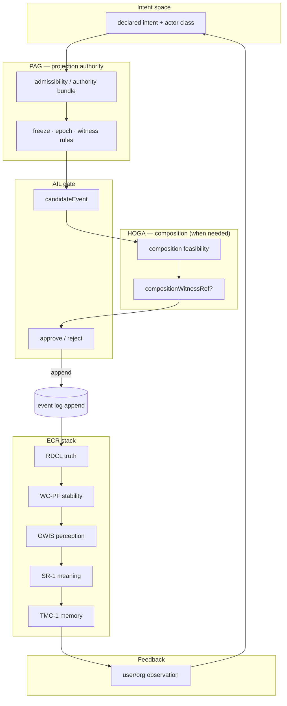

# Rhizoh — AIL-1 Governance & Execution Junction (GEJ-1) (V1)

**Rol:** [AIL-1](RHIZOH_AGENCY_INTENT_SHAPING_V1.md) açıldığında kaçınılmaz olan **policy** ve **governance** katmanlarının, [ECR](RHIZOH_EPISTEMIC_CONTINUITY_RUNTIME_ECR_V1.md) çekirdeği ve mevcut **PAG / HOGA** sözleşmeleriyle **nerede birleştiğini** tanımlar; **[EAERT](RHIZOH_EAERT_EXECUTION_EQUIVALENCE_V1.md)** ile **icra denkliği** tamamlanır. Bu belge **ürün ekranı** değil — **canlılık eşiği** (live system threshold) için execution sözleşmesidir.

**Önkoşul:** [AIL-1](RHIZOH_AGENCY_INTENT_SHAPING_V1.md) · [ECR Execution Model](RHIZOH_ECR_EXECUTION_MODEL_V1.md) · [RDCL Implementation Map](RHIZOH_RDCL_IMPLEMENTATION_MAP_V1.md)

**Normatif üst bağlar (Castle epistemik çekirdek):** [PAG-1](PAG_1_PROJECTION_AUTHORITY_GOVERNANCE_V1.md) · [HOGA-1](ECER_ADV_HOGA_1_HIGHER_ORDER_GOVERNANCE_ALGEBRA.md) · [TTA-1](ECER_ADV_TLOA_TRANSITION_ALGEBRA_TTA_1.md)

**Durum:** `NORMATIVE_TARGET`

---

## 1. Kritik gerilim (saklanmaz)

Asıl soru artık **“kim değiştiriyor?”** değil —

**“Hangi intent gerçekliği şekillendiriyor?”**

| Sonuç | Açıklama |
|--------|-----------|
| **Policy layer** | Hangi `intent` sınıflarının hangi **event** tiplerine dönüşebileceği **yazılı kural** olmadan sistem **canlı** sayılmaz |
| **Governance layer** | Intent’ler arası **çelişki**, **öncelik**, **freeze / CUT_OVER** ve **minority witness** fiilen **değerlendirici** hale gelir |

Bu birleşim teknikten çıkar: **epistemic governance architecture** (yalnız runtime değil, **meşruiyet yüzeyi**). Tasarım uzayı: **controlled reality admission** — yalnız uygulama değil, **hangi gerçekliğin log’a kabullenmesi** sorusu.

---

## 1b. GEJ-1 olmadan ve ile (dürüst risk)

| Durum | Risk / kazanç |
|--------|----------------|
| **GEJ-1 yok** | **AIL-1 → kontrolsüz reality drift** (meşruiyetsiz veya çelişkili intent log’a düşer) · **ECR → doğru ama anlamsız tutarlılık** (içsel hash uyur, dışsal “gerçek dünya” sapar) |
| **GEJ-1 var** | Sistem ilk kez **“ne gerçek olacak?”** sorusunu **yönetir** — yani **hangi olaylar gerçekliğe kabullenir** (admission), sonra ECR deterministik işler |

---

## 2. Üçlü rol (sabit tanım)

| Bileşen | Rol (kısa isim) | Soru |
|---------|------------------|------|
| **ECR** | **Ontology** — *what exists* (log sonrası tutarlı türev; [EAERT §0](RHIZOH_EAERT_EXECUTION_EQUIVALENCE_V1.md) ile aynı çekirdek dil) | Verilen olaylar için **deterministik** state / perception / meaning / memory |
| **GEJ-1** | **Reality admission law** — *what becomes real* | **Hangi** `intent` / `candidateEvent` **log’a yazılabilir**? (PAG / HOGA) |
| **AIL-1** | **Reality manipulation engine** — *how it changes* | **Nasıl** yeni olay üretilir, hangi kanallar, hangi sınırlar |
| **EAERT** | **Distributed execution equivalence** — *how it is enforced* | **Her node’da aynı** admission + transformation + projection mı? ([EAERT V1](RHIZOH_EAERT_EXECUTION_EQUIVALENCE_V1.md)) |

**Sonuç cümleleri:**

- **ECR** = pasif değil, **deterministik** substrat.  
- **AIL-1** = güçlü ama **sınırsız değil** — sınır GEJ + EAERT’tir.  
- **GEJ-1** = sistemin **politik fiziği** (admission).  
- **EAERT** = **icra denkliği** — “tek doğru üretir” değil, **“tek gerçeklik bozulmadan taşınır”**.

**Mimari sıçrama:**

| Önce | Şimdi |
|------|--------|
| “Olaylar **doğru işleniyor** mu?” | “**Hangi olaylar** gerçeğe **dönüşebilir**?” |

> **Sabit cümle:** Sistem artık yalnızca gerçekliği **hesaplamıyor** — gerçekliğin **hangi intent ile oluşabileceğini** **seçiyor** (admission).

**Dörtlü çekirdek:** [EAERT §0](RHIZOH_EAERT_EXECUTION_EQUIVALENCE_V1.md) — artık **genişletilemez**, yalnızca **instantiate** edilir.

---

## 3. AIL-1 hangi noktada PAG / HOGA ile birleşir? (cevap özeti)

| Birleşim | Yer | Ne sorulur? |
|-----------|-----|-------------|
| **PAG** | **Event append öncesi** — *admissibility gate* | Bu `intent` → `candidateEvent` dönüşümü **hangi projection authority / steward / council** zinciriyle **meşru**? FREEZE / epoch / minority witness kuralları ihlal **yok** mu? ([PAG-1](PAG_1_PROJECTION_AUTHORITY_GOVERNANCE_V1.md)) |
| **HOGA** | **Toplu veya bileşik müdahale öncesi** — *composition gate* | İki veya daha fazla intent-taşıyan eylem **birlikte** uygulanınca MetaΔ/ECPT anlamında **fail-closed** mı? Bilinmeyen bileşim ⇒ **AMBIGUOUS** + witness şartı ([HOGA-1](ECER_ADV_HOGA_1_HIGHER_ORDER_GOVERNANCE_ALGEBRA.md)) |
| **ECR (RDCL / WC-PF / …)** | **Append sonrası** | Olaylar **deterministik** işlenir; arıza **WC-PF**; anlam **SR-1**; hafıza **TMC-1** |

**Canlılık eşiği cümlesi:** PAG + (gerektiğinde) HOGA **yeşil** olmadan `rhizoh_events`’a **yazılmamalı**; yazılsa bile **EAERT** olmadan **divergent execution reality** riski kalır — tam canlı iddia için **PAG/HOGA + EAERT**.

---

## 4. Execution flow (intent → … → feedback)



**Okuma:** `COMP` / `WIT` yalnızca **çoklu** veya **sıra-duyarlı** müdahale paketlerinde zorunlu; tekil, önceden izinli intent→event yolu PAG ile kapanabilir.

---

## 5. WC-PF ve OWIS ile sıra

- **WC-PF:** Append **sonrası** snapshot / replay arızası — AIL **önce** meşruiyet verir.  
- **OWIS:** State’ten world — AIL **world’ü değiştirmez**; yalnızca **state’i değiştiren olayın** girmesine izin verir.

---

## 6. Dürüst değerlendirme

| Parça | Durum |
|--------|--------|
| **ECR çekirdeği** | Tasarım olarak **tamam** (tutarlılık substratı) |
| **AIL-1 milatı** | **Var** — sınır dili tanımlı |
| **GEJ-1 (bu belge)** | **Junction + taxonomy + enforcement matrisi** — PAG/HOGA **sözleşmesi** burada |
| **EAERT** | **Normatif tanım [V1](RHIZOH_EAERT_EXECUTION_EQUIVALENCE_V1.md)** — kod / dağıtık enforcement **sprint** |
| **“Canlı sistem”** | **PAG (+isteğe HOGA) + EAERT** üretimde yoksa iddia **zayıf** |

---

## 6b. Full execution loop (zincir özeti)

Normatif sıra (§4 diyagramı ile aynı):

```text
GEJ-1 (intent) → PAG → HOGA? → AIL gate → append → RDCL → WC-PF → OWIS → SR-1 → TMC-1 → feedback → intent
```

**Not:** `HOGA?` yalnızca bileşik / sıra-duyarlı paketlerde zorunlu; tekil yol PAG ile kapanabilir.

---

## 7. GEJ-1 failure mode taxonomy (normatif)

| Mod | Tanım | Tipik belirti | Normatif tepki (özet) |
|-----|--------|----------------|------------------------|
| **Silent reality drift** | Admission zayıf veya bypass — log teknik olarak tutarlı, **kabullenilen gerçeklik kümesi** sessizce kayar | ECR hash / replay OK; ürün düzeyinde “yanlış his” · [RDCL drift](RHIZOH_RDCL_IMPLEMENTATION_MAP_V1.md#8-drift-detection-layer) uyumsuzluğu | GEJ audit + admission policy sıkılaştırma + SR-1/TMC şeffaflığı |
| **Forbidden reality attempt** | FREEZE / epoch / PAG ihlali ile **açıkça** yasak intent | `candidateEvent` **reject** | Red log + DLQ / companion açıklama (ürün); **append yok** |
| **Partial admission** | Paketin bir alt kümesi meşru, diğeri değil; **atomik olmayan** yazım | Yarım batch, sıra çelişkisi | **Fail-closed** — tamamı reddet veya HOGA witness + yeniden paketleme |
| **Ambiguous composition** | HOGA bilinmeyen bileşim sınıfı | `AMBIGUOUS` ([HOGA-1](ECER_ADV_HOGA_1_HIGHER_ORDER_GOVERNANCE_ALGEBRA.md)) | Witness zorunlu veya **ret**; sessiz kabul **yasak** |
| **Spurious double admission** | Aynı etki için çift kabul (idempotency ihlali) | Yinelenen projection | Idempotency anahtarı + GEJ replay testi |

Bu tablo **yazılım hata sınıfları** değil — **controlled reality admission** tasarım uzayının **epistemik** hata aileleridir.

---

## 8. Failure mode → PAG / HOGA enforcement mapping (matris)

| Failure mode (§7) | **PAG** (ne enforce edilir?) | **HOGA** (ne enforce edilir?) | Canlı gate notu |
|-------------------|------------------------------|-------------------------------|------------------|
| **Silent reality drift** | Authority bundle **scope** + epoch witness **dual-read** kuralları sıkılaştırılır; **DISSENT_CAPTURE** görünürlüğü | Bileşim sınıfı **yeniden sınıflandırma** — bilinmeyen çiftler `AMBIGUOUS` | **EAERT:** admission log vs projection hash **sürekli** karşılaştırma |
| **Forbidden reality attempt** | **FREEZE** / steward-council zinciri **hard reject** | — (çoğunlukla tek intent) | Gate **deny** + immutable audit |
| **Partial admission** | Paket başına **tek meşruiyet kararı** — alt öğe ihlali ⇒ tümü ret | **ORDER_SENSITIVE** ⇒ `compositionWitnessRef` zorunlu | **Atomik batch** veya tam ret (EAERT transaction sınırı) |
| **Ambiguous composition** | PAG ön şart: roller net değilse **ön ret** | `HOGA_ERR_COMPOSITION_UNDEFINED` / witness şartı | Fail-closed **default** |
| **Spurious double admission** | **Idempotent projection key** PAG policy alanına girer | Bileşik yolda **aynı etki** iki kez sayılmaz | EAERT **replay + idempotency** harness |

**EAERT:** Tam normatif tanım, invariant seti ve failure modeli — **[EAERT V1](RHIZOH_EAERT_EXECUTION_EQUIVALENCE_V1.md)** (üretim kodu ayrı sprint).

---

## 9. GEJ-1 ↔ AIL-1 conflict resolution physics (reality collision)

**Tanım:** İki (veya daha fazla) **kabullenilebilir** intent aynı `correlationId` veya aynı **projection surface** için **çelişkili** `candidateEvent` üretir → **reality collision**.

| Faz | Fizik (normatif) |
|-----|------------------|
| **C1 — Detection** | Aynı admission window içinde çakışan `candidate` kümesi tespit (policy graph). |
| **C2 — Classification** | (a) **commutative** — sıra önemsiz, birleşik HOGA sınıfı bilinir · (b) **order-sensitive** — witness şartı · (c) **incompatible** — birlikte kabul **yasak** |
| **C3 — Resolution** | **PAG öncelik:** steward/council önerisi + minority witness; **numeric tie-break yok** (epistemik olarak yasak) — ya **witness** ya **defer** ya **reject all** |
| **C4 — Materialization** | Tek **admitted** paket append; diğerleri **superseded** meta veya DLQ (TMC-1 append etiği korunur) |

**Özet:** Çarpışma **“hangisi kazandı?”** değil — **“hangi birlikte kabullenilebilir composition sınıfı var?”** sorusudur; cevap yoksa **fail-closed**.

---

## 10. Son teknik gerçek (dört üst katman + ECR içi modüller)

### 10.1 Üst omurga — gerçeklik üretim pipeline’ı (feature set değil)

| Katman | Soru | Rol |
|--------|------|-----|
| **ECR** | *What exists?* | **Ontology** — tutarlı türev gerçeklik |
| **GEJ-1** | *What may exist?* | **Admissibility** — admission law |
| **AIL-1** | *What is allowed to change?* | **Transformation** — intent / agency |
| **EAERT** | *What actually becomes real everywhere?* | **Execution equivalence** — **[EAERT V1](RHIZOH_EAERT_EXECUTION_EQUIVALENCE_V1.md)** |

**EAERT özeti:** GEJ-1 **izin verir**, AIL-1 **değiştirir**, ECR **hesaplar** — EAERT **“bu karar ve değişim her node’da aynı şekilde gerçekleşti mi?”** sorusunu **distributed execution equivalence** ile kapatır.

### 10.2 ECR içi modüller (önceki tablo — alt yapı)

| Modül | Rol (özet) |
|--------|------------|
| **RDCL** | Stabil **truth** |
| **WC-PF** | Failure-safe **world** |
| **OWIS** | **Perception** |
| **SR-1** | **Meaning** |
| **TMC-1** | **Memory** |

### 10.3 EAERT olmadan GEJ + AIL

**GEJ-1** politik olarak doğru · **AIL-1** intent olarak doğru olabilir; **EAERT** yoksa → **politik olarak doğru ama fiziksel olarak ayrışmış gerçeklikler** (aynı admitted akış, farklı node hissi).

### 10.4 Failure perspektifi (derinleşme)

Önce: wrong event / wrong state / wrong replay.  
Şimdi: **divergent execution reality** — aynı transformation → farklı node’larda farklı **reality**. Dört sınıf: [EAERT §3](RHIZOH_EAERT_EXECUTION_EQUIVALENCE_V1.md) (GEJ / AIL / ECR / **EAERT**).

### 10.5 Üst çerçeve (ne değil / ne)

- ❌ Klasik **software architecture** tek başına yeterli değil.  
- ✔ **Distributed reality constitution system** + **execution-consistent reality system** + **A0 invariant** ([EAERT §7](RHIZOH_EAERT_EXECUTION_EQUIVALENCE_V1.md)).

---

## 11. İlişkili belgeler

- **[EAERT V1 — Execution equivalence](RHIZOH_EAERT_EXECUTION_EQUIVALENCE_V1.md)**  
- [AIL-1](RHIZOH_AGENCY_INTENT_SHAPING_V1.md) · [ECR](RHIZOH_EPISTEMIC_CONTINUITY_RUNTIME_ECR_V1.md) · [ECR Execution Model](RHIZOH_ECR_EXECUTION_MODEL_V1.md) · [FER-1](RHIZOH_FIREBASE_EPISTEMIC_RUNTIME_SPEC_FER1.md)  
- [PAG-1](PAG_1_PROJECTION_AUTHORITY_GOVERNANCE_V1.md) · [HOGA-1](ECER_ADV_HOGA_1_HIGHER_ORDER_GOVERNANCE_ALGEBRA.md) · [TTA-1](ECER_ADV_TLOA_TRANSITION_ALGEBRA_TTA_1.md)  

---

*GEJ-1 — admission law; EAERT — execution equivalence; dörtlü pipeline.*
