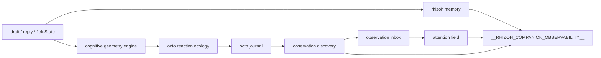
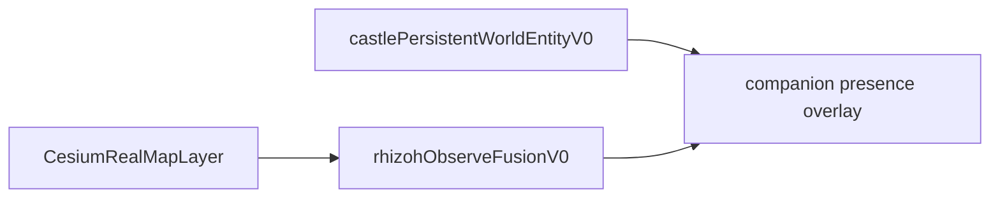

# Castle System Reality Graph v0

**Status:** RESEARCH-ONLY · **UI freeze + system introspection phase**  
**Tag:** `RESEARCH-ONLY` per [`SPECFLOW_MARKERS.md`](../SPECFLOW_MARKERS.md)

**Goal:** Redesign değil — var olan cognitive sistemin **davranış topolojisini görünür** kılmak.  
**Forward vision:** [`RHIZOH_DGCS_MULTI_INSTANCE_COGNITION_V0.md`](RHIZOH_DGCS_MULTI_INSTANCE_COGNITION_V0.md) · cognitive field map (below)

---

## Executive summary

| Layer | Truth anchor | Risk today |
|-------|--------------|------------|
| **Cube** | `cognition_ingress` topology | ✓ invariant sealed |
| **Observer** | Octo journal → inbox (read-only on cube) | ✓ Sprint E verified |
| **Companion** | Rhizoh attention (interpretation only) | ✓ soft coupling |
| **Cesium** | Geographic projection surface | Passive — not cube truth |
| **Command graph** | Voice registry + grammar | **Split brain:** map cmds emit, no Cesium consumer |
| **UI observability** | `__RHIZOH_COMPANION_OBSERVABILITY__` | **Console-only** — no panel reads it |

---

## [UI LAYER]

### Routes (`CastleShellRouter.jsx`)

| Path | Surface |
|------|---------|
| `/` | `AppRhizoh528` → T0 or spatial shell |
| `/dev/octo-lab` | `OctoConversationLabPageV1` — isolated Octo+cube sim |
| `/studio-live` | `StudioLiveRoomV1` (env-gated) |

### Core components

| Cluster | Key files |
|---------|-----------|
| **Octo stage** | `OctoConversationStageV1.jsx` — mounted: lab, T0 chrome, spatial dock |
| **Chat / T0** | `RhizohT0ShellChromeV1.jsx`, `AppRhizoh528T0.jsx` |
| **Spatial shell** | `RhizohSpatialWorldShell.jsx` + `RhizohConversationDockV0.jsx` |
| **Product drawer** | `UnifiedProductShellBar.jsx` → `RhizohProductSurfaceDrawerV0.jsx` |
| **Companion** | `CastlePetStudioPanelV0.jsx`, `CompanionDormancyOverlayV0.jsx`, `CompanionTimelinePanelV0.jsx` |
| **Studio live** | `StudioLiveRoomV1.jsx`, `StudioLiveRoomDrawerV1.jsx` |
| **Overlays / gates** | `WorldObservationGateV0.jsx`, `CastleInitiationGateV0.jsx`, `CastleAuthOverlay.jsx` |

### Panels by surface

| Surface id | Panels |
|------------|--------|
| `world` | No drawer (map-first) |
| `hall` | Control center, castle layers debug, kernel console |
| `studio` | World living map, kernel console |
| `profile` | Observable reality, pet studio, runtime health |
| `broadcast` / `greenroom` | Director deck |

### Habitat focus (visual, not voice)

`rhizohHabitatFocusModeV0.js` → modes `conversation` | `navigation` | `world`  
Affects: capability wheel opacity, chat dock scale, Octo strip height, map strip visibility.

**UI freeze rule:** Bu envanterde listelenen yüzeyler **değiştirilmez** — sadece graph overlay (dev) eklenebilir.

---

## [SPATIAL LAYER]

### Cube geometry field (truth)

```
user draft/reply
  → ingestCognitiveDraftV1 / ingestActiveSentenceV1  [cognition_ingress ONLY]
  → stepCognitiveGeometryEngineV1
  → octoSpeakingCrystalV1 (wire/glass cube + nodes)
```

| Module | Role |
|--------|------|
| `octoCognitiveGeometryCompilerV1.js` | Semantic → twist/fold/spikes/stretchY |
| `cubeTopologyOwnershipInvariantV0.js` | Agent/observers forbidden from topology write |
| `octoSpeakingCrystalV1.js` | Visual + tick orchestration |
| `octoCubeCentricCameraV1.js` | Camera lookAt = cube (Octo peripheral) |

### Observation field (witness)

| Module | Role |
|--------|------|
| `octoReactionEcologyV0.js` | Cube signal → Octo interest/behavior |
| `octoJournalV0.js` | Dwell, geometry kinds, curiosity |
| `octoObservationReportV0.js` | Discovery → inbox |
| `rhizohObservationInboxCouplingV0.js` | Inbox → attention (max 0.07) |
| `rhizohAttentionFieldV0.js` | Soft bias — suggests, does not command |

### Regime field (checkpoints)

| Artifact | Role |
|----------|------|
| `docs/academic/regime-checkpoints/sprint-e/*.json` | Dynamic regime proofs |
| `regimeDistanceMetricV0.js` | Checkpoint ↔ live distance |
| `window.__RHIZOH_COMPANION_OBSERVABILITY__.regimeDistanceFromLastCheckpoint` | Live metric |

### Cesium / world projection (non-truth)

| Module | Role |
|--------|------|
| `CesiumRealMapLayer.jsx` | Istanbul bootstrap viewport, POI, pet binding |
| `cesiumWorldProjectionBind.js` | Runtime → visible world projection |
| `rhizohPetCesiumSpatialBindingV0.js` | PWE → Cesium entity |
| `geographicAnchorsV0.js` | Calibration root (not universe center) |

**Boundary:** Cesium = projection surface. Cube = cognitive truth in Octo Lab / conversation stage.

### Fox (ambient + species — not yet observer tracer)

| Where | Status |
|-------|--------|
| `assetRegistryV1.js` → `/models/fox1.glb` | Loaded in `StudioLiveRoomV1` ambient slot |
| `observerSpeciesRegistryV0.js` → `fox_v1` | Spec only — `topologyWrite: false` |
| Octo Lab / conversation stage | **Not mounted** as second witness |

### Studio 3D (non-Cesium)

`StudioLiveRoomV1.jsx` — stage + ambient models (fox, medusa, robot), separate camera modes.

---

## [COMMAND GRAPH]

### Pipeline

```
voice STT / (text: partial path)
  → routeVoiceInputV0 / resolveLocalActionAuthorityV0
  → rhizohCommandGateV0 (confidence ≥ 0.82)
  → dispatchLocalCommandHandlerV0
  → layer handler → CustomEvent + state machine + app binding
```

| Registry | `rhizohLocalCommandRegistryV0.js` |
| Graph catalog | `rhizohCommandExecutionGraphV0.js` → `window.__CASTLE_COMMAND_EXECUTION_GRAPH__` |
| State machine | `rhizohCommandStateMachineV0.js` → `window.__CASTLE_COMMAND_STATE__` |

### Handlers → events

| Handler | Event | Binding target |
|---------|-------|----------------|
| `mapSpatialCommandHandlerV0` | `rhizoh:map-command` | `cesium.op` via `rhizohLocalCommandAppBindingV0` |
| `cameraVisionCommandHandlerV0` | `rhizoh:camera-command` | `camera.op` |
| `systemCastleCommandHandlerV0` | `rhizoh:system-command` | castle rooms, freeze, ghosts |
| `mediaCommandHandlerV0` | `rhizoh:media-command` | fake TV layer |
| `audioVoiceCommandHandlerV0` | `rhizoh:audio-command` | TTS rate, stop listening |

### Critical gaps (code facts)

| Command | Emitted | Consumed |
|---------|---------|----------|
| `map_open`, `map_zoom_in/out` | ✓ binding + event | **No Cesium subscriber in client src** |
| `rhizoh:command-state-changed` | ✓ | **No addEventListener found** |
| Text chat `handleExecute` | LLM / grammar | **Does not use** `routeVoiceInputV0` |
| Map tool fly (grammar) | `onOpenMapToolV0` → `rhizohWorldMapToolV0` | ✓ separate path from voice map cmds |

### Spatial commands that work today

| Trigger | Path | Effect |
|---------|------|--------|
| Grammar `OPEN_MAP_TOOL` | `AppRhizoh528T0` `handleExecute` | `SET_PRODUCT_SURFACE: world`, map fly |
| LLM directive `ZOOM_CASTLE` | `applyRhizohDirective` | `__CASTLE_CESIUM__.focusCastle` |
| Habitat mode `world` | `rhizohHabitatFocusModeV0` | UI visual shift |
| Studio camera modes | `studioLiveRoomCameraV1.js` | Orbit target change |
| Cube-centric camera | `octoCubeCentricCameraV1.js` | Topology micro-drift |

---

## [AGENTS]

### Octo (`octo_v1`)

| Role | Code fact |
|------|-----------|
| **Is** | Spatial observer tracer; journal + discovery |
| **Is not** | Map drawer; cube owner; camera center (cube-centric now) |
| **Motion** | `deriveOctoMotionDriveV1` ← fieldState, draft, reply, busy |
| **Mounts** | Lab, T0 chrome, spatial dock |

### Rhizoh (companion renderer)

| Role | Code fact |
|------|-----------|
| **Is** | Interpretation bridge; attention field; memory topics |
| **Is not** | Topology writer; execution authority |
| **INTERPRETING** | `rhizohFieldState` on voice/text LLM paths |
| **Coupling** | Inbox → attention only (Sprint E) |

### Fox (`fox_v1`)

| Role | Code fact |
|------|-----------|
| **Is** | Species registry profile; ambient GLB in live room |
| **Future** | Map anomaly detector — branching/spike entropy zones |
| **Is not** | Active observer in Octo Lab yet |

---

## [DATA FLOW]

### Primary cognitive chain (Octo Lab / T0 stage)



### Parallel world chain (Cesium / PWE)



**No edge today:** `attentionField` → Cesium (by design). Cube and map are **separate truth surfaces**.

### Observability sinks

| Global | Publisher | UI reader |
|--------|-----------|-----------|
| `__RHIZOH_COMPANION_OBSERVABILITY__` | `octoSpeakingCrystalV1` | **Console only** |
| `__CASTLE_COMMAND_EXECUTION_GRAPH__` | command graph | debug / cohort snapshot |
| `__CASTLE_COMMAND_STATE__` | state machine | debug |
| `__RHIZOH_OBSERVE_FUSION__` | observe fusion | gate copy only |
| `__RHIZOH_COMPANION_PRESENCE__` | companion presence | dormancy overlay |

---

## System graph — nodes & edges

### Nodes

| Node | Authority |
|------|-----------|
| `cube` | Truth (topology) |
| `octo` | Observation |
| `rhizoh` | Interpretation |
| `fox` | Spec / ambient (future witness) |
| `cesium` | Geographic projection |
| `attentionField` | Soft bias |
| `inbox` | Observation deposit ledger |
| `camera` | Perspective (cube-centric in lab) |
| `commandRegistry` | Voice/local intent |
| `habitatFocus` | UI visual policy |

### Control edges (user intent)

| Control | Effect layer |
|---------|--------------|
| zoom (voice cmd) | binding emitted — **orphan** |
| zoom (grammar/LLM) | Cesium fly ✓ |
| pan / map open | product surface + map tool ✓ |
| rotate | studio orbit / cube topology drift |
| focus octo | layer focus / habitat conversation mode |
| rhizoh interpret | fieldState INTERPRETING — no cube write |

### Truth edges (data)

| From | To | Write? |
|------|-----|--------|
| cognition_ingress | cube.targetTopology | ✓ only path |
| octo journal | inbox | ✓ reports |
| inbox | attentionField | ✓ capped |
| rhizoh memory | attentionField | ✓ topic signals |
| observer/companion | cube | **✗ forbidden** |
| chat text (T0) | cube | ✓ via draft prop to stage |
| cesium | cube | **✗ none** |

---

## Cognitive field map — forward model (not UI yet)

**Not** classic `location → marker`. **State → field intensity.**

| Layer | Renderer (proposed) | Data source |
|-------|---------------------|-------------|
| L1 Geometry heatmap | `cubeFieldRendererV1` | `currentTopology`, engine energy |
| L2 Observation density | `observationTraceLayerV1` | journal favorites, inbox events |
| L3 Regime overlay | `regimeOverlayLayerV1` | checkpoints, `ledBy`, regime distance |
| L4 Invariant boundary | `invariantBoundaryRendererV1` | `topologyOwnership`, forbidden writers |

### Map interaction semantics (reading system)

| Gesture | Meaning |
|---------|---------|
| zoom | perspective shift |
| pan | observation traversal |
| rotate | cognitive angle change |

**Rule:** Map is **cube-driven projection** — never agent-driven, never UI-driven fiction.

### Target data model

```json
{
  "geometryField": {
    "stretch": [],
    "branching": [],
    "twist": []
  },
  "observationEvents": [],
  "regimeCheckpoints": [],
  "invariant": "cube.topology.never_agent_owned"
}
```

---

## Step plan (from here)

| Step | Status |
|------|--------|
| **1 — System inventory** | ✓ this document |
| **2 — Graph extraction** | ✓ nodes/edges above |
| **3 — Overlay debug layer** | ⏳ dev-only graph viz (optional) |
| **4 — Fox/Cesium/Rhizoh trace mapping** | ⏳ after S3 |

### Immediate fixes (when execution resumes)

1. Wire `rhizoh:local-command-binding` Cesium consumer OR document voice map cmds as **registry-only**
2. Optional dev panel reading `__RHIZOH_COMPANION_OBSERVABILITY__` (no prod UI change)
3. Fox as second witness in Octo Lab (species registry already exists)

---

## Related

- [`RHIZOH_OBSERVER_FIELD_NODE_V0.md`](RHIZOH_OBSERVER_FIELD_NODE_V0.md)
- [`regime-checkpoints/REGIME_DISTANCE_METRIC_V0.md`](academic/regime-checkpoints/REGIME_DISTANCE_METRIC_V0.md)
- [`RHIZOH_WORLD_MESH_MENTAL_MODEL_V1.0.md`](RHIZOH_WORLD_MESH_MENTAL_MODEL_V1.0.md)
- [`OBSERVATION_FABRIC_V1.md`](OBSERVATION_FABRIC_V1.md)
