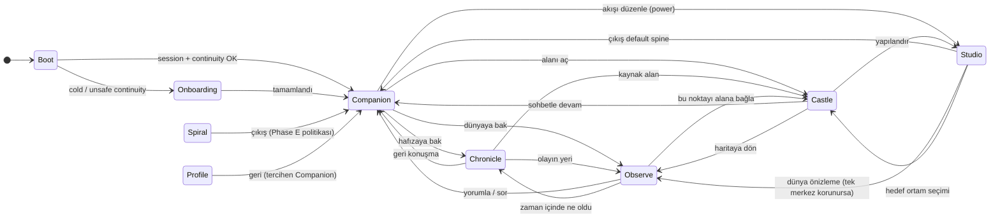

# Rhizoh — Companion-first final UX state machine (V1)

**Rol:** Ürün kabuğu için **hedef** navigasyon ve zihinsel durum makinesi — gerçek uygulama akışı, ekran geçişleri ve **state sadeleştirme** ilkeleri. Kod envanteri değil; implementasyon `apps/client` ile zaman içinde hizalanır.

**Normatif üst belgeler:** [FREEZE-0](RHIZOH_FREEZE_0.md) (tek duygusal merkez, UI collapse) · [Implementation Map](RHIZOH_IMPLEMENTATION_MAP.md) (spine vs ikinci halka) · [Companion Journey](RHIZOH_COMPANION_REFERENCE_JOURNEY.md) · **Geçiş sözleşmesi:** [State Transition Spec V1](RHIZOH_STATE_TRANSITION_SPEC_V1.md) · **Companion→Observe koreografi:** [TCS-1](RHIZOH_TRANSITION_CHOREOGRAPHY_SPEC_TCS1.md) · **Observe dünya enjeksiyonu:** [OWIS-1](RHIZOH_OBSERVE_WORLD_INJECTION_SPEC_OWIS1.md) · **Deneyim stresi:** [ESTL-1](RHIZOH_EXPERIENCE_STRESS_TEST_LAYER_ESTL1.md) · **Kopma raporu:** [ESTL UX Collapse Report](RHIZOH_ESTL_UX_COLLAPSE_REPORT_V1.md) · **UI collapse optimizasyonu:** [ESTL UI Collapse Optimization](RHIZOH_ESTL_UI_COLLAPSE_OPTIMIZATION_V1.md) · **OPT diff viewer:** [ESTL-OPT UI Diff Viewer](RHIZOH_ESTL_OPT_UI_DIFF_VIEWER_V1.md) · **Algı ekonomisi:** [ESTL döngüsü](RHIZOH_PERCEPTION_ECONOMY_AND_ESTL_LOOP_V1.md) · **Canlı doğrulama:** [ESTL Full-Cycle Live Session](RHIZOH_ESTL_FULL_CYCLE_LIVE_SESSION_V1.md)

**Kaynak gerçeklik (bugün):** `CastleShellRouter` tüm path’leri tek `AppRhizoh528`’e verir; `productSurface` `SET_PRODUCT_SURFACE` ile güncellenir ve izinli küme şu an: `world | hall | greenroom | broadcast | studio | profile` (`AppRhizoh528.jsx`). Alt bar: `UnifiedProductShellBar.jsx`.

**Durum:** `NORMATIVE_TARGET` — V1 hedef makine; rota/isim refactor’u yapıldıkça “Bugün” sütunu güncellenir.

---

## 1. Tasarım ilkesi (tek cümle)

**URL = kullanıcının “hangi dünyadayım?” cevabı; `productSurface` = bu cevabın tek UI özeti; çekirdek state’i ürün navigasyonuna taşınmaz.**

---

## 2. İki halka (geçiş kuralları üstünde)

| Halka | Yüzeyler | Geçiş kuralı |
|-------|-----------|----------------|
| **Spine (Rhizoh OS “homepage”)** | Companion · Chronicle · Observe | Varsayılan dönüş, cold start, geri tuşu önce buraya bağlanır. |
| **İkinci halka** | Castle · Studio · Spiral (+ Hall / GreenRoom / Broadcast ürün kararına göre) | Spine’dan **bilinçli** geçiş; geri dönüş spine’a **tek adımda** netleşir. |

**Yasaklı yüzey:** Spine ekranında ikinci halkanın **duygusal merkezini** aynı anda öne çıkarmak (FREEZE-0 ihlali).

---

## 3. Final durum kümesi (hedef `productSurface` / rota)

V1’de isimler **kullanıcı zihniyeti** ile birebir hizalanır (Implementation Map ile aynı dil).

| Hedef `id` | Hedef rota (öneri) | Zihinsel durum | Duygusal merkez | Not |
|------------|-------------------|----------------|-----------------|-----|
| `companion` | `/companion` | Bağ kurma | Connection | **Default landing** (auth sonrası). |
| `chronicle` | `/chronicle` | Hafızayı tutma | Memory | Tek zaman çizelgesi merkezi. |
| `observe` | `/observe` (veya `/map` → redirect) | Fark etme | Awareness | Harita / dünya hissi; tek merkez. |
| `castle` | `/castle/:castleId` veya eşdeğer | Buradayım | Presence | URL ile paylaşılabilir alan. |
| `studio` | `/studio` | Akışı yönetme | Control | Graph / workflow; ağırlık burada kalır. |
| `spiral` | `/spiral` | (Phase E) Kolektif deneysellik | — | Policy ile kapalı / geç açılır ([FREEZE-0 §7](RHIZOH_FREEZE_0.md)). |
| `profile` | `/settings`, `/academy` → tek mantık | Kimlik / tercih | — | Ayarlar; spine’dan ayrı “hesap” modu. |
| `live` (opsiyonel birleşik) | `/hall/*`, `/greenroom/*`, `/broadcast/*` | Canlı ortam | Presence + performans | İstersen alt-state; üst seviyede tek `live` ile sadeleştirilebilir. |

**Bugünkü kod eşlemesi (geçiş):** `world` → hedef `observe`; `/map` ve kök `/` için tek politikada birleştirme; `companion` / `chronicle` / `castle` henüz yoksa **stub route + aynı duygusal merkez** ile açılır.

---

## 4. Durum geçiş grafiği (hedef)

Aşağıdaki kenarlar **ürün olarak izinli** ana geçişlerdir; her kenar = tek duygusal merkez değişimi.

**Okuma:** Çift yönlü çoğu kenar vardır; fakat **default geri** (sistem “nerede bıraktım?”) **Companion** veya son spine ekranıdır (ürün kararı: Companion = ev).

---

## 5. Ekran geçiş tablosu (izin matrisi — özet)

Satır = “neredeyim”; sütun = “tek dokunuşla mantıklı sonraki dünya”.

|  | → Companion | → Chronicle | → Observe | → Castle | → Studio | → Spiral | → Profile |
|--|:-----------:|:-----------:|:---------:|:--------:|:--------:|:--------:|:---------:|
| **Companion** | — | ✓ | ✓ | ✓ | ✓ (secondary) | gated | ✓ |
| **Chronicle** | ✓ | — | ✓ | ✓ | ✓ (secondary) | gated | ✓ |
| **Observe** | ✓ | ✓ | — | ✓ | ✓ (secondary) | gated | ✓ |
| **Castle** | ✓ | ✓ | ✓ | — | ✓ | gated | ✓ |
| **Studio** | ✓ (tercih) | ✓ | ✓ | ✓ | — | gated | ✓ |
| **Spiral** | ✓ | ○ | ○ | ○ | ○ | — | ✓ |

**Gated:** Spiral yalnız Phase E / feature flag; spine’dan doğrudan **önerilmez** (FREEZE-0).

**Secondary:** Studio’ya geçiş “güç kullanıcısı” yolu; alt bar veya üst seviye nav’da Companion’dan daha az görünür olmalı.

---

## 6. Gerçek uygulama akışı (oturum yaşam döngüsü)

1. **Boot** — Router path okunur; continuity katmanı (auth, WS, local continuity) **Companion’a hazırlık** yapar; kullanıcıya kernel gösterilmez.
2. **Cold start** — `Onboarding` (kısa, sakin); bitince **tek** hedef: `Companion`.
3. **Warm return** — Deep link yoksa **Companion**; deep link varsa ilgili spine/ikinci halka state’i, fakat **tek merkez** kuralı korunur.
4. **Deep link** — `/chronicle#…`, `/observe?…`, `/castle/…` doğrudan giriş; üstte/bottom nav’da **bulunduğun dünya** net etiketlenir.
5. **Çıkış / arka plan** — Uygulama geri geldiğinde önce **path**; path belirsizse **Companion**.

---

## 7. State sadeleştirme (uygulanabilir kurallar)

### 7.1 Tek doğruluk kaynağı

- **Öncelik sırası:** `location.pathname` (ve gerekli `search`) → `productSurface` türetimi. Manuel `dispatch(SET_PRODUCT_SURFACE)` yalnız path ile **çelişmiyorsa** kullanılır.
- **Anti-pattern:** Sohbet aşaması, harita modu, studio drawer ve `productSurface`’in **farklı hikâyeler** anlatması (“doğru ama yaşanamaz”).

### 7.2 Ürün state’inin küçültülmesi

Aşağıdakiler **Companion/Chronicle** rotalarında görünür olmamalı veya **katı mod** ile kilitlenmeli:

- `layerFocus`, `satelliteScanMode`, ağır kernel panelleri (Observe/Studio’da kalır).
- `viewMode: CITIZEN | DEVELOPER` — geliştirici yüzeyi **ayrı route** veya gizli jest; spine ile **aynı ekranda** birleşmez.
- `rhizohSceneAnchor` — öncelikle Observe/Studio sahnesi; Companion’da yalnız sakin mikro-UX (FREEZE-0 uygunluğu şart).

### 7.3 `/spiral` bugünkü eşleme riski

Şu an `/spiral` → `productSurface: "studio"` ([Implementation Map kaynak notu](RHIZOH_IMPLEMENTATION_MAP.md)). Hedef: **`spiral` ayrı `id`** veya en azından Studio içinde **ayrı alt-state**; aksi halde “kontrol” ile “kolektif deneysellik” duygusal olarak karışır.

### 7.4 Alt navigasyon (Hall / GreenRoom / Broadcast)

İki seçenek (birini kilitle):

- **A)** Hepsi `live` altında birleşik FSM (oda = alt parametre).
- **B)** Ayrı `id`’ler kalır; o zaman spine alt barında **en fazla 3–4** öğe görünür, canlı salonlar “Companion’dan girilen mod” olarak konumlanır.

---

## 8. Bottom bar / shell (hedef UX)

**Spine’da sabit 3:** Companion · Chronicle · Observe.

**İkinci halka:** Castle · Studio · (Spiral gated) · Profile — “daha az sıklık” konumu (overflow menü veya ikinci satır); FREEZE-0’a aykırı **altı eşit güçlü tab** yerine hiyerarşi.

Bugünkü `PRODUCT_SHELL_ITEMS` (`world`, `hall`, …) hedef tabloya **rename + reorder** ile evrilir; rota senkronu aynı dosyada veya `AppRhizoh528` path effect’inde güncellenir.

---

## 9. Invisible Kernel Tests ile hizalama

Her major geçiş için soru: **“Kullanıcı hangi dünyadayım?”** — cevap **etiket + animasyon + tek merkez** ile verilebiliyorsa geçer; verilemiyorsa geçiş **daraltılmalı** ([Implementation Map §5](RHIZOH_IMPLEMENTATION_MAP.md)).

---

## 10. Uygulama checklist (V1 → kod)

1. `/companion` route + `companion` surface; default redirect auth sonrası.
2. `/chronicle` route + `chronicle` surface; parçalı hafıza birleştirilir.
3. `world` → `observe` (veya `/map` → `/observe` redirect) + alt bar dilinde “Observe”.
4. `/spiral` için `studio` ile surface birleştirmesini kaldır veya alt-state ile ayır.
5. Path → surface effect tek yerde toplanır; çelişen dispatch’ler temizlenir.
6. Companion/Chronicle’da `layerFocus` / developer araçları **görünmez**.

---

*Companion-first UX state machine V1 — spine FSM, ikinci halka, URL önceliği, state sadeleştirme.*
