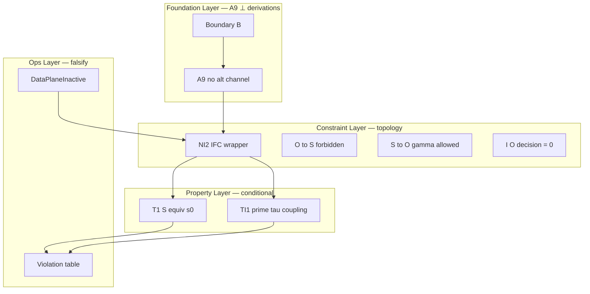

# Rhizoh Constraint Closure Map v1.0

**Status:** ACTIVE (topology SSOT — **boundary system**, not proof engine)  
**Phase:** 0.5 formal stack **closed** after this map  
**Parent:** [`RHIZOH_SYSTEM_NON_INTERFERENCE_THEOREM_V2.0.md`](RHIZOH_SYSTEM_NON_INTERFERENCE_THEOREM_V2.0.md)  
**Academic track (Phase A — compression only):** [`RHIZOH_TLA_EXECUTION_CORE_SKETCH_V1.0.md`](RHIZOH_TLA_EXECUTION_CORE_SKETCH_V1.0.md)  
**Operational kernel (4 primitives, no metaphor):** [`architecture/rhizoh_spec_v1.md`](architecture/rhizoh_spec_v1.md) (ROKS v1.0) · measurements: [`architecture/rhizoh_canonical_measurement_map_v1.md`](architecture/rhizoh_canonical_measurement_map_v1.md) · runtime role lock: [`architecture/rhizoh_runtime_semantic_role_lock_v1.md`](architecture/rhizoh_runtime_semantic_role_lock_v1.md) · epistemic firewall: [`architecture/rhizoh_final_epistemic_firewall_v1.md`](architecture/rhizoh_final_epistemic_firewall_v1.md) · authority graph: [`architecture/rhizoh_authority_graph_audit_v1.md`](architecture/rhizoh_authority_graph_audit_v1.md)

**One sentence:** Rhizoh guarantees **allowed information-flow topology** under explicit foundation axioms — not “truth of a single theorem.”

---

## 0. Class shift (read this first)

| Old framing | Current framing |
|-------------|-----------------|
| Proof engine | **Constraint-satisfied boundary system** |
| T1 = main proof object | T1 = **property** under NI2 wrapper |
| “Is this true?” | “**Under which axioms** is this guaranteed?” |
| Theorem stack grows | **Formal expansion stops** at Phase 0.5 (NI2 §0 guard) |

**T1** is no longer marketed as a standalone “provable theorem” — it is a **constraint-satisfied system property** conditional on **A9 ∈ Foundation Layer**.

---

## 1. Layer topology (three planes)



| Layer | Role | Failure mode |
|-------|------|----------------|
| **Foundation** | Existence conditions — **not derived** | Single-point: A9 false ⇒ **entire stack void** |
| **Constraint** | Allowed flow topology (IFC) | NI2 violated ⇒ security model broken |
| **Property** | What holds *if* constraints hold | T1/TI1 false ⇒ implementation bug |
| **Ops** | Executable falsification | Hash/tick/O→S rows |

---

## 2. Dependency DAG (canonical)

```
Boundary B
    └── A9 (FOUNDATION — unprovable inside stack)
            ├── DataPlaneInactive (runtime gate ↔ A6)
            ├── Adversary A_net (bounded injection)
            └── NI2 (non-interference wrapper)
                    ├── γ : S → O  [allowed]
                    ├── ¬(O → S)   [forbidden]
                    ├── I(O; decision(S+)) = 0
                    ├── T1  (S_t ≡ s_0)
                    └── TI1′ (τ_adv = τ_canonical, dI_ext/dτ = 0)
```

**Transitive closure rule:** No path from `I_ext` or `O` to `δ` except `π_core → ⊥` when inactive.

**Cascade (failure propagation):**

| Fails first | Cascade |
|-------------|---------|
| **A9** | T1, TI1′, NI2, MI constraint — **all void** (not “partially true”) |
| **DataPlaneInactive** (ops) | π not forced to ⊥ — T1 may fail |
| **¬(O→S)** (O1 breach) | MI constraint fails; control-plane leakage |
| **TI1′** | τ skew — temporal isolation broken; T1′ combined claim fails |
| **T1 only** | State inflation — core breach; independent of O size |

---

## 3. Constraint vs theorem vs axiom (classification table)

| ID | Name | Class | Depends on | Provable inside stack? |
|----|------|-------|------------|------------------------|
| **A9** | No alternative channel | **FOUNDATION AXIOM** | Boundary B | **No** — A9 ⟂ all derivations |
| A1–A8, A10 | δ total, Σ closed, etc. | Structural axiom | — | Assumed / enforced by code shape |
| A6 / gate | DataPlaneInactive | **Operational invariant** | env + `phase1ActivationGateV0` | CI (P1) |
| **NI2** | IFC bidirectional closure | **Constraint wrapper** | A9, A1–A10, A_net | Conditional proof sketch |
| **¬(O→S)** | Backward non-interference | **Constraint** | NI2 | Phase 0.5 trivial (O inert); Phase 1+ needs O1 |
| **γ** | S → O observation | **Allowed channel** | NI2 | N/A (permitted) |
| **MI=0** | I(O; decision(S+))=0 | **Constraint** (strengthens ¬(O→S)) | ¬(O→S), S4 | Statistical / trace audit |
| **T1** | S_t ≡ s_0 | **System property** | NI2, L1–L4 | Conditional on A9 |
| **TI1′** | τ_adv = τ_canonical | **Temporal normalization** | T3, T4, ⊥ path | Conditional on A9 |
| **O1** | Witness non-feedback | **Deferred constraint** | Phase 1+ thaw | Not in Phase 0.5 closure |

**Naming rule:** Call **T1** a *property*, **NI2** a *constraint*, **A9** a *foundation* — avoid “Theorem proves security” in ops comms.

---

## 4. A9 — foundation fragility (explicit)

| Property | Statement |
|----------|-----------|
| Role | **Interpretation constraint** on codebase — **not mutable state** |
| Orthogonality | **A9 ⟂ derivations** — cannot be derived from L1–L4 |
| SPOF | Intentional **architectural** single point — not a bug |
| If A9 fails | Model **undefined** — not “system breaks gracefully” |
| Mitigation | P1 CI · capability isolation · violation row “A9 breach” |
| Doc status | [`RHIZOH_SYSTEM_NON_INTERFERENCE_THEOREM_V2.0.md`](RHIZOH_SYSTEM_NON_INTERFERENCE_THEOREM_V2.0.md) §5 |

**Academic label:** *A9 ∈ System Foundation Layer — boundary condition, not in-system variable.*

---

## 5. Information-flow lattice (dynamic observation)

| Node | Grows? | Affects S? |
|------|--------|------------|
| **S** (core) | No (T1 / P1-S) | — |
| **O** (observation) | Yes (Phase 1 ω — see O1 spec) | **Forbidden** |
| **Gateway buffer** | Yes (adversary flood) | **Forbidden** on S |
| **UI / γ(S)** | Display only | **Forbidden** on δ |

**Model name:** *Dynamic observation lattice* — O grows; **hard** ¬(O→S).

### 5.1 \(\gamma(S)\) — lossy (invariant)

| Variant | Rhizoh |
|---------|--------|
| Lossless mirror | ❌ |
| **Lossy abstraction** | ✅ \(\mathcal{O}(S) \subsetneq \text{Embed}(S)\) |

Observer is **not** full core state. Phase 1 witnesses do not reconstruct \(S\). Detail: [`RHIZOH_PHASE1_O1_CONSTRAINT_SPEC_V1.0.md`](RHIZOH_PHASE1_O1_CONSTRAINT_SPEC_V1.0.md) §3.

---

## 6. τ — semantic execution filter (hassas nokta)

| Event | `execution_step`? | Affects τ vs canonical? |
|-------|-------------------|-------------------------|
| Internal epistemic tick | Yes | Baseline drift (both runs) |
| \(p_k\) → \(\pi_{\text{core}}=\bot\) only | **No** | Must not add steps vs canonical |
| Meaningful \(\sigma \in \Sigma\) | Yes | Internal only when thawed |

**Nuance:** Under inactive data-plane, external input is **semantically null** for τ — τ trace is **adversary-independent** relative to canonical (not frozen at constant).

*Ref:* [`RHIZOH_TEMPORAL_ISOLATION_LEMMA_V1.0.md`](RHIZOH_TEMPORAL_ISOLATION_LEMMA_V1.0.md) §2.1

---

## 7. Falsification → constraint mapping

| Violation row | Broken constraint / property |
|---------------|-------------------------------|
| hash(\(S_t\)) ≠ hash(\(s_0\)) | **T1** / NI2.1 |
| τ_adv ≠ τ_canonical | **TI1′** / NI2.2 |
| O → S write | **¬(O→S)** / MI / NI2.3 |
| Routing ∝ packet rate only | **S4** / MI |
| Direct L1 write | **A9** (foundation breach) |

**Question answered:** *Under which axioms is this guaranteed?* — Row tells you **which layer** broke.

---

## 8. Document index (formal stack — closed)

| Order | Doc | Layer |
|-------|-----|-------|
| 1 | [`RHIZOH_STATE_ISOLATION_ASYNC_INPUT_PHASE0_5_V1.0.md`](RHIZOH_STATE_ISOLATION_ASYNC_INPUT_PHASE0_5_V1.0.md) | Spec |
| 2 | [`RHIZOH_STATE_ISOLATION_ADVERSARY_MODEL_V1.0.md`](RHIZOH_STATE_ISOLATION_ADVERSARY_MODEL_V1.0.md) | Adversary |
| 3 | [`RHIZOH_TEMPORAL_ISOLATION_LEMMA_V1.0.md`](RHIZOH_TEMPORAL_ISOLATION_LEMMA_V1.0.md) | TI1′ |
| 4 | [`RHIZOH_STATE_ISOLATION_THEOREM_V1.0.md`](RHIZOH_STATE_ISOLATION_THEOREM_V1.0.md) | T1 property |
| 5 | [`RHIZOH_SYSTEM_NON_INTERFERENCE_THEOREM_V2.0.md`](RHIZOH_SYSTEM_NON_INTERFERENCE_THEOREM_V2.0.md) | NI2 |
| 6 | **This map** | Closure / DAG |
| — | [`RHIZOH_PHASE_GATE_OPERATING_MODE_V1.0.md`](RHIZOH_PHASE_GATE_OPERATING_MODE_V1.0.md) | Ops (not formal expand) |

**No new formal doc** after this file for Phase 0.5 unless a **new violation row** or **new channel** appears.

---

## 9. Next work (ops only)

| ID | Type | Action |
|----|------|--------|
| B-MUST | Ops | MANUAL readiness checklist |
| P2 | Ops | [`RHIZOH_O1_VIOLATION_EXECUTION_SPEC_V1.0.md`](RHIZOH_O1_VIOLATION_EXECUTION_SPEC_V1.0.md) · `npm run ops:o1-violation-harness` |
| O1 | Contract | [`RHIZOH_PHASE1_O1_CONSTRAINT_SPEC_V1.0.md`](RHIZOH_PHASE1_O1_CONSTRAINT_SPEC_V1.0.md) — implement after READY |

*Constraint closure map v1.0 — 2026-05-19*
