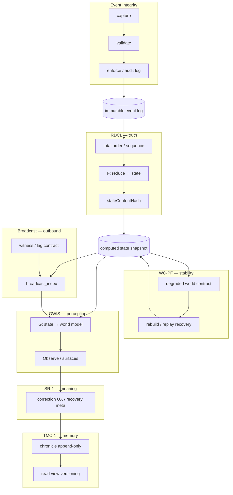
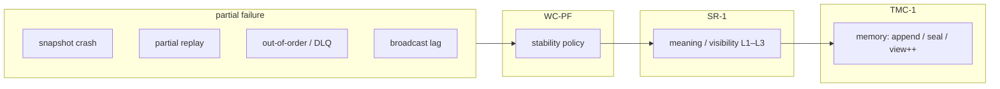
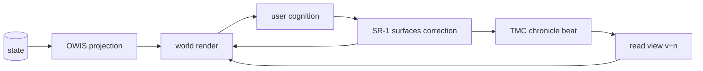
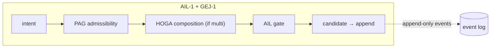

# Rhizoh — ECR Execution Model (V1)

**Rol:** [Epistemic Continuity Runtime (ECR)](RHIZOH_EPISTEMIC_CONTINUITY_RUNTIME_ECR_V1.md) için **sistem fiziği** seviyesinde tek sayfa: veri akışı, arıza enjeksiyonu, algı (OWIS) ve hafıza (TMC) döngüsü. **Ürün ekranı spesifikasyonu değil** — çalışma zamanı **topolojisi ve sözleşme sınırları**.

**Durum:** `NORMATIVE_TARGET`

---

## 1. Garanti zinciri (normatif ifade)

```text
same event → same reality → same interpretation → same memory coherence
```

Katman karşılığı: **Event Integrity** → **RDCL** (reality = state+world) → **WC-PF** (reality stabil) → **OWIS** (perception) → **SR-1** (interpretation / meaning) → **TMC-1** (memory coherence).

---

## 2. Boyutlar (pipeline)

```text
event → truth → stability → perception → meaning → memory
```

**Agency (AIL-1):** Bu pipeline’ın **üstüne** girer — `intent → policy → gated action → event append`. **PAG / HOGA** birleşim diyagramı ve canlılık eşiği: **[GEJ-1](RHIZOH_AIL1_GOVERNANCE_EXECUTION_JUNCTION_V1.md)**.

| Boyut | ECR modülü | Çıktı |
|-------|------------|--------|
| event | Integrity | geçerli append |
| truth | RDCL | `state`, `stateContentHash` |
| stability | WC-PF | `worldMode`, recovery motoru |
| perception | OWIS | `world` (render input) |
| meaning | SR-1 | `recovery` UX, L1–L3 |
| memory | TMC-1 | Chronicle append, view version |

**Broadcast** bu zincire **parallel outbound** dallanır (witness lag; state truth’tan ayrı).

---

## 3. Ana veri akışı (diyagram)



**Okuma:** `WC-PF` hem `ST` üzerinde çalışır hem `ST`’yi kurtarır; `Broadcast` `G`’ye **referans** verir, fakat harici gerçek **witness** ile gelir ([WC-PF §6](RHIZOH_WORLD_CONSISTENCY_PARTIAL_FAILURE_V1.md)).

---

## 4. Arıza ve anlam enjeksiyonu (diyagram)



**Kural:** Arıza **sessizce** dünya değiştirmez; önce **stability**, sonra **meaning**, sonra **memory** yazılır.

---

## 5. Algı + anlam + hafıza mikro-döngüsü



**TMC-1 kısıtı:** `CH` **rewrite değil** — yalnızca append, seal veya `viewVersion` ([TMC-1 §3](RHIZOH_TRUST_MEMORY_CONSISTENCY_V1.md)). “Gerçeklik değişmez; **okunma biçimi** evrimleşir.”

---

## 6. Dağılım dürüst notu (implementasyon)

| Blok | Tasarım | Tipik üretim kodu |
|------|---------|-------------------|
| RDCL + WC-PF | Tam (spec + map) | **Truth / recovery backend** kademeli |
| OWIS + SR-1 + TMC-1 | UX / meaning spec tam | **Runtime client** bağlama kısmi |
| Broadcast | Outbound spec | **Execution gap** (index / worker) |

---

## 7. Agency / intent (bilinçli boşluk — ECR v1)

Mevcut ana diyagram **yansıtma + tutarlılık** içindir. **Co-evolution** için AIL-1 + **[GEJ-1](RHIZOH_AIL1_GOVERNANCE_EXECUTION_JUNCTION_V1.md)** (PAG/HOGA) boru hattı gerekir — **canlılık eşiği** burada başlar.



---

## 8. Bir sonraki risk sınırı (ECR dışı değil — üst uyarı)

**Semantic drift across time + identity consistency:** Aynı kullanıcı kimliği farklı oturumlarda **farklı “gerçeklik hissi”** taşırsa, teknik doğruluk korunsa bile **ECR algısı** bozulur. Bu, TMC-1 sonrası **kimlik / oturum / companion sürekliliği** tasarım alanıdır (ayrı belge önerilir).

**Agency vakumu:** AIL-1 olmadan otomatik müdahaleler log’a dağınık yazılırsa tutarlılık ve güven zedelenir.

---

## 9. İlişkili belgeler

- [ECR çatı belgesi](RHIZOH_EPISTEMIC_CONTINUITY_RUNTIME_ECR_V1.md)  
- [AIL-1 — Agency & Intent Shaping](RHIZOH_AGENCY_INTENT_SHAPING_V1.md)  
- [GEJ-1 — Governance & Execution Junction](RHIZOH_AIL1_GOVERNANCE_EXECUTION_JUNCTION_V1.md)  
- [EAERT V1](RHIZOH_EAERT_EXECUTION_EQUIVALENCE_V1.md)  
- [RDCL Implementation Map](RHIZOH_RDCL_IMPLEMENTATION_MAP_V1.md)  
- [WC-PF](RHIZOH_WORLD_CONSISTENCY_PARTIAL_FAILURE_V1.md) · [SR-1](RHIZOH_SEMANTIC_RECOVERY_V1.md) · [TMC-1](RHIZOH_TRUST_MEMORY_CONSISTENCY_V1.md) · [OWIS-1](RHIZOH_OBSERVE_WORLD_INJECTION_SPEC_OWIS1.md)  

---

*ECR Execution Model V1 — dataflow, failure, perception, memory loop; agency AIL-1; enforcement EAERT.*
