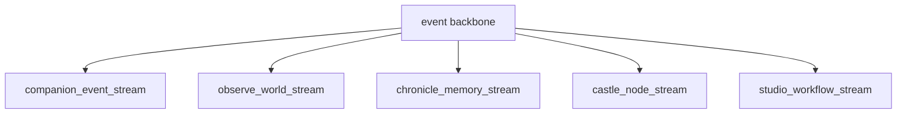

# Rhizoh — Firebase Epistemic Runtime Spec (FER-1)

**Rol:** “Teorik OS” → **realtime experiential OS** geçişi için **Firebase üzerinde eksik olan katmanları** normatif olarak tanımlar: **event omurgası**, **state sync sözleşmesi**, **canlı yayın / witness** hattına veri modeli. Bu belge **Console tıklama rehberi** değil; **isimlendirme, koleksiyon sözleşmesi, senkron kuralları ve ürün katmanları (TCS / OWIS / ESTL) ile eşleme**dir.

**Kaynak gerçeklik (bugün):** İstemci ve gateway **Firestore + Auth** kullanır (`apps/client/src/firebase/*`, `apps/gateway/src/firebasePersistence.js`). Örnek koleksiyonlar: `users/{uid}`, `active_castles/{uid}`. **Birleşik epistemic event bus**, **TCS↔Firestore canonical sync**, **reconciliation engine**, **Firestore Rules (epistemic)**, **broadcast index implementasyonu** henüz **yok** — FER-1 sözleşmeyi kilitlemiştir; aşağıdaki **durum tablosu** uygulama boşluklarını listeler.

**İlişkili:** [Implementation Map](RHIZOH_IMPLEMENTATION_MAP.md) · [TCS-1](RHIZOH_TRANSITION_CHOREOGRAPHY_SPEC_TCS1.md) · [OWIS-1](RHIZOH_OBSERVE_WORLD_INJECTION_SPEC_OWIS1.md) · [ESTL-1](RHIZOH_EXPERIENCE_STRESS_TEST_LAYER_ESTL1.md) · [Algı ekonomisi](RHIZOH_PERCEPTION_ECONOMY_AND_ESTL_LOOP_V1.md) · [Castle node runtime](CASTLE_NODE_RUNTIME_MODEL.md) · [Schema pack README](schemas/firebase/README.md) · [Firestore Rules intent](FIRESTORE_RULES_INTENT_FER1_V1.md) · **[Minimal Production Stack](RHIZOH_FER1_MINIMAL_PRODUCTION_STACK_V1.md)** · **[Runtime closure patch](RHIZOH_FER1_RUNTIME_CLOSURE_PATCH_V1.md)** · **[Production closure blueprint](RHIZOH_FER1_PRODUCTION_CLOSURE_BLUEPRINT_V1.md)** · **[RDCL implementation map](RHIZOH_RDCL_IMPLEMENTATION_MAP_V1.md)** · **[WC-PF partial failure](RHIZOH_WORLD_CONSISTENCY_PARTIAL_FAILURE_V1.md)** · **[Semantic recovery SR-1](RHIZOH_SEMANTIC_RECOVERY_V1.md)** · **[Trust memory TMC-1](RHIZOH_TRUST_MEMORY_CONSISTENCY_V1.md)** · **[ECR](RHIZOH_EPISTEMIC_CONTINUITY_RUNTIME_ECR_V1.md)** · **[ECR execution model](RHIZOH_ECR_EXECUTION_MODEL_V1.md)** · **[AIL-1 agency](RHIZOH_AGENCY_INTENT_SHAPING_V1.md)** · **[GEJ-1](RHIZOH_AIL1_GOVERNANCE_EXECUTION_JUNCTION_V1.md)** (PAG/HOGA junction) · **[EAERT](RHIZOH_EAERT_EXECUTION_EQUIVALENCE_V1.md)**

**Durum:** `NORMATIVE_TARGET`

---

## 1. Sistem durumu (tek cümle)

**Epistemic model complete, runtime causality incomplete** — tasarım ve dil tamam; **nedensellik (zaman çizelgesi + güvenli yazma + birleştirme)** kabloları eksik.

**Firebase şu an:** Rhizoh’un **sinir sistemi değil**, çoğunlukla **veri deposu + auth**; FER-1 sinir sisteminin **sözleşmesidir**.

---

## 2. Durum tablosu (net)

| Alan | TANIMLANDI (FER-1 dil + mimari) | GERÇEKLEŞMEDİ (kritik gap) |
|------|----------------------------------|-----------------------------|
| Event backbone | Mantıksal stream’ler, `type` / envelope alanları, koleksiyon yolu önerisi | **`rhizoh_events/...` fiziksel katman yok**; yalnız `users`, `active_castles`, gateway persistence |
| Event şema | İsim standardı + örnek OWIS event tipleri | **JSON Schema dosyaları yok**; validation yok; `schemaVersion` zorunluluğu enforce edilmiyor → [schema pack](schemas/firebase/README.md) |
| State sync üçlüsü | client ↔ firebase ↔ canonical diyagram + sözleşme maddeleri | **Reconciliation engine yok**; diff/merge, causal ordering, last-write politikası **kod yok** |
| Firestore Rules | “Kim yazar” üst seviye | **`firestore.rules` epistemic kapsam yok** → [Rules intent](FIRESTORE_RULES_INTENT_FER1_V1.md) |
| Live broadcast | event → witness → index → embed → Observe | **Index servisi, YouTube bridge, live registry, OWIS bağlama kodu** yok |
| ESTL hooks | Koleksiyon önerileri | **Yazma kota + rules + uygulama** yok |
| TCS / OWIS mapping | Alan tabloları | İstemci/gateway’de **Firebase alanlarına bağlı tek doğruluk** yok |

**Özet:** ✔ **Dil ve mimari tamam** · ❌ **Şema enforcement + runtime reconciliation + erişim kontrolü + broadcast kablosu** eksik.

---

## 3. Kritik mimari boşluk (bir cümle)

**Schema enforcement + runtime reconciliation + access control** — üçü olmadan event’ler **var** sayılsa bile sistem onları **güvenilir bir zaman çizelgesine ve tek gerçeğe** dönüştürmez.

---

## 4. Firebase tarafında somut eksikler

### A) `/events` (rhizoh_events) katmanı yok

Bugün: `users`, `active_castles`, `firebasePersistence` (gateway).  
Eksik: `rhizoh_events/` altında **companion / observe / chronicle / castle / studio** stream’lerine **append** edilen normatif koleksiyon ağacı.

### B) Rules (güvenlik) yok — **en kritik gap**

Eksik örnekler: ESTL write limiti; companion vs observe **yazma ayrımı**; TCS ayna alanlarında **whitelist**; broadcast koleksiyonlarında üyelik.  
Normatif intent: [FIRESTORE_RULES_INTENT_FER1_V1.md](FIRESTORE_RULES_INTENT_FER1_V1.md).

### C) Stream indexing yok

YouTube / live / Observe için **event → sıralı indeks → replayable stream** tablosu veya koleksiyon yok; “event var ama **zaman çizelgesi yok**” problemi burada çözülür.

---

## 5. Zincir kırılması (ürün kazanımı)

Önceki ürün zinciri: **TCS → OWIS → ESTL → UI**.  
FER-1 ile hedeflenen **runtime** zinciri: **TCS → Firebase → OWIS → UI** — ortada **ortak nedensellik ve güvenli yazma** katmanı vardır.

---

## 6. Taşıma katmanı (özet)

**Birincil taşıyıcı:** **Firestore** (mevcut kod ile uyum). **Realtime Database** isteğe bağlı ek hat — mantıksal stream adları aynı kalır.

---

## 7. A) Event backbone (mantıksal bus)



### 7.1 İsim standardı (event envelope)

| Alan | Kural |
|------|--------|
| **type** | `snake_case` + `_vN` soneki |
| **source** | `client` \| `gateway` \| `function` \| `witness` \| `system` |
| **schemaVersion** | Tamsayı; payload şeması değişince artar — **gateway validate zorunlu** |
| **occurredAt** | `serverTimestamp` tercih |
| **correlationId** | Zincirleme; **global uniqueness** Rules’ta değil → gateway / function |

**Payload:** [Schema pack](schemas/firebase/README.md) — `rhizoh_event_types.json` + `payloads/*.schema.json`.

### 7.2 Koleksiyon eşlemesi (öneri)

| Stream | Yol (öneri) |
|--------|-------------|
| companion | `rhizoh_events/companion/items` veya `companion_event_stream/{id}` |
| observe | `rhizoh_events/observe/items` |
| chronicle | `rhizoh_events/chronicle/items` |
| castle | `rhizoh_events/castle/items` (+ `active_castles` ile tek kaynak kuralı) |
| studio | `rhizoh_events/studio/items` |

---

## 8. B) State Sync Bridge + reconciliation (tasarım)

```text
client_state (TCS / UI)
        ↕  sync contract + throttle
firebase_realtime_state (ayna)
        ↕  reconciliation / merge
backend_canonical_state (gateway)
```

**Henüz yok:** `client_state ↔ canonical_state` **diff resolution**, **conflict merge**, **causal ordering** (vector clock veya gateway serial). TCS belgeleri var; **distributed consistency layer** yok.

---

## 9. C) Live Broadcast Layer

`domain_event` → witness → Firebase → **stream index** → YouTube/embed → Observe.  
**Eksik:** index katmanı, YouTube API köprüsü, **live stream registry**, **OWIS tek katman bağlama kodu**.

---

## 10. TCS ↔ Firebase

| TCS kavramı | Firebase alanı (öneri) |
|-------------|-------------------------|
| `productSurface` | `rhizoh_client_sync/{uid}/productSurface` |
| `tcsPhase` | telemetry; rules’ta whitelist |
| carry özeti | kısa alan; gateway ağırlıklı |

---

## 11. OWIS stream (observe)

Örnek `type`: `observe_skeleton_ready_v1`, `observe_anchor_committed_v1`, … — payload’da `primaryClaimCount` (max-2 ile uyum). **Enforcement:** Rules (kısmi) + **function**.

---

## 12. ESTL telemetry

`estl_sessions`, `estl_diff_index`, `estl_live_sessions` — **rules + kota** olmadan production’a açılmamalı ([intent](FIRESTORE_RULES_INTENT_FER1_V1.md)).

---

## 13. FER-1 implementation sprint (yeni spec değil — üç parça)

| Parça | Çıktı |
|-------|--------|
| **1 — Schema layer** | `docs/schemas/firebase/` doldurulur: `rhizoh_event_types.json`, envelope + payload JSON Schema; gateway’de validate; `schemaVersion` reddi. |
| **2 — Rules layer** | `firestore.rules` + emulator testleri; [Rules intent](FIRESTORE_RULES_INTENT_FER1_V1.md) ile satır satır eşleme. |
| **3 — Sync / broadcast bridge** | `rhizoh_client_sync` implementasyonu; reconciliation modülü (gateway); `broadcast_index` + dış API köprüsü + Observe dinleyicisi. |

**Eski §10 sıra listesi** bu sprint içinde parçalara bölünür; önce **1+2** (güvenli yazılan event), sonra **3**.

**Repo karşılığı (minimal stack):** [RHIZOH_FER1_MINIMAL_PRODUCTION_STACK_V1.md](RHIZOH_FER1_MINIMAL_PRODUCTION_STACK_V1.md) — şema dosyaları, deploy-ready rules parçası, gateway + Functions iskeleti.

---

## 14. Uygulama sırası (önerilen — özet)

1. Schema pack + gateway validate.  
2. Rules + `rhizoh_events` minimum companion + observe.  
3. `rhizoh_client_sync` + reconciliation v0.  
4. Chronicle + castle stream.  
5. Studio stream.  
6. Broadcast index + OWIS bind.  
7. ESTL koleksiyonları rules ile.

---

## 15. İlişkili belgeler

- [FREEZE-0](RHIZOH_FREEZE_0.md)  
- [Rhizoh Implementation Map](RHIZOH_IMPLEMENTATION_MAP.md)  
- [TCS-1](RHIZOH_TRANSITION_CHOREOGRAPHY_SPEC_TCS1.md) · [OWIS-1](RHIZOH_OBSERVE_WORLD_INJECTION_SPEC_OWIS1.md) · [ESTL-1](RHIZOH_EXPERIENCE_STRESS_TEST_LAYER_ESTL1.md)  

---

*FER-1 — epistemic runtime sözleşmesi; causality + rules + schema sprint.*
