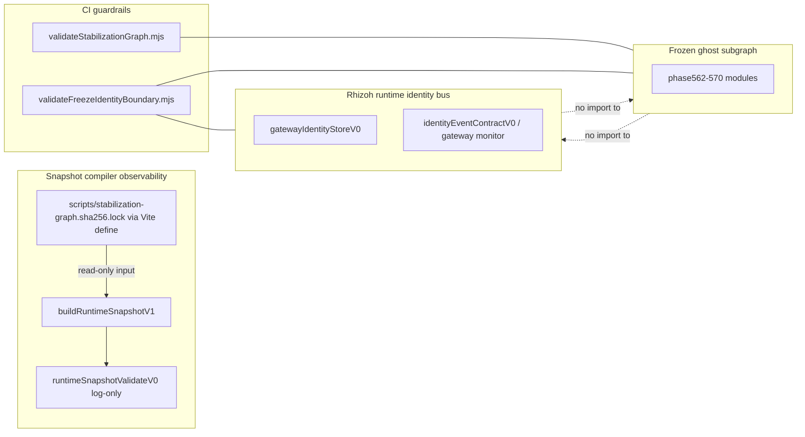

# Rhizoh — Freeze · Identity · Snapshot (canonical reference, V0)

**Faz adı (işletme):** Canonical SSOT Lock-in (Post-Architecture Stabilization) — **yeni özellik değil**, yanlış anlamayı ve drift’i CI + dokümanla zorlaştırma.  
**Faz:** Post-SSOT hardening / stability lock — **davranış genişletme değil**, sınır ve drift önleme.  
**Bu dosyanın rolü:** İstemci tarafında **freeze çekirdeği**, **gateway-owned `connectionId`**, ve **`runtimeSnapshot.v1`** arasındaki ilişkiyi tek yerde sabitler. Kod ve CI hâlâ üst merci; doküman yürütme motoru değildir.

**İlişkili (detay / envanter):**

- [`RHIZOH_SGRA_OPERATIONAL_MAP_V0.md`](RHIZOH_SGRA_OPERATIONAL_MAP_V0.md) — hangi katmanda hangi karar (decision routing)  
- [`RHIZOH_SESSION_IDENTITY_INVENTORY_V0.md`](RHIZOH_SESSION_IDENTITY_INVENTORY_V0.md) — `traceId` / continuity / `sessionId` binding haritası  
- [`RHIZOH_RUNTIME_FRAME_CORRELATION_V0.md`](RHIZOH_RUNTIME_FRAME_CORRELATION_V0.md) — `runtimeFrameId`, timeline, snapshot anahtarları  
- [`RHIZOH_RUNTIME_IDENTITY_RESOLUTION_FLOW_V0.md`](RHIZOH_RUNTIME_IDENTITY_RESOLUTION_FLOW_V0.md) — merge anları (ses/metin)  
- [`RHIZOH_SSOT_SELECTION_POLICY_V0.md`](RHIZOH_SSOT_SELECTION_POLICY_V0.md) — concern başına anchor (politika katmanı)

---

## 1. Ne SSOT değildir (epistemik sınır)

| Artefakt | Risk |
|----------|------|
| `runtimeSnapshot.v1` (sessionStorage / export) | **Gözlemlenebilirlik / kaza ayıklama** içindir; yürütme grafiğinin yerine geçmez. Log veya snapshot “tek gerçek” gibi okunmamalıdır. |
| `[CASTLE_SNAPSHOT_VALIDATION]` uyarıları | **Sessiz bozulma sinyali** (log-only); throw veya otomatik düzeltme yoktur. |
| Bu markdown dosyası | Kod ve `validateStabilizationGraph.mjs` + freeze–identity boundary script ile çelişirse **kod + CI doğru** kabul edilir; doküman güncellenir. |

---

## 2. Kimlik: `connectionId` sahipliği (istemci)

**Tek yazım yüzeyi (runtime store):** `apps/client/src/rhizoh/runtime/gatewayIdentityStoreV0.js`

- `setActiveConnectionId` ve `applyGatewayIdentityEvent` — **yalnızca gateway kökenli** olaylarla güncellenir; UI bu store’a `connectionId` yazmaz.
- Okuma: `getConnectionId()`, `subscribeGatewayIdentity`, `subscribeGatewayIdentitySimple` (ör. `useSyncExternalStore`).
- UI deseni: **intent emit** (ör. bağlantı seçimi sunucuya / gateway monitor’a) + **store subscribe**; React’ta **`connectionId` için gateway store dışında paralel “gizli state” tutulmaz** (regression sınıfı — aşağıdaki checklist; kod tabanında bu anti-pattern için CI grep guard vardır).

**POST gövdeleri:** Ana sohbet ve paneller mümkün olduğunca `getConnectionId()` ile hizalanır; bazı dar yollar (ör. belirli ses/HUD çağrıları) geçici olarak `connectionId: ""` geçebilir — envanterde “kalan yüzey” olarak not edilir, **bilinçli tekilleştirme** hedefi korunur.

---

## 3. Freeze ↔ Identity sınırı (CI guardrail)

**Drift guard pack (CI):** `scripts/validateCanonicalDriftGuards.mjs` — yasaklı UI dual-write token taraması, zorunlu canonical doc linkleri (üç dosya, kasıtlı dondurulmuş liste), `runtimeSnapshotV1` üst-seviye anahtar kilidi (`scripts/runtimeSnapshotV1.topLevelKeys.lock.json`, kaynakla bire bir; parse paylaşımı `runtimeSnapshotV1SnapBlockParse.mjs`), freeze–identity import sınırı (`validateFreezeIdentityBoundary.mjs` dahil).  
**npm:** `npm run stabilization:validate-canonical-drift` · lock yenileme: `npm run stabilization:snapshot-v1-top-level-lock:sync` · tekil freeze: `stabilization:validate-freeze-identity-boundary`.

**Kurallar (statik import yönü):**

1. `apps/client/src/ghost/*.js` (test hariç) → `rhizoh/runtime` **import edemez** (freeze yukarı coupling yapmaz).  
2. `apps/client/src/rhizoh/runtime/*.js` → `ghost` **import edemez** (identity otobüsü freeze’e yazmaz).

Bu, `validateStabilizationGraph.mjs` / hash kilidinin **yerine geçmez**; yalnızca **bağımlılık yönü** kilitidir.

---

## 4. Snapshot derleyici ve freeze graph girdisi

**Kod:** `apps/client/src/rhizoh/runtime/runtimeSnapshotV1.js`

- Snapshot, stabilization grafiğini **yeniden tanımlamaz**; yalnızca build zamanında enjekte edilen **tek satırlık kilit özeti**ni taşır: `freezeGraphLockSha256` (`vite.config.js` → `__CASTLE_STABILIZATION_GRAPH_SHA256_LOCK__`, kaynak `scripts/stabilization-graph.sha256.lock`).
- **Doğrulama (log-only):** `runtimeSnapshotValidateV0.js` — şema / alan uyumsuzluğu / türetilmiş `mergeId` tutarsızlığı / (prod’da) boş freeze lock → `console.warn`, throw yok.

---

## 5. Tek diyagram (sınır koruma)

---

## 5.5 Policy evolution — bu katmanda bilinçli dar tutma

Bu fazda risk artık çoğunlukla **politika evrimi**: guard’ların ve dokümanın kendisi şişerse false positive ve bakım yükü üretir.

| Risk | Karşı önlem |
|------|----------------|
| **Guard expansion creep** | `validateCanonicalDriftGuards.mjs` içinde yeni regex / yasaklı token **genişletme** yapmadan önce ayrı inceleme; tek dual-write token bilinçli dar kapsam. |
| **Snapshot schema inflation** | Yeni gözlemlenebilirlik alanlarını mümkünse **mevcut iç içe nesnelerin** altına koy (`studioCapability`, `gatewayState` vb.); üst seviye anahtar ekleme nadirdir. Değişince: `npm run stabilization:snapshot-v1-top-level-lock:sync`. |
| **Doc canonical overload** | Bu dosya **sınır + sahiplik + CI indeksi**; detay yeni bölüm eklemeden önce [`RHIZOH_SESSION_IDENTITY_INVENTORY_V0.md`](RHIZOH_SESSION_IDENTITY_INVENTORY_V0.md) / frame / flow dokümanlarında genişlet. Zorunlu canonical backlink listesi CI’da **üç dosya ile dondurulmuştur** — yeni dosya eklemek yerine mevcut üçlüyü güncelle. |

---

## 5.6 Operasyonel sıkışma (guard fatigue · sync coupling · canonical rigidity)

Teknik riskler kapandıktan sonra kalan sürtünme çoğunlukla **işletme ritmi** ve **katı sınırların maliyeti**.

| Risk | Ne yapıyoruz |
|------|----------------|
| **Guard fatigue** | Tam ağır kapı: `ci:enforce-client` (şema + drift + typecheck + test). **Hafif iç döngü:** `npm run stabilization:validate-client-boundaries-quick` — yalnız şema kilidi + canonical drift paketi; tip/test yok (gecikme ve bilişsel yük burada değil, orada). |
| **Sync coupling** | `runtimeSnapshot.v1` üst seviye şekli ↔ `runtimeSnapshotV1SnapBlockParse.mjs` içindeki **tek anchor** ↔ türetilmiş `runtimeSnapshotV1.topLevelKeys.lock.json`. Coupling bilinçli ve **tek satır bakım yüzeyi** (`logRuntimeSnapshotValidationIssues` öncesi `snap` bloğu); lock elle değil `snapshot-v1-top-level-lock:sync` ile üretilir. |
| **Canonical rigidity** | CI’daki zorunlu backlink **üç dosya** — yeni Rhizoh yüzey dokümanları önce **serbestçe** envanter / policy / feature doc’larında yaşar; “zorunlu listeye alma” **bilinçli küçük mutasyon** (başka bir zorunluluğu inceltme veya üçlüden birini birleştirme) ile yapılır; bu dosyayı her yeni özellik için şişirme. |
| **Decision latency drift** | Hangi katmanda neye karar verileceği: [`RHIZOH_SGRA_OPERATIONAL_MAP_V0.md`](RHIZOH_SGRA_OPERATIONAL_MAP_V0.md) (SGRA — Spec / Guarded CI / Runtime / Agent-ops ritmi). |

---

## 6. Yeni özellik PR’ları için drift checklist (kısa)

- [ ] `npm run stabilization:validate-canonical-drift` yeşil mi? (PR öncesi tam; iterasyon sırasında isteğe bağlı `npm run stabilization:validate-client-boundaries-quick`.)  
- [ ] UI’da `connectionId` / seçili bağlantı için **yeni `useState` veya prop zinciri** eklenmedi mi? (Gerekirse yalnızca store + intent.)  
- [ ] `apps/client/src/ghost/**` içinden `rhizoh/runtime` çağrısı yok mu?  
- [ ] `apps/client/src/rhizoh/runtime/**` içinden `ghost` çağrısı yok mu?  
- [ ] Snapshot veya log çıktısı ürün kararını **otomatik** yönlendirmiyor mu? (İnsan / operatör yorumu.)  
- [ ] `buildRuntimeSnapshotV1` üst seviye alanları değiştiyse `npm run stabilization:snapshot-v1-top-level-lock:sync` çalıştırıldı mı?

---

*V0 — Freeze + identity + snapshot canonicalization; mimari değişimde bu başlık altında güncellenir.*
