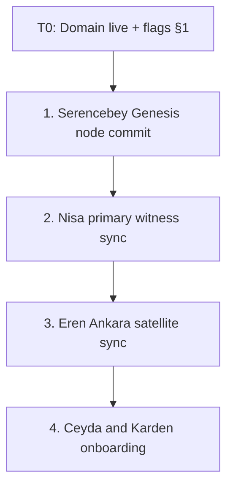
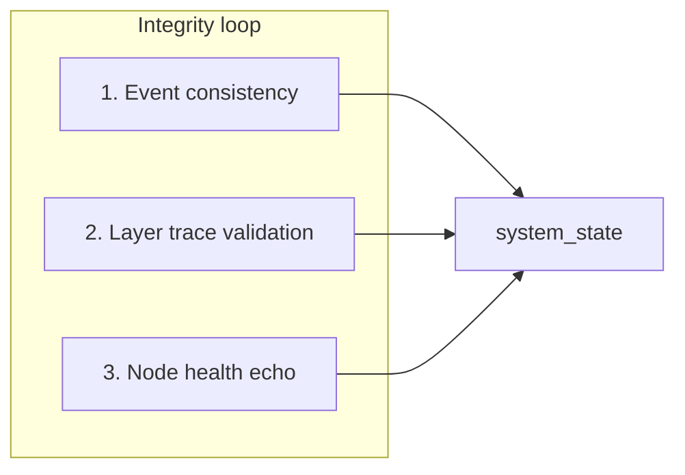

# Rhizoh Go-Live Activation Protocol (V1)

**Document status:** SECURED / READY FOR SHIFT  
**Enforces:** [`TEMPORAL_IDENTITY_CONTINUITY_V0.md`](../apps/client/docs/TEMPORAL_IDENTITY_CONTINUITY_V0.md) §17–§23 runtime invariants under multi-user concurrency  
**Epistemic constitution:** [`RHIZOH_CASTLE_GENESIS_PRODUCTION_ARCHITECTURE_V1.md`](RHIZOH_CASTLE_GENESIS_PRODUCTION_ARCHITECTURE_V1.md) §0 (External → Real → Derived → Narrative) · Lab AI: [`EXTERNAL_LAB_AI_INTEGRATION_SPEC_V1.md`](EXTERNAL_LAB_AI_INTEGRATION_SPEC_V1.md)  
**Tag:** `CORE-ELIGIBLE` (membrane flags, gateway CORS) · `RESEARCH-ONLY` (worker replay rollback procedures until automated)

**Role:** Launch-control handbook — not a coding sprint. When DNS propagates and the captain gives **shift command**, execute sections **in order**.

**Lifecycle (full):**

```text
DEPLOY → ENABLE FLAGS → RUN CHECKLIST (§5) → ACTIVATE GUARDIANS (§3)
  → VERIFY STATE CONSISTENCY (§7) → SELF-AUDIT → CONTINUOUS VALIDATION (§7.4 + Stability Contract)
```

---

## 0. Preconditions

| Gate | Requirement |
|------|-------------|
| **Launch Polish Night** | [`LAUNCH_POLISH_NIGHT_V1.md`](../apps/client/docs/LAUNCH_POLISH_NIGHT_V1.md) signed off — mic/TTS/camera/concurrency before domain |
| **Violation law stress** | [`RHIZOH_VIOLATION_SIMULATION_SUITE_V0.1.md`](RHIZOH_VIOLATION_SIMULATION_SUITE_V0.1.md) — `allPassed` before shift |
| **External boundary (A11)** | [`RHIZOH_EXTERNAL_BOUNDARY_VALIDATION_V0.1.md`](RHIZOH_EXTERNAL_BOUNDARY_VALIDATION_V0.1.md) — `externalBoundary.validate()` on staging |
| Architecture | §0 Reality Seal accepted; no C→B/A leakage in new code paths |
| Frozen core | v562–v570 untouched; `stabilization:validate-graph` green on release branch |
| Client build | `apps/client` production bundle with flags in §1 |
| Gateway | `apps/gateway` deployed; CORS includes production origins (§2) |
| Secrets | `VITE_OPENWEATHER_API_KEY` (Real weather); gateway token aligned client ↔ server |
| Guardians | Sequential bootstrap roster (§3) — no concurrent first-five storm |

---

## 1. Feature flag truth table (activation matrix)

Production `.env.production` (`apps/client`) — **ESM membrane** locked for go-live:

```bash
# --- Core frozen environment ---
VITE_DEBUG=0
VITE_CASTLE_AUTHORITY_PROFILE=production
VITE_ONTOLOGICAL_WATCHDOG=1

# --- ESM layer activation (prod-safe; no VITE_DEBUG umbrella required) ---
VITE_SOVEREIGN_NODE_ONBOARDING=1
VITE_SATELLITE_NODE_REGISTRY_V0=1
VITE_EPISTEMIC_SIM_RESEARCH=0          # Lab debug bus / overlay OFF in production

# --- Real layer ingress (A) ---
VITE_REAL_LAYER_WEATHER_INGRESS=1
VITE_REAL_LAYER_TRAFFIC_INGRESS=1        # Enable when TomTom/traffic ingest wired
VITE_OPENWEATHER_API_KEY=<secret>        # Required for weather Real trace

# --- Fallback gateways (protocol targets; wire in client ingress) ---
VITE_API_TIMEOUT_MS=2500
VITE_MAX_CONCURRENT_NODES_BOOTSTRAP=128

# --- Production gateway (replace with rhizoh.io edge) ---
VITE_GATEWAY_HTTP=https://api.rhizoh.io/v1/rhizoh/llm
VITE_GATEWAY_WS=wss://stream.rhizoh.io/v1/events
VITE_LIVE_GATEWAY_BASE=https://api.rhizoh.io
VITE_GATEWAY_TOKEN=<production-secret>
```

### 1.1 Flag semantics

| Flag | Layer | Prod value | Effect |
|------|-------|------------|--------|
| `VITE_DEBUG` | Membrane | `0` | Hides dev overlays; granular lab flags off unless allowlisted |
| `VITE_ONTOLOGICAL_WATCHDOG` | A/B guard | `1` | Continuity / substrate drift observer |
| `VITE_SOVEREIGN_NODE_ONBOARDING` | A + C ritual | `1` | Dynamic WGS84 Guardian wizard + Cesium pick |
| `VITE_SATELLITE_NODE_REGISTRY_V0` | A registry | `1` | Constellation graph participants |
| `VITE_EPISTEMIC_SIM_RESEARCH` | B/C lab | `0` | No sim event-bus mirror in prod |
| `VITE_REAL_LAYER_WEATHER_INGRESS` | A | `1` | OpenWeather → normalized feed only |
| `VITE_REAL_LAYER_TRAFFIC_INGRESS` | A | `1` | Traffic API raw JSON (when implemented) |
| `VITE_API_TIMEOUT_MS` | A resilience | `2500` | Ingress timeout → baseline, not fake Derived |
| `VITE_MAX_CONCURRENT_NODES_BOOTSTRAP` | Gateway policy | `128` | Caps parallel onboarding (protocol; enforce at edge) |

**Production membrane allowlist:** `castleDebugGateV0.js` — flags in §1.1 marked “prod-safe” activate with granular `=1` even when `VITE_DEBUG=0`.

**Staging contrast:** [`apps/client/.env.staging.example`](../apps/client/.env.staging.example) — `VITE_DEBUG=1` + `VITE_EPISTEMIC_SIM_RESEARCH=1` for captain backstage verification.

---

## 2. Domain and routing map (edge shell)

| Public URL | Backend | Notes |
|------------|---------|-------|
| `https://rhizoh.io/` | `apps/client` static (Firebase Hosting / CDN) | SPA; Cesium + Genesis |
| `https://api.rhizoh.io/v1/` | `apps/gateway` (Cloud Run / K8s ingress) | REST + Rhizoh LLM path |
| `wss://stream.rhizoh.io/v1/events` | `apps/gateway` WebSocket hub | Event ingress; WAL peer sync |
| `https://rhizoh.io/manifesto` | Static route or redirect | Serves outreach pack ([`OUTREACH_ACADEMIC_PAPER_PACK_V0.1.md`](OUTREACH_ACADEMIC_PAPER_PACK_V0.1.md)) |

### 2.1 Gateway CORS (required before shift)

Update `apps/gateway` production env:

```bash
CASTLE_ALLOWED_ORIGINS=https://rhizoh.io,https://www.rhizoh.io,https://castle-genesis.web.app
CASTLE_HTTP_CORS_ORIGIN=https://rhizoh.io
```

Health probes (pre-shift): `GET https://api.rhizoh.io/health/live` · `/health/ready` · `/deps`.

### 2.2 Client env alignment

Client `VITE_*_GATEWAY_*` hosts **must** match TLS certificates on api/stream subdomains (single-origin policy per [`apps/client/.env.production.example`](../apps/client/.env.production.example)).

---

## 3. Guardian bootstrap sequence (first five nodes)

**Rule:** Sequential onboarding — **no concurrent** first-wave Guardian storm (ordering drift + `epi_sig_*` determinism).



| Order | Guardian | Expected `nodeId` (dynamic) | Captain check |
|-------|----------|-----------------------------|---------------|
| 1 | Serencebey (Genesis) | `node:kadikoy_satellite` or genesis anchor per runbook | Shadow WAL tick 0; `bootValidityTokenCreated: false` |
| 2 | Nisa (witness) | Per witness runbook | Event bus read-only if sim off |
| 3 | Eren | `node:ankara_satellite` | Map pick Ankara WGS84 |
| 4 | Ceyda / Karden | `node:{city}_satellite` from map pick | Friend flow: [`FRIEND_ZERO_FRICTION_ONBOARDING_V0.1.md`](../apps/client/docs/FRIEND_ZERO_FRICTION_ONBOARDING_V0.1.md) |

**Verification window:** After each seal, `apps/worker` (or captain console) runs **derived recomputation spot-check** — if `resonanceScore` path deviates > ±1 ms equivalent jitter from golden trace, **gateway holds** next node registration (rate-limit barrier).

**Captain backstage:** [`CAPTAIN_BACKSTAGE_VERIFICATION_V0.1.md`](CAPTAIN_BACKSTAGE_VERIFICATION_V0.1.md) · technical: [`GUARDIAN_FIRST_ANCHOR_RUNBOOK_V0.1.md`](../apps/client/docs/GUARDIAN_FIRST_ANCHOR_RUNBOOK_V0.1.md).

---

## 4. Kill switch and rollback path (emergency brakes)

### 4.1 Level A — Soft circuit breaker (UI / onboarding)

**Trigger:** Gateway broadcast or config push: `sovereign_onboarding_enabled: false`  
**Immediate ops fallback:** Redeploy client with `VITE_SOVEREIGN_NODE_ONBOARDING=0` (and `VITE_SATELLITE_NODE_REGISTRY_V0=0` if needed).

| Continues | Stops |
|-----------|-------|
| Real layer ingress (weather/traffic) where configured | New satellite anchor UI |
| Existing registry read | New Guardian seals |

System returns to **frozen baseline** presentation; no execution core write.

**Recovery state after Level A:** `GENESIS_BASELINE_READONLY`

| Property | Value |
|----------|--------|
| Genesis anchor | **Immutable** — never rewritten by kill switch |
| Satellite registry | Read-only (existing nodes visible) |
| Real ingress | May continue (weather/traffic) |
| New Guardian seals | Blocked |
| Narrative / UI | Neutral baseline — no pseudo-physics copy |

### 4.2 Level B — Hard rollback (data plane)

**Trigger:** WAL segment split / async causality fork detected on event bus.

| Step | Action |
|------|--------|
| 1 | Gateway closes WebSocket fan-out (`stream.rhizoh.io`) |
| 2 | `apps/worker` truncates Redis append stream to last **verified** `SealedRuntimeSnapshot` |
| 3 | Clients receive `replay_required` (or reconnect) — rehydrate from canonical seal only |
| 4 | Post-mortem: [`TEMPORAL_IDENTITY_CONTINUITY_V0.md`](../apps/client/docs/TEMPORAL_IDENTITY_CONTINUITY_V0.md) §17–§23 audit log |

> Level B automation is **protocol-defined**; confirm worker replay script version before first production use.

**Recovery state after Level B:** `LAST_KNOWN_GOOD_SNAPSHOT` (LKG)

| Property | Value |
|----------|--------|
| Replay anchor | Last **verified** `SealedRuntimeSnapshot` on worker/redis |
| Post-LKG append stream | Discarded (truncated) |
| Genesis anchor | **Unchanged** — rollback does not redefine genesis |
| Clients | `replay_required` → rehydrate from LKG only |
| Derived layer | Recomputed from replay — no Narrative-authored scores |

See thresholds and quarantine rules: [`POST_GO_LIVE_AUTONOMOUS_STABILITY_CONTRACT_V1.md`](POST_GO_LIVE_AUTONOMOUS_STABILITY_CONTRACT_V1.md) §5.

---

## 5. Go-live deterministic checklist (T−7 seconds)

Execute from captain workstation immediately before **shift command**. Mark each `[ ]` → `[x]` in SESSION_LOG.

### Test 1 — `event_bus_stress`

**Intent:** 60 s @ 50 `observer_action_pulse`/s — zero heap growth / listener leak.

| Command (client vitest) | Proxy |
|-------------------------|-------|
| `npm run test -- src/rhizoh/runtime/__tests__/epistemicObserverTelemetryV0.test.js` | Observer publish path |
| Manual: 60 s interaction soak in staging with Performance monitor | Full bus |

**Pass:** No unbounded `listenersV0` growth; bus status stable.

### Test 2 — `shadow_wal_collision`

**Intent:** Two coordinate picks in the same ms → distinct `segmentHash`; no silent merge.

| Command | Module |
|---------|--------|
| `npm run test -- src/rhizoh/runtime/sovereign/__tests__/shadowContinuityBufferV0.test.js` (if present) | Shadow WAL |
| Captain: `window.__rhizoh_shadow_continuity` after double-click stress | Live |

**Pass:** Second tick rejected or chained with new segment; no hash collision.

### Test 3 — `api_fallback_simulation`

**Intent:** Weather/traffic > `VITE_API_TIMEOUT_MS` → Derived does **not** invent scores; baseline / null Real trace.

| Command | Module |
|---------|--------|
| `npm run test -- src/rhizoh/runtime/__tests__/weatherIngestV0.test.js` | Normalize + epoch id |
| Block network / mock timeout in staging | Ingress |

**Pass:** No `densityScore` without Real feed; UI/Narrative neutral (§0.4).

### Test 4 — `narrative_leakage_check`

**Intent:** Without `derived_state`, `@Rhizoh` / `@Atlas` remain silent (no pseudo-physics).

| Command | Module |
|---------|--------|
| `npm run test -- src/rhizoh/runtime/sovereign/__tests__/multiObserverEntanglementGuardV0.test.js` | C blocked |
| Policy: companion `suggestionOnly` + empty derived snapshot | Manual |

**Pass:** No prose claiming field bend / viscosity without B trace.

### Aggregate preflight (CI parity)

```bash
npm run stabilization:validate-client-boundaries-quick
npm run test -- src/rhizoh/runtime/sovereign/__tests__/
```

---

## 6. Shift command sequence (day-of)

**Ontological freeze gate:** This section is not “deploy only.” It is when production **defines what counts as admissible reality** (flags, seals, membranes, sim-off). See [`RHIZOH_OPERATIONAL_CONSTITUTION_V1.md`](RHIZOH_OPERATIONAL_CONSTITUTION_V1.md) (Articles I–III + enforcement map).

| Step | Owner | Action |
|------|-------|--------|
| 1 | Infra | DNS A/AAAA + TLS for `rhizoh.io`, `api.`, `stream.` |
| 2 | Infra | Deploy gateway → verify `/health/live` |
| 3 | Infra | Build client with §1 flags → deploy Hosting |
| 4 | Captain | Run §5 checklist → log in [`SESSION_LOG.md`](academic/SESSION_LOG.md) |
| 5 | Captain | §3 sequential Guardian invites |
| 6 | Captain | Confirm constellation arcs (C) over multi-node Real anchors (A) |
| 7 | Captain | Start §7 post-activation integrity loop (T+0→300s) |
| 8 | All | Log final `system_state`; enable continuous validation (§7.4) |

---

## 7. Post-activation integrity loop (T+0 → T+300s)

**Why:** Production often looks “green” at T+0, then **silent drift** appears (event ordering, ingestion latency, Derived skew). This is not always a hard fail — it is the most dangerous class of production bug.

**When:** Immediately after the last first-wave Guardian seal (end of §3).

### 7.1 Three continuous checks (every 30 s)



#### 1 — Event consistency

| Question | Pass criterion |
|----------|----------------|
| Ordering monotonic? | Gateway `seq` or shadow `walTick` non-decreasing |
| Duplicate ingestion? | No duplicate `seq` in 60 s window |

**Signals:** `window.__rhizoh.epistemicSimResearch.eventBus.trace()` (staging) · `window.__rhizoh_shadow_continuity` · gateway stream cursor (captain).

#### 2 — Layer trace validation (§0 Reality Seal)

| Question | Pass criterion |
|----------|----------------|
| REAL → DERIVED broken? | No Derived metric without Real trace id |
| Orphan Narrative? | No companion line without §0.10 `source_chain` + `trust_class` |

**Signals:** `runOperationalContinuityProbeV1` · compression/resonance reports · companion policy log.

#### 3 — Node health echo

Each activated Guardian **`nodeId`** emits ≥ 1 heartbeat within **120 s**.

**Schema:** `guardian_heartbeat_v0` — see Stability Contract §3.3.

**Signals:** `window.__rhizoh.satelliteRegistry.nodes()` · per-node `registeredAtMs` / shadow mirror.

### 7.2 Output (single field)

```text
system_state: LIVE_OK | DEGRADED | QUARANTINE
```

| State | Meaning |
|-------|---------|
| `LIVE_OK` | All three checks pass |
| `DEGRADED` | Exactly one check failed — investigate before next Guardian |
| `QUARANTINE` | Two or more failed — Level A recommended |

### 7.3 Captain commands (client)

**Preferred — unified epistemic tick** ([`RHIZOH_EPISTEMIC_TICK_ENGINE_V0.1.md`](RHIZOH_EPISTEMIC_TICK_ENGINE_V0.1.md)):

```javascript
// One-shot: playbook + boundary + observability + synthesis → one correlationId
const tick = await window.__rhizoh.epistemicTick.run();

// §7 loop 5 min @ 30s (convergence layer — same as goLiveIntegrity.startLoop)
window.__rhizoh.goLiveIntegrity.startLoop({ durationMs: 300_000, intervalMs: 30_000 });

// Last unified report
window.__rhizoh_epistemic_tick; // epistemic_state · correlationId · synthesis
window.__rhizoh_go_live_integrity; // mirror (system_state = epistemic_state)
```

Legacy one-shot (playbook only):

```javascript
window.__rhizoh.goLiveIntegrity.evaluate(window.__rhizoh.goLiveIntegrity.collect());
```

**Vitest:** `npm run test -w apps/client -- src/rhizoh/runtime/__tests__/epistemicTickEngineV0.test.js`

### 7.4 Continuous validation (after T+300s)

| Interval | Mechanism |
|----------|-----------|
| 60 s | `VITE_SUBSTRATE_HEALTH_REPORT=1` → `/rhizoh/substrate/health` |
| Seal cadence | `realityHealthMetricsV0` (`__rhizoh.debug().realityHealth`) |
| Boot / revoke | `VITE_ONTOLOGICAL_WATCHDOG=1` pass |

Full thresholds, entropy limits, auto-quarantine: [`POST_GO_LIVE_AUTONOMOUS_STABILITY_CONTRACT_V1.md`](POST_GO_LIVE_AUTONOMOUS_STABILITY_CONTRACT_V1.md).

---

## 8. Related documents

| Doc | Use |
|-----|-----|
| [`RHIZOH_CASTLE_GENESIS_PRODUCTION_ARCHITECTURE_V1.md`](RHIZOH_CASTLE_GENESIS_PRODUCTION_ARCHITECTURE_V1.md) | §0 ESM + agent map |
| [`GUARDIAN_FIRST_ANCHOR_RUNBOOK_V0.1.md`](../apps/client/docs/GUARDIAN_FIRST_ANCHOR_RUNBOOK_V0.1.md) | Technical anchor steps |
| [`FRIEND_ZERO_FRICTION_ONBOARDING_V0.1.md`](../apps/client/docs/FRIEND_ZERO_FRICTION_ONBOARDING_V0.1.md) | Eren / Ceyda / Karden copy |
| [`CAPTAIN_BACKSTAGE_VERIFICATION_V0.1.md`](CAPTAIN_BACKSTAGE_VERIFICATION_V0.1.md) | Post-“Bitti Kaptan!” |
| [`apps/client/.env.production.example`](../apps/client/.env.production.example) | Production env template |
| [`POST_GO_LIVE_AUTONOMOUS_STABILITY_CONTRACT_V1.md`](POST_GO_LIVE_AUTONOMOUS_STABILITY_CONTRACT_V1.md) | Drift thresholds, heartbeat schema, quarantine, LKG recovery |

---

## 9. Operational readiness (honest)

| Dimension | Status |
|-----------|--------|
| Deployment-ready | 🟢 |
| Activation-safe (controlled) | 🟢 |
| Architecture-solid (§0 ESM) | 🟢 |
| Observability | 🟡 — §7 loop + Stability Contract; automate gateway-side checks next |
| Self-verification at T+300s | 🟢 — client integrity loop + captain console |

*Rhizoh is a launch instrument **and** a post-activation self-audit protocol. Silent drift must surface before it becomes mythology. Awaiting shift command, Captain.*
