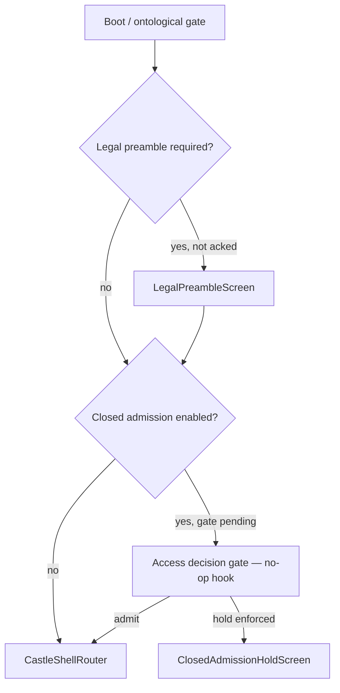

# Rhizoh Ingress Flow v1.0 (rhizoh.com)

**Status:** ACTIVE  
**Implementation:** `RhizohIngressFlow.jsx` · `ingress_router.js` · `mountCastleApplicationV0.js`

---

## 1. User journey

---

## 2. Triggers

| Step | When |
|------|------|
| Legal preamble | `rhizoh.com` / `*.rhizoh.com` / `VITE_RHIZOH_LEGAL_PREAMBLE=1` / `PROD` |
| Cohort intake | `VITE_RHIZOH_CLOSED_ADMISSION=1` and session not admitted |
| Hold block | Above + `VITE_RHIZOH_CLOSED_ADMISSION_ENFORCE=1` and verdict ≠ admit |

Disable preamble locally: `VITE_RHIZOH_LEGAL_PREAMBLE=0`

---

## 3. Session keys

| Key | Purpose |
|-----|---------|
| `rhizoh_legal_preamble_ack_v0.1` | ToS/KVKK ack |
| `rhizoh_closed_admission_subject_ref_v0.1` | Opaque subject id |
| `rhizoh_closed_admission_done_v0.1` | Cohort step completed |

---

## 4. Legal freeze

Ingress UX may be polished; **no new legal promises** per [`LEGAL_FREEZE_SPEC_V1.0.md`](LEGAL_FREEZE_SPEC_V1.0.md).

---

## Related

- [`LEGAL_REALITY_SPEC_V0.1.md`](LEGAL_REALITY_SPEC_V0.1.md) §5
- [`apps/client/public/legal/`](../apps/client/public/legal/) — static ToS/KVKK HTML
