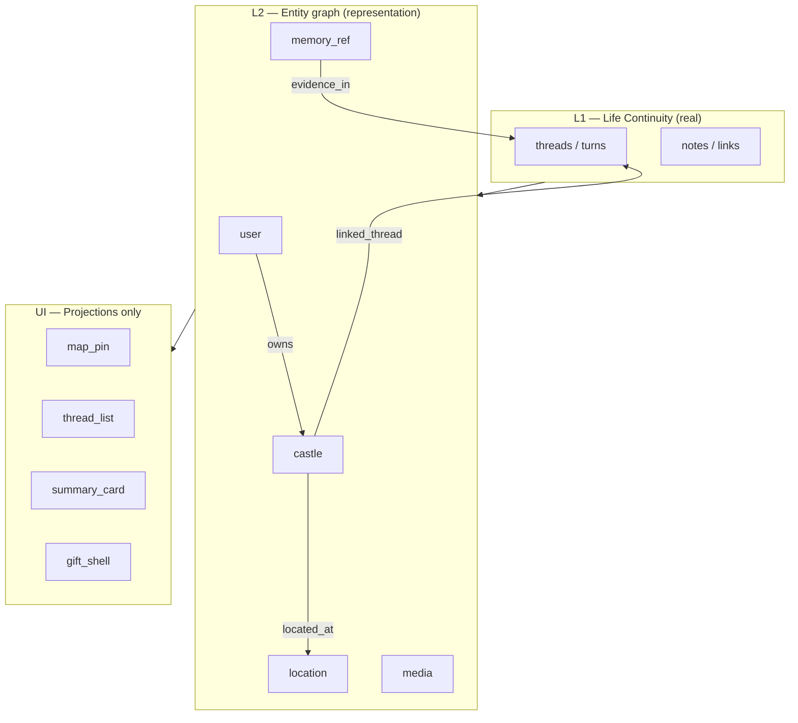

# Rhizoh L2 — Entity + Projection Bridge Core v0 (Product SSOT)

**Status:** ACTIVE — **scope freeze** (world model; not UI features)  
**SPECFLOW:** `FUTURE-PROOF-ONLY` — defines **representation layer** above L1 facts  
**As of:** 2026-06-01  
**Parent:** [`RHIZOH_L1_LIFE_CONTINUITY_V0.md`](RHIZOH_L1_LIFE_CONTINUITY_V0.md)  
**Machine SSOT:** [`schemas/life-entity-v0.schema.json`](schemas/life-entity-v0.schema.json)

**One-line:** *Features are missing because the world model is missing — not because the map widget is missing.*

**Binding sentence:**

> **L1 = gerçek** (turns, notes, links) · **L2 = temsil** (entities + graph) · **UI = yalnızca projection** (map, list, card, gift shell).

---

## 0. Naming lattice (L2 clarified)

| Code | Name | Question |
|------|------|----------|
| **L1** | Life Continuity | What **happened** in time? (evidence store) |
| **L2** | Entity + Projection Bridge | What **things** exist in the user’s world, and how are facts **linked** to them? |
| **L2-trust** | Trust / pattern maps (deferred) | How do we **read** reliability over time — **without** execution authority |
| **L3** | Visual Language | How is process **shown** (geometry, wave, crystal) |

L2 is **not** a smarter LLM. L2 is the **UI-independent world graph** that projections consume.

---

## 1. Problem statement (Castle / Metehan)

**Symptom:** “Metehan’ın Ankara’daki castle’ı haritada görünmüyor.”

**Wrong diagnosis:** “Harita API’si eksik.”

**Correct diagnosis:** There is no **entity**:

```text
entity: castle_metehan_ankara
  kind: castle
  label: Metehan's Castle
  owner_user_id: metehan_uid
  location_id: loc_ankara_tr
  linked_thread_ids: [ thr_20260526_a1, ... ]
```

**Map is a projection of `location_id` + `castle` entities — not a product root.**

Same for video, gift, messaging shells: they are **views** over `media`, `user`, `memory_ref` nodes — not parallel silos.

---

## 2. Three-layer stack (locked)



| Layer | May | Must not |
|-------|-----|----------|
| **L1** | Append evidence; deterministic recall citations | Invent entities; drive admission/WAL |
| **L2** | Upsert entities/edges; bind L1 ids | Execute; score trust into routing; replace L1 truth |
| **UI** | Render `projection_bundle` | Create meaning not backed by L2+L1 |

**Observation ≠ Execution:** L2 graph updates are **product representation**, not frozen epistemic core state. See [`LAYER_EXPANSION_PROTOCOL.md`](LAYER_EXPANSION_PROTOCOL.md).

---

## 3. L2-alpha entity kinds (minimal)

| Kind | `entity_kind` | Purpose | L1 anchor |
|------|---------------|---------|-----------|
| **User** | `user` | Subject of world | Firebase `user_id` |
| **Castle** | `castle` | User’s place / node / “home” in mesh | Product node id (not global MMO claim) |
| **Location** | `location` | WGS84 or named place | Optional coords |
| **Memory ref** | `memory_ref` | Pointer to evidence | `thread_id`, `turn_id`, `note_id` |
| **Media** | `media` | Future video/file shell | **OUT** of L2-alpha — stub only |

**L2-alpha IN:** `user`, `castle`, `location`, `memory_ref`  
**L2-alpha OUT:** trust scores, behavior clusters, embeddings as stored fields, public social graph

---

## 4. Graph structure (UI-independent)

### 4.1 Node (`EntityNodeV0`)

| Field | Required | Notes |
|-------|----------|-------|
| `entity_id` | ✔ | Stable id |
| `entity_kind` | ✔ | Enum |
| `user_id` | ✔ | Owning subject (tenant boundary) |
| `label` | ✔ | Display default |
| `created_at` / `updated_at` | ✔ | ISO |
| `status` | ✔ | `active` \| `archived` \| `erased` |
| `payload` | | Kind-specific bag (see schema) |

### 4.2 Edge (`EntityEdgeV0`)

| `rel` | From → To | Meaning |
|-------|-----------|---------|
| `owns` | user → castle | “Metehan’s castle” |
| `located_at` | castle → location | Map projection source |
| `linked_thread` | castle → memory_ref | Conversation belongs to place |
| `references_turn` | memory_ref → (implicit turn id in payload) | Evidence link |
| `attached_note` | memory_ref → note id in payload | User note at place |

Edges are **directed**, **user-scoped**, **append-friendly** (soft-delete via `status`).

### 4.3 Walkthrough — Metehan / Ankara

```json
{
  "nodes": [
    { "entity_id": "usr_metehan", "entity_kind": "user", "label": "Metehan" },
    { "entity_id": "cst_ankara_home", "entity_kind": "castle", "label": "Ankara Castle" },
    { "entity_id": "loc_ankara_tr", "entity_kind": "location", "label": "Ankara",
      "payload": { "lat": 39.9334, "lon": 32.8597 } }
  ],
  "edges": [
    { "rel": "owns", "from_id": "usr_metehan", "to_id": "cst_ankara_home" },
    { "rel": "located_at", "from_id": "cst_ankara_home", "to_id": "loc_ankara_tr" },
    { "rel": "linked_thread", "from_id": "cst_ankara_home", "to_id": "mem_thr_a1",
      "payload": { "thread_id": "thr_20260526_a1" } }
  ]
}
```

**Map projection** = `SELECT location WHERE exists(castle -located_at-> location AND user owns castle)` — not a separate map database.

---

## 5. Projection Bridge (L2 → UI)

Projections are **derived views**, regenerable, non-authoritative.

**Activation (earned visibility):** [`RHIZOH_PROJECTION_ACTIVATION_LAYER_V0.md`](RHIZOH_PROJECTION_ACTIVATION_LAYER_V0.md) — `map_pin` thresholds, castle reveal stages, first emergence.

| `projection_kind` | Source entities | UI surface (examples) |
|-------------------|-----------------|------------------------|
| `map_pin` | castle + location | Cesium / REAL_MAP pin |
| `thread_list` | memory_ref + L1 threads | Castle sidebar |
| `continuity_strip` | latest linked_thread + L1 turn | “Continue at Ankara Castle” |
| `recall_panel` | memory_ref + L1 citations | Citation-only recall UI |
| `weekly_summary_card` | L1 summary projection (L1.β) | Calm card — cites `source_turn_ids` |

### 5.1 `ProjectionBundleV0` (UI contract)

Single read API for clients:

```json
{
  "contract_version": "life-entity-v0",
  "user_id": "...",
  "as_of": "2026-06-01T12:00:00.000Z",
  "projections": [
    {
      "projection_kind": "map_pin",
      "entity_id": "cst_ankara_home",
      "location": { "lat": 39.9334, "lon": 32.8597 },
      "label": "Ankara Castle",
      "source_entity_ids": ["cst_ankara_home", "loc_ankara_tr"]
    }
  ],
  "evidence_refs": [
    { "thread_id": "thr_20260526_a1", "turn_id": "trn_..." }
  ]
}
```

**Rule:** UI **never** writes graph edges; UI sends **commands** (create castle, link thread) → gateway **upserts L2** + **appends L1** separately.

---

## 6. L1 → L2 bridge — Resolver runtime

**Resolver** = automatic binder (not NLP): context fields → registry + edges.

| Module | Status |
|--------|--------|
| [`lifeEntityGraphV0.js`](../apps/gateway/src/rhizoh/lifeEntityGraphV0.js) | ✔ in-memory graph |
| [`lifeProjectionBridgeV0.js`](../apps/gateway/src/rhizoh/lifeProjectionBridgeV0.js) | ✔ `buildProjectionBundleV0` |
| [`lifeContinuityResolverV0.js`](../apps/gateway/src/rhizoh/lifeContinuityResolverV0.js) | ✔ `resolveLifeContinuityToEntityGraphV0` |

| L1 event | Resolver action |
|----------|-----------------|
| `appendTurn` + `context.life_continuity.castle_id` | `owns`, `located_at`, `linked_thread`, `references_turn` |
| `appendNote` with `thread_id` | *(next)* `attached_note` |
| `recallCitationsV0` hit | `recall_panel` projection cites L1 ids — no new entities |

**Env:** `CASTLE_LIFE_ENTITY_RESOLVER=1` (with `CASTLE_LIFE_CONTINUITY_APPEND=1`) → gateway attaches `lifeEntityProjection` + `lifeEntityResolver`.

**Context hints (explicit only):** `life_continuity.castle_id`, `castle_id`, `castle.location.{lat,lon}`, `display_name`.

**Mode:** `deterministic_context_bind_v0` — no embedding extraction.

**Forbidden:** L2 edge creation changing gateway admission, WAL, or `phase*.js` inputs.

---

## 7. Why map / video / gift become “natural”

| Feature | Without L2 | With L2 |
|---------|------------|---------|
| **Map** | Camera flies to Istanbul bootstrap | Pins from `located_at` edges |
| **Video** | Orphan player | `media` node linked to `castle` + `memory_ref` |
| **Gift** | Marketing overlay | `gift_shell` projection on `user`→`castle` edge event |
| **Messaging** | Another silo | Thread list projection over same graph |

**Product gap today:** not missing widgets — missing **entity graph** that widgets project.

---

## 8. L2-alpha scope lock

### IN

- Entity kinds: user, castle, location, memory_ref  
- Edges: owns, located_at, linked_thread, references_turn, attached_note  
- Projection kinds: map_pin, thread_list, continuity_strip, recall_panel  
- Per-user graph isolation  
- Tombstone erase (align L1 erasure)

### OUT (explicit)

- Public discover graph / MMO topology claims  
- Trust score persistence (→ **L2-trust**)  
- Embedding-indexed retrieval (→ **L2-trust** / violates L1 Path A)  
- Media binary storage (→ later + legal)  
- L3 visual encodings as graph nodes  

---

## 9. Success tests

| Test | Pass |
|------|------|
| **Castle on map** | User with `castle` + `located_at` → `map_pin` projection returns Ankara coords |
| **Thread at castle** | `linked_thread` → continuity strip shows castle label + thread title |
| **Recall at castle** | Recall citations include `castle_id` in projection metadata — not invented place |
| **Erase** | User erases castle → pins disappear; L1 threads remain or cascade per policy |

---

## 10. Implementation sequence

| Order | Deliverable |
|-------|-------------|
| 1 | Spec + schema ✔ |
| 2 | `lifeEntityGraphV0` ✔ |
| 3 | `lifeProjectionBridgeV0` ✔ |
| 4 | `lifeContinuityResolverV0` + gateway hook ✔ |
| 5 | Client: read `lifeEntityProjection` — no graph logic in UI |
| 6 | Cohort smoke: Metehan / Ankara pin + thread link |

**Parallel:** L1 persist (Firestore), legal addendum — does not block L2 spec.

---

## 11. Related

| Doc | Role |
|-----|------|
| [`RHIZOH_L1_LIFE_CONTINUITY_V0.md`](RHIZOH_L1_LIFE_CONTINUITY_V0.md) | Evidence layer |
| [`schemas/life-continuity-v0.schema.json`](schemas/life-continuity-v0.schema.json) | L1 shapes |
| [`RHIZOH_WORLD_MESH_MENTAL_MODEL_V1.0.md`](RHIZOH_WORLD_MESH_MENTAL_MODEL_V1.0.md) | Originless mesh — castle = node, not world center |
| [`OBSERVATION_FABRIC_V1.md`](OBSERVATION_FABRIC_V1.md) | Agents interpret; never execute |
| [`RHIZOH_MOCK_VS_REAL_BOUNDARY_MAP_V1.0.md`](RHIZOH_MOCK_VS_REAL_BOUNDARY_MAP_V1.0.md) | Map feel without entity = demo leak |

---

*L2 Entity + Projection Bridge v0 — world model before features.*
