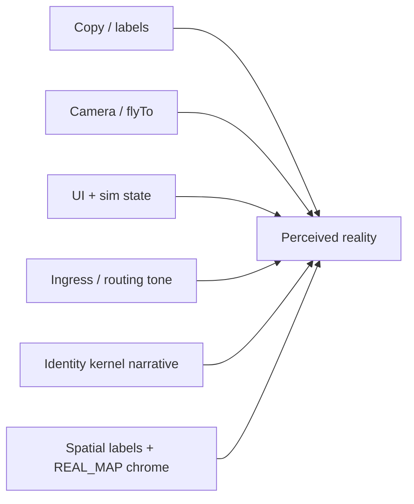
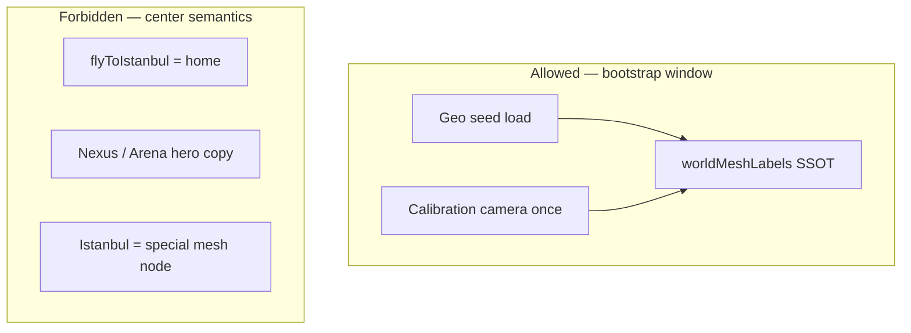

# Rhizoh Mock vs Real Boundary Map v1.0

**Status:** ACTIVE — **primary SSOT** (perception / algı sızıntı haritası)  
**Current phase:** **0.5 — Safe Reality Layer**

**One-line:** *Deterministic simulation system optimized for reality perception, not demo representation.*

---

## Document order (do not invert)

| Step | Doc | Role |
|------|-----|------|
| **1 — NOW** | **This file** | What may feel real, what must not leak, where demo feel **emerges** |
| **2 — After boundary** | [`RHIZOH_SIMULATION_REALISM_POLISH_V1.0.md`](RHIZOH_SIMULATION_REALISM_POLISH_V1.0.md) | Action backlog — **only items allowed by §4–§7 here** |
| **3 — Last** | [`RHIZOH_CONCEPT_CODE_MAPPING_V1.0.md`](RHIZOH_CONCEPT_CODE_MAPPING_V1.0.md) | File-level SSOT — **frozen after boundary + polish pass** |

> Mapping before boundary **wrongly hardens** paths that are still perception-coupled.

---

## 0. Problem statement (not architecture)

| True | False |
|------|-------|
| System is **not wrong** — it is **felt wrong** sometimes | “Rewrite core architecture” |
| Demo feel lives in **UX + state coupling** | Demo feel = one bad file |
| Goal = **engineer human perception** of the system | Goal = flip sim/real binary |

**Core risk:** Demo cues **seep back unnoticed** after a polish pass unless this map is the gate.

---

## 1. How “game feel” emerges (behavioral coupling)

Demo feel is **not** in `AppRhizoh528.jsx` alone. It is the **product** of simultaneous signals:

| Coupling cluster | Modules (representative) | Effect if misaligned |
|------------------|--------------------------|----------------------|
| **A — Seed city + camera** | `CesiumRealMapLayer`, `geo.js`, `flyToIstanbul`, `cesiumEpistemicBootstrapV0` | “This app is Istanbul” |
| **B — Copy + labels** | `worldMeshLabelsV0`, welcome card, `REAL_MAP` HUD strings | Bootstrap vs “home” confusion |
| **C — Scripted motion** | `realityDirector`, `enqueueApexCameraAfterCesiumIfNeeded`, DSL `REAL_MAP` spawn | System **plays** a scene |
| **D — Fake social/agents** | `RelationalPresenceComposerV1`, L9 swarm drafts, `demoLoopState` HUD | Live MMO / tutorial agents |
| **E — Identity continuity** | `rhizohIdentityKernelV1`, `favoritePlaces`, broadcast memory | User anchored to city not mesh |
| **F — Ingress (allowed)** | `ingress_router`, legal preamble | Official ≠ demo **if** calm; leak if gamey |

**Rule:** Changing **one** cluster without checking others **reopens** demo feel.

---

## 2. Perception axes (boundary dimensions)

Every surface signal must be classifiable on **five axes** (not three layers alone):

| Axis | What it controls | Phase 0.5 rule |
|------|------------------|----------------|
| **UI** | Layout, panels, badges, mode toggles | Show **state**, not “quest UI” |
| **State** | React/sim stores, `demoLoopState`, epistemic tick, map mode | Deterministic; **no random fake life** |
| **Copy** | Visible strings, TR/EN narrative | SSOT: `worldMeshLabelsV0` for mesh framing |
| **Routing** | Ingress → app; `/demo` lane (DEV) | Frozen official tone; no onboarding game |
| **Camera** | Fly-to, mode switch GLOBE↔REAL_MAP | Bootstrap window only; **no unsolicited cinematic** |

**Cross-axis leak example:** Correct copy (“bootstrap window”) + automatic `flyToIstanbul` on open ⇒ user still reads **Istanbul = home**.

---

## 3. Demo-feel sources — perception leakage register

| ID | Source | Axis | Leakage risk | Status |
|----|--------|------|--------------|--------|
| L1 | Auto / default `flyToIstanbul` | Camera | **HIGH** | **Stabilized** (boot fly removed; bootstrap viewport) |
| L2 | `REAL CITY 3D (CESIUM)` / procedural city copy | UI + Copy | MEDIUM | **Stabilized** (observation map chrome; SSOT labels) |
| L3 | `Istanbul Nexus` / swarm defense social drafts | Copy + State | **HIGH** | **Stabilized** (`formatMeshSwarmFieldObservationV0`) |
| L4 | `Istanbul Arena (simulated)` event preview | Copy | MEDIUM | **Stabilized** (`meshFieldLayer`) |
| L5 | `Demo Loop: {state}` in prod HUD | UI | **HIGH** | **Stabilized** (state observation; dev-gated loop UI) |
| L6 | Scaffold `RHIZOH_AGENT_*` attention lines | State + UI | MEDIUM | Open |
| L7 | `demoLoopState` driving cognition overlay | State | MEDIUM | Open |
| L8 | Identity `favoritePlaces` / Istanbul field memory | State + Copy | MEDIUM | Partial (bootstrap label) |
| L9 | Named sim profiles in HUD (Nisa/Eren/Ceyda) | UI | **CRITICAL** | Guarded (`AGENTS.md`) |
| L10 | Ingress cohort as “game level” | Routing | LOW | Frozen — calm copy |
| L11 | Sovereign onboarding wizard | UI + Routing | MEDIUM | Research-gated |
| L12 | Studio `Bind demo avatar` | UI | N/A prod | Studio-only |
| L13 | `/demo` guest lane | Routing | LOW (DEV) | DEV only |
| L14 | `trigger: "demo"` in internal events | State | LOW | Internal — hide from HUD |
| L15 | Gateway “yerel demo” fallback banner | Copy | MEDIUM | Open |

**Leakage:** User infers *live world*, *center city*, or *tutorial product* from any **HIGH** row visible on cold open.

---

## 4. Allowed realism vs forbidden simulation cues

### 4.1 Allowed realism (perception — OK on prod shell)

| Cue | Why allowed | Constraint |
|-----|-------------|------------|
| Deterministic map / globe render | World-like surface | Cesium does not assert external truth |
| `REAL_MAP · bootstrap window` | Honest framing | Must not say “your city” / “home” |
| Epistemic tick / stability readouts | System observability | Read-only; not “agents acting” |
| Ingress legal preamble | Real control-plane | Calm official tone (frozen) |
| Bootstrap observation hint | Mesh initiator framing | SSOT string only |
| Internal pulses / heat (deterministic) | Ambient field | No fake randomness |
| `open composition` preference | Neutral intent | Not “guided creation” |

### 4.2 Forbidden simulation cues (must not appear on prod cold path)

| Cue | Why forbidden | Where it leaks today |
|-----|---------------|----------------------|
| “Demo” / “simulation profile” / “tutorial” | Product = toy | HUD, gateway banner, genesis playground |
| `guided creation` / scripted onboarding | Game quest | Was `RelationalPresenceComposer` — **fixed** |
| Named outreach personas as live users | False social proof | Docs only — **never HUD** |
| Istanbul as **origin** / **only world** | Single-city demo | Camera default + Nexus copy |
| Autonomous agent swarm **fiction** in feed | MMO trailer feel | L1 social drafts |
| Visible `Demo Loop` state machine | Meta-demo chrome | `AppRhizoh528` HUD |
| Unsolicited camera fly on load | System plays you | `flyToIstanbul` paths |
| `(simulated)` only in fine print | Still reads as real place | Arena string — reframe to field layer |

**Gate for polish PR:** No new **forbidden** row; every change must cite allowed row or reduce a **leakage ID**.

---

## 5. Seed city influence boundary

Istanbul is **not** a node, **not** HOME_BASE, **not** universe center.

| Zone | Allowed | Forbidden |
|------|---------|-----------|
| **Data loaders** | `ISTANBUL_GEO`, OSM bbox, calibration root in `geographicAnchorsV0` | Treating load region as user identity |
| **Camera** | First-open **bootstrap observation window** | Default “home” fly on every session without user intent |
| **Copy** | “Bootstrap window · Istanbul” (short) | “Istanbul merkez”, “Ana şehir”, “Seed node”, “Hoş geldin İstanbul’a” |
| **Identity graph** | Latent field memory **without** center semantics | `favoritePlaces` implying user lives in Fatih |
| **Events / broadcast** | Generic “field layer” location | `Istanbul Nexus`, `Arena (simulated)` as hero location |
| **Anchor policy** | `primaryAnchorResolverV0` / `anchorTruthTableV0` wins | UI default overriding HOME_BASE |

See also [`RHIZOH_WORLD_MESH_MENTAL_MODEL_V1.0.md`](RHIZOH_WORLD_MESH_MENTAL_MODEL_V1.0.md).

---

## 6. UI / state / copy / routing — quick classifier

Use when reviewing any PR:

| Signal | UI | State | Copy | Routing | Camera |
|--------|----|-------|------|---------|--------|
| Welcome card hint | ✔ | | ✔ | | |
| `demoLoopState` | ✔ | ✔ | | | |
| Cohort accept | ✔ | | | ✔ | |
| `setRealityMode(REAL_MAP)` | ✔ | ✔ | | | ✔ |
| Legal preamble | ✔ | | ✔ | ✔ | |
| Epistemic tick ledger | | ✔ | | | |
| `flyToIstanbul` | | | | | ✔ |

If a change touches **2+ columns**, re-run **§3 leakage register**.

---

## 7. Three system layers (orthogonal to perception axes)

| Layer | Phase 0.5 | Perception note |
|-------|-----------|-----------------|
| **Surface** | Production-grade deterministic sim | Highest demo-leak risk (§3) |
| **Control plane** | Real paths; data-plane inert | Official tone **allowed** |
| **Data plane** | Off | No external “aliveness” |

---

## 8. Phase map (binding over time)

| Phase | Name | Perception target |
|-------|------|-------------------|
| **0.5** | Safe Reality Layer (**now**) | World-like, zero external risk |
| **1** | Controlled signal | Presence validation only; still non-effective |
| **2** | Edge / sovereign pick | User node without city center |
| **3** | Distributed topology | Multi-region mesh |

---

## 9. Mock vs real (artifact table)

| Artifact | Feels real? | Actually real? | Stays sim until |
|----------|-------------|----------------|-----------------|
| Cesium REAL_MAP | ✔ | Internal render | Phase 2+ tile policy |
| Ingress / legal | ✔ | ✔ control path | — |
| Cohort gate | ✔ | UI no-op | — |
| Epistemic tick / WAL | Internal | Protocol sim | Phase 3 |
| `device_heartbeat_v1` | N/A | ❌ off | Phase 1 + READY |
| Nisa/Eren/Ceyda | ❌ | ❌ | **Never** prod HUD |

**Rule:** *Feels real* ⊂ surface + control perception. *Is real* externally = data plane only, post-gates.

---

## 10. Phase 1+ gate (unchanged)

| Candidate | Prerequisite |
|-----------|----------------|
| `device_heartbeat_v1` | Legal + S1–S4 + ops READY |
| `VITE_RHIZOH_PHASE1_SIGNAL=1` | [`RHIZOH_ACTIVATION_READINESS_CHECKLIST_V1.0.md`](RHIZOH_ACTIVATION_READINESS_CHECKLIST_V1.0.md) |

**Must not move:** Center city semantics, named agents in HUD, WAL from external input.

---

## 11. Acceptance — boundary complete

- [x] Leakage register (§3) covers distributed demo sources
- [x] Allowed vs forbidden cues (§4) defined
- [x] Seed city boundary (§5) explicit
- [x] Coupling / axes documented (§1–§2)
- [ ] All **HIGH** leakage IDs closed (→ Step 2 polish)
- [ ] Concept → code mapping reconciled to this file (→ Step 3)

---

## 12. Next steps (phase gate — not more design)

**Operating mode:** [`RHIZOH_PHASE_GATE_OPERATING_MODE_V1.0.md`](RHIZOH_PHASE_GATE_OPERATING_MODE_V1.0.md)

1. **Freeze** — L1–L5 stabilized; only bugfix / leakage regression (cite L-ID)  
2. **Activation readiness** — DNS/TLS/deploy scaffold; `npm run activation:readiness-check`; MANUAL checklist; READY/HOLD log; signal **off**  
3. **Mapping** — deferred until post-READY (draft only)  

L6/L15 = optional regression backlog; **not** a new perception sprint.

---

## Related

| Doc | When |
|-----|------|
| [`RHIZOH_WORLD_MESH_MENTAL_MODEL_V1.0.md`](RHIZOH_WORLD_MESH_MENTAL_MODEL_V1.0.md) | Originless mesh |
| [`RHIZOH_SIMULATION_REALISM_POLISH_V1.0.md`](RHIZOH_SIMULATION_REALISM_POLISH_V1.0.md) | Step 2 |
| [`RHIZOH_CONCEPT_CODE_MAPPING_V1.0.md`](RHIZOH_CONCEPT_CODE_MAPPING_V1.0.md) | Step 3 (finalize after polish) |
| [`RHIZOH_V1_ARCHITECTURAL_STATE_V1.0.md`](RHIZOH_V1_ARCHITECTURAL_STATE_V1.0.md) | Cold execution |

*Boundary map v1.0 — perception SSOT — 2026-05-19*
