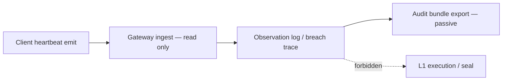

# Rhizoh Phase 1 — Controlled Real Signal Architecture v1.0

**Status:** SPEC ONLY (no implementation until Phase 0 exit + legal signal class)  
**Tag:** `PLANNING` — does not thaw epistemic primitive freeze by itself  
**Parent:** [`RHIZOH_PHASE_EVOLUTION_ROADMAP_V1.0.md`](RHIZOH_PHASE_EVOLUTION_ROADMAP_V1.0.md)

---

## 1. Purpose

Connect Rhizoh to **one** real-world observation channel so the system **reads** reality — without pretending to be a live global distributed deployment.

**Protects:** legal freeze · Observation ≠ Execution · fixed epistemic machine.

**Phase 1 mantra:** The system **verifies existence** from the outside world; it **never changes the world** (including sealed core state).

---

## 2. Three layers — must not collapse

| Layer | Meaning | Phase 1 role |
|-------|---------|--------------|
| **Heartbeat** | “I am here” — system presence signal | Only ingress type allowed |
| **Observation log** | “We saw this” — forensic / ops witness | Append-only **witness** channel |
| **WAL (L1)** | “System reality” — sealed execution truth | **Never** written from heartbeat path |

**Primary risk:** Observation psychologically or technically **bleeding into WAL**. Phase 1 must **lock** separation in code and CI, not only in prose.

### 2.1 What each surface is *not*

| Surface | Is NOT |
|---------|--------|
| Observation log | Product **telemetry** (analytics, funnels, ML features) |
| Audit export | Product **behavior** (routing, admission, UX decisions) |
| WAL / L1 | Influenced by liveness, online status, or device presence |

---

## 3. What Phase 1 is

| Property | Value |
|----------|--------|
| Signal count | **Exactly one** primary type (see §4) |
| Direction | **Ingress read-only** → observation / audit surface |
| Execution | **No** L1 state transition from signal alone |
| Identity | Opaque `deviceRef` / `sessionRef` — no celebrity, no public graph |
| Legal | Signal class named in counsel-approved KVKK before switch-on |

---

## 4. What Phase 1 is not

| Excluded | Phase |
|----------|-------|
| Camera / vision stream | 2+ |
| Full telemetry / motion / biometrics | 2+ |
| Edge node registry (production) | 2 |
| Multi-region WAL sync | 3 |
| Permissioned data plane (full) | 2+ |
| Live CSP + device trust + auth hardening | 1.1+ (parallel prep only) |
| “Global node” marketing or topology claims | 3 |

---

## 5. Recommended first signal (pick one for v1.0 implementation)

| Candidate | Pros | Cons |
|-----------|------|------|
| **A — `device_heartbeat_v1`** ✅ default | Minimal PII, easy legal framing, ops-friendly | Coarse location |
| B — `location_ping_v1` | Geographic anchor | Higher KVKK sensitivity |
| C — `user_session_event_v1` | Aligns with ingress session | Less “world” signal |

**Phase 1 default:** **`device_heartbeat_v1`** — proves liveness + client build id + consent epoch; optional coarse timezone offset only (no GPS until counsel approves).

---

## 6. Signal schema (minimal)

```json
{
  "schema": "castle.rhizoh.controlled_signal.device_heartbeat.v1",
  "deviceRef": "dev_opaque_uuid",
  "sessionRef": "subj_opaque_uuid",
  "emittedAtMs": 1710000000000,
  "clientBuildId": "rhizoh-client@1.0.0+sha",
  "consentEpoch": "legal_preamble_ack_v0.1",
  "online": true
}
```

**Rules:**

- `deviceRef` created client-side after legal ack; not linked to real name in Phase 1 pipeline  
- No free-text payload  
- No image/binary blobs  
- Max 1 heartbeat / 60s per device (rate limit at gateway)

---

## 7. Ingestion path (conceptual — not built in Phase 0)



| Layer | Phase 1 behavior |
|-------|------------------|
| Client | Emit only if legal ack + cohort gate (if enabled) |
| Gateway | Validate schema, rate limit, TLS, **no** auto-mutate world state |
| Runtime | Append to **observation** surface (`violationObservationLogV0` class channel or dedicated read-only buffer) |
| Tick / WAL | Heartbeat **does not** close ticks or change `epistemic_state` |

### 7.1 WAL isolation — enforcement layer (required at activation)

Implements **causal isolation contract** S1–S4 (incl. no observation→control side-channel) from [`RHIZOH_V1_ARCHITECTURAL_STATE_V1.0.md`](RHIZOH_V1_ARCHITECTURAL_STATE_V1.0.md) §0. Spec alone is insufficient; Phase 1 switch-on requires runtime + CI enforcement.

When Phase 1 code lands, **all** of the following are mandatory:

| Invariant | Enforcement |
|-----------|-------------|
| `I1` | Heartbeat handler **must not** call `appendLocalWalHistoryEntryV0`, `appendEpistemicTickToLedgerV0`, or any seal/state transition API |
| `I2` | Heartbeat records use channel `controlled_signal_heartbeat_v1` on **observation / breach trace only** — never `walHistoryLocal` |
| `I3` | `runEpistemicTickV0` / `runEpistemicAuditBundleV0` **must not** read heartbeat buffer as tick input |
| `I4` | CI test: ingest N heartbeats → WAL segment count unchanged; ledger node count unchanged |
| `I5` | Code review gate: no import from `controlled_signal_*` into `postGoLiveIntegrityLoopV0` or L1 subgraph |
| `I6` | **S4:** no control-plane branch on observation volume, timing, or ordering (side-channel coupling test) |

---

## 8. No feedback loop guarantee (binding)

**Clarification:** *No feedback loop* ≠ *no system feedback*. Phase 1 may emit **logs**, **observation** records, and **audit** attachments — they are **causally non-effective** on L1/admission/routing (S1–S3 in [`RHIZOH_V1_ARCHITECTURAL_STATE_V1.0.md`](RHIZOH_V1_ARCHITECTURAL_STATE_V1.0.md) §0).

**Engineering form:** *Observed data may exist without being causally effective.*

Heartbeat may be **received → logged → exported**. It **must not** close any control loop:

| System area | Phase 1 effect |
|-------------|----------------|
| **Admission** (`closedUserAdmissionEngineV0`, cohort gate) | **None** — no signal → admit/hold/reject |
| **Ingress routing** (`ingress_router`, `deriveIngressPhase`) | **None** — online/offline does not change route |
| **Identity graph** (`epistemicIdentityContinuityV0`, causality) | **None** — no new nodes/edges from heartbeat |
| **Stability / suppression** (`epistemicStabilityControllerV0`) | **None** |
| **Product policy / UX** (`rhizohProductPolicy*`) | **None** |
| **AI narrative (L4)** | **None** — presence ≠ binding fact |

**Audit export:** may **include** heartbeat slice as **evidence attachment** for human/ops review — not as input to the next tick or policy merge.

---

## 9. Observation ≠ Execution (binding)

| Allowed | Forbidden |
|---------|-----------|
| Log heartbeat for integrity / ops | “Device online ⇒ user rights changed” |
| Correlate with `correlationId` in audit export | Heartbeat triggers AI narrative as fact |
| Passive dashboard / debug witness | Heartbeat writes sovereign node registry (Phase 2) |

---

## 10. Legal-ready checklist (before switch-on)

- [ ] Counsel ack for **device liveness** category in KVKK  
- [ ] Retention period stated (e.g. 90d ops / 12mo security)  
- [ ] No new marketing claim (“global sensor network”)  
- [ ] `LEGAL_FREEZE_SPEC` thaw or Phase 1 addendum signed  
- [ ] Ingress copy unchanged except optional “anon device pulse” one-liner if counsel approves

---

## 11. Infrastructure — closed switch & deployment order

### 11.1 Correct sequence (binding)

| When | Action | Switch |
|------|--------|--------|
| **NOW (Phase 0)** | Spec · UI polish · routing freeze · passive sanity | Heartbeat endpoint **absent or 404/disabled** |
| **NEXT** | DNS / domain (GoDaddy → Cloudflare) · Firebase/hosting slot | TLS + ingress live; **signal path still off** |
| **LAST** | Phase 1 activation | `VITE_RHIZOH_PHASE1_SIGNAL=1` + gateway route enabled + §10 legal complete |

DNS/Firebase **before** signal activation is allowed; **signal before** legal + WAL isolation CI is not.

### 11.2 Per-system rules

| System | Phase 1 rule |
|--------|----------------|
| `rhizoh.com` DNS / TLS | May go live — **ingress only** |
| Firebase / hosting | Staging/prod shell; **no** open Firestore rules for heartbeat collection |
| Cloudflare WAF | Per [`INFRASTRUCTURE_DNS_HARDENING_V0.1.md`](INFRASTRUCTURE_DNS_HARDENING_V0.1.md) |
| Heartbeat endpoint | **Disabled** until §10; default `VITE_RHIZOH_PHASE1_SIGNAL=0` |

---

## 12. Entry / exit criteria

### Entry (leave Phase 0 model-only)

1. Phase 0 checklist in [`RHIZOH_PHASE_EVOLUTION_ROADMAP_V1.0.md`](RHIZOH_PHASE_EVOLUTION_ROADMAP_V1.0.md)  
2. This spec reviewed  
3. Legal signal class approved  
4. Passive coherence check green  

### Exit (enter Phase 2)

1. 30 days stable heartbeat ingest (staging)  
2. Zero L1 mutations attributed to signal  
3. Audit bundle exports include heartbeat slice reproducibly  
4. Edge node registry spec drafted (separate doc)

---

## 13. Phase 1 implementation surface (future — not now)

When approved, expected **minimal** code touch (no new epistemic primitive):

| Area | Change type |
|------|-------------|
| `apps/gateway` | POST `/v1/signal/heartbeat` — validate + append log |
| Client | Timer emit behind flag |
| Docs | Privacy § update |

**Explicit:** no new `*V0` tick/ledger module; reuse observation + audit export only.

---

## 14. Relation to sovereign / Cesium

Existing sovereign geographic pick ([`sovereignNodeOnboardingWizardV0`](../../apps/client/src/rhizoh/runtime/sovereign/)) remains **Phase 2** UX — Phase 1 must not conflate WGS84 anchor with heartbeat flood.

---

## Related

| Doc | Role |
|-----|------|
| [`LEGAL_FREEZE_SPEC_V1.0.md`](LEGAL_FREEZE_SPEC_V1.0.md) | Blocks premature live claims |
| [`RHIZOH_REALITY_BREACH_OBSERVABILITY_V0.1.md`](RHIZOH_REALITY_BREACH_OBSERVABILITY_V0.1.md) | Observation channel pattern |
| [`RHIZOH_OPERATIONAL_CONSTITUTION_V1.md`](RHIZOH_OPERATIONAL_CONSTITUTION_V1.md) | WAL truth discipline |
| [`INFRASTRUCTURE_DNS_HARDENING_V0.1.md`](INFRASTRUCTURE_DNS_HARDENING_V0.1.md) | Closed switch prep |

---

*Rhizoh Systems — Phase 1 Controlled Real Signal v1.0 — SPEC ONLY — 2026-05-19*
