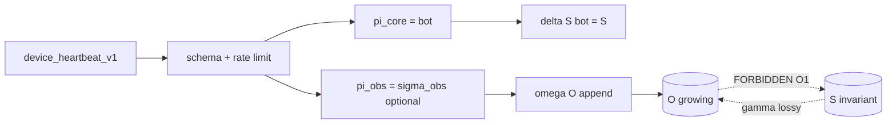

# Rhizoh Phase 1 — O1 Constraint Spec v1.0

**Status:** RUNTIME BEHAVIOR CONTRACT (not a theorem — thaw-gated)  
**Class:** Constraint extension boundary · **does not relax NI2 on \(S\)**  
**Parent:** [`RHIZOH_PHASE1_CONTROLLED_REAL_SIGNAL_V1.0.md`](RHIZOH_PHASE1_CONTROLLED_REAL_SIGNAL_V1.0.md) · [`RHIZOH_CONSTRAINT_CLOSURE_MAP_V1.0.md`](RHIZOH_CONSTRAINT_CLOSURE_MAP_V1.0.md)

**Prerequisites:** Ops **READY** · legal signal class · I1–I6 enforcement · `isDataPlaneActiveV0() === true` (staging probe only until signed)

---

## 0. What O1 is / is not

| O1 is | O1 is not |
|-------|-----------|
| Runtime contract for **observation plane** \(O\) under Phase 1 | A new “theorem” or proof layer |
| Controlled introduction of \(\omega\) (witness append) | Relaxation of \(\neg(O \to S)\) on core \(S\) |
| Growth model + falsification rows for Phase 1 | Full mirror of \(S\) into \(O\) |

**Epistemology:** Phase 1 adds **witnessed consistency**, not **truth production**. System stays *consistent and bounded*, not “more correct.”

---

## 1. O1 constraint (formal contract)

**O1 (witness non-feedback):** For all \(o \in O_t\), at all times \(t\) while Phase 1 is active:

\[
\neg(o \to S) \land \neg(o \to \Sigma_{\text{control}}) \land \neg(o \to \delta)
\]

**Corollary (unchanged from Phase 0.5):**

\[
\pi_{\text{core}}(p) = \bot \quad \text{(S1 — no L1 write from heartbeat)}
\]

**NI2 relaxation:** **None** on core. Only **observation leg** activates:

| NI2 edge | Phase 0.5 | Phase 1 (O1) |
|----------|-----------|----------------|
| \(\neg(O \to S)\) | ✔ | ✔ **unchanged** |
| \(\gamma: S \to O\) | ✔ lossy | ✔ lossy (see §3) |
| \(I(O; \text{decision}(S^+)) = 0\) | ✔ | ✔ **I6 enforced** |
| T1 on \(S\) | \(S \equiv s_0\) | **Still required** — heartbeat does not mutate \(S\) |

---

## 2. Controlled coupling introduction (only this path)

| Step | Allowed effect |
|------|----------------|
| Validate \(p\) | Gateway CPU/memory only |
| \(\pi_{\text{core}}(p) = \bot\) | **No** \(\delta\) change on \(S\) |
| \(\omega(O, \sigma_{\text{obs}})\) | Append-only witness record |
| \(\gamma(S)\) | Read-only snapshot for UI/audit — **lossy** |

**Forbidden coupling (instant O1 violation):**

- Witness count / timing → ingress route, cohort, admission  
- Witness content → `appendEpistemicTickToLedgerV0`, WAL, seal APIs  
- Observation buffer → `runEpistemicTickV0` input (I3)

---

## 3. \(\gamma(S)\) — **lossy** abstraction (explicit invariant)

| Model | Rhizoh choice |
|-------|----------------|
| Lossless mirror | ❌ Not used — observer is **not** full \(S\) |
| **Lossy projection** | ✅ **Default** |

\[
\gamma:\ S \to \mathcal{O}(S) \quad \text{with} \quad \mathcal{O}(S) \subsetneq \text{Embed}(S)
\]

**Meaning:**

- UI / audit show **derived fields** (stability summary, tick index, hash proxy) — not raw L1 graph export by default  
- Phase 1 heartbeat records in \(O\) are **orthogonal** to \(\gamma\) — they do not reconstruct \(S\)  
- **No claim** that \(O\) can rebuild \(S\) (prevents “observation = truth” collapse)

**Falsification:** If ops recovers full L1 bytes from \(O\) alone without authorized export path ⇒ **lossy invariant broken** (design breach).

---

## 4. Observation growth model

Let \(N\) = accepted heartbeats in window \(W\).

| Bound | Rule |
|-------|------|
| **Rate** | ≤ 1 / 60s per `deviceRef` (gateway) |
| **Size** | \(\|O_t\| \le \|O_0\| + N \cdot s_{\max}\) where \(s_{\max}\) = max witness record bytes (schema-closed) |
| **Cardinality** | Distinct `deviceRef` bounded by ops policy (not unbounded fleet in Phase 1) |
| **Retention** | Append-only; prune only via explicit ops policy (not automatic → routing) |

**Growth does not imply power:** \(|O|\uparrow\) with \(S \equiv s_0\) is **valid** under O1.

---

## 5. Phase 1 property set (conditional — not T1 replacement)

| ID | Property | Enforced by |
|----|----------|-------------|
| **P1-S** | \(S_t \equiv s_0\) on L1 slice (T1 carries forward) | I1–I4 CI |
| **P1-O** | O1: \(\neg(O \to S)\) | I5, I6, code review |
| **P1-τ** | \(\tau_{\text{adv}} = \tau_{\text{canonical}}\) (no extra steps from \(p_k\)) | TI-P2 |
| **P1-MI** | \(I(O_t; \text{decision}(S_{t+1})) = 0\) | Side-channel test |

**If any P1-* fails:** model **undefined** under A9 interpretation constraint (see closure map §4) — not “graceful degradation.”

---

## 6. A9 under Phase 1 (interpretation constraint)

**A9** is not mutable runtime state. It is an **interpretation constraint** on the codebase:

| A9 holds | A9 fails |
|----------|----------|
| Only \(\pi_{\text{core}}\) drives \(\delta\) from \(I_{\text{ext}}\) | Hidden handler writes L1 |
| Model **defined** | Model **undefined** — not “app keeps running safely” |

Phase 1 **does not weaken** A9; it adds traffic that must **still** collapse to \(\bot\) on core.

---

## 7. NI2 “relaxation rules”

| Question | Answer |
|----------|--------|
| Can \(O \to S\) ever open in Phase 1? | **No** — O1 forbids |
| Can \(\pi_{\text{core}} \ne \bot\) for heartbeat? | **No** — S1 |
| Can UI show “online” from heartbeat? | **Display only** — must not branch admission/routing (I6) |
| Can audit export include heartbeat slice? | **Yes** — read-only attachment |

Any future **controlled coupling** to \(S\) requires **new phase doc + legal thaw + NI2 v3** — not O1.

---

## 8. Falsification (O1 violation table)

| Row | Witness |
|-----|---------|
| O1-1 | L1/WAL segment count changes after \(N\) heartbeats |
| O1-2 | Ingress route differs with only heartbeat rate change |
| O1-3 | `runEpistemicTickV0` reads heartbeat buffer |
| O1-4 | Reconstruct full \(S\) from \(O\) without authorized export |
| O1-5 | \(\tau_{\text{adv}} \ne \tau_{\text{canonical}}\) under flood |

Attach results to `docs/exports/ops/o1_violation_run_v1.0.json` — runner: [`RHIZOH_O1_VIOLATION_EXECUTION_SPEC_V1.0.md`](RHIZOH_O1_VIOLATION_EXECUTION_SPEC_V1.0.md) · `npm run ops:o1-violation-harness`

---

## 9. Thaw checklist (before O1 active in prod)

- [ ] [`RHIZOH_ACTIVATION_READINESS_CHECKLIST_V1.0.md`](RHIZOH_ACTIVATION_READINESS_CHECKLIST_V1.0.md) MANUAL **READY**
- [ ] I1–I6 green in CI
- [ ] Staging probe: `VITE_RHIZOH_PHASE1_SIGNAL=1` with O1-1..O1-5 pass
- [ ] Counsel sign-off on `device_heartbeat_v1` class
- [ ] Closure map reviewed — **no NI2 core relaxation** acknowledged

---

## 10. Related

| Doc | Role |
|-----|------|
| [`RHIZOH_CONSTRAINT_CLOSURE_MAP_V1.0.md`](RHIZOH_CONSTRAINT_CLOSURE_MAP_V1.0.md) | DAG · cascade · γ lossy |
| [`RHIZOH_SYSTEM_NON_INTERFERENCE_THEOREM_V2.0.md`](RHIZOH_SYSTEM_NON_INTERFERENCE_THEOREM_V2.0.md) | NI2 |
| [`RHIZOH_PHASE_GATE_OPERATING_MODE_V1.0.md`](RHIZOH_PHASE_GATE_OPERATING_MODE_V1.0.md) | Ops freeze |

*O1 constraint spec v1.0 — runtime contract — 2026-05-19*
