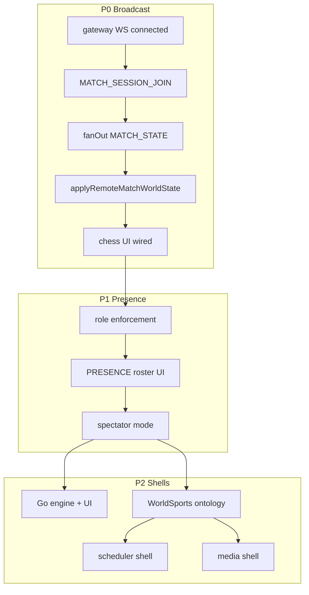

# Rhizoh Product Layer Unlock Map v1

**Tag:** `RESEARCH-ONLY` · `FUTURE-PROOF-ONLY`  
**Parent:** [`RHIZOH_NETWORK_COMPLETION_ROADMAP_V1.md`](RHIZOH_NETWORK_COMPLETION_ROADMAP_V1.md) · [`RHIZOH_PRODUCTIZATION_PHASE_GATE_V0.1.md`](academic/RHIZOH_PRODUCTIZATION_PHASE_GATE_V0.1.md)  
**Deploy baseline:** post-358 (broadcast scaffold + gateway WS helpers live)

---

## SSOT sentence

> **Ürün katmanı eksik değil — ürün katmanı için gerekli sosyal state altyapısı eksik.**

Rhizoh today = **single-player distributed truth simulation engine**.  
Product unlock = **multi-client authoritative state stream** + **presence** + **session share UX**.

Do **not** build Go UI, sports plugins, scheduler shells, or media viewers until P0 closes.

---

## Strategic priority (locked order)

```text
P0  Broadcast layer     — websocket fan-out · session sync · multi-client state stream
P1  Presence model      — who · where · player / observer / spectator
P2  Product shells      — Go · sports · scheduler UI · media viewer
```

---

## Layer 0 — What already works (engine, not product)

| Capability | Status | Module |
|------------|--------|--------|
| Event-sourced truth kernel | ✓ | `matchmakingTruthKernelV0.js` |
| Single-writer commit policy | ✓ | `matchmakingSingleWriterPolicyV0.js` |
| Gateway move validation + commit | ✓ | `matchMoveAuthorityV0.js` (chess.js) |
| Session broadcast room (in-memory) | ✓ scaffold | `matchBroadcastRoomV0.js` |
| Client WS transport + console API | ✓ scaffold | `matchmakingBroadcastTransportV0.js` |
| Gateway WS auto-resolve | ✓ | `matchmakingGatewayWsV0.js` |
| Remote state projection | ✓ | `matchmakingWorldProjectionV0.js` |
| Chess arena UI (local) | ✓ | `RhizohChessArenaWorkspaceV0.jsx` |
| Harness verification | ✓ | `verifyProduction` / `verifyAuthorityBoundary` |

**Critical gap:** Chess UI does **not** call `matchBroadcast` or truth kernel for moves. Arena = local `chess.js`; matchmaking = parallel shadow lane.

---

## P0 — Broadcast layer unlock

### Exit criteria (product-unlock gate)

1. Tab A moves → Tab B receives `MATCH_STATE` within gateway RTT  
2. Both tabs: `replay().moveCount` identical after ack  
3. `verifyBroadcastE2e()` passes in CI or manual runbook  
4. `phasesMissingUntilLive` empty in `verifyAuthorityBoundary`

### API inventory

| API / surface | Exists? | Wired to UI? | Gap |
|---------------|---------|--------------|-----|
| `window.__rhizoh.matchBroadcast.quickStart()` | ✓ | ✗ | DevTools only |
| `window.__rhizoh.matchBroadcast.joinSession()` | ✓ | ✗ | No auto-join on session create |
| `window.__rhizoh.matchBroadcast.bind()` | ✓ | ✗ | No React subscription |
| `window.__rhizoh.matchmaking.session.create` | ✓ | ✗ | Shadow console |
| Gateway `MATCH_SESSION_JOIN` handler | ✓ | — | Needs live socket |
| Gateway `fanOutMatchSessionV0` | ✓ | — | Room must be non-empty |
| `applyRemoteMatchWorldStateV0` | ✓ | ✗ | Not hooked to chess board |
| Auto broadcast on `app.gateway.connected` | ✗ | ✗ | **Missing** |
| `verifyBroadcastE2e()` harness | ✗ | ✗ | **Missing** |
| Session share URL (`?match=sessionId`) | ✗ | ✗ | **Missing** |
| Reconnect + resume from `serverSeq` | ✗ | ✗ | **Missing** |

### Event stream required (P0 minimum)

```text
Client A                          Gateway                         Client B
────────                          ───────                         ────────
MATCH_SESSION_JOIN ──────────────► join room
                                  MATCH_SESSION_PRESENCE ────────► roster
MATCH_MOVE (proposal) ───────────► validate → commit
                                  MATCH_MOVE_ACK ────────────────► applyAck
                                  MATCH_STATE ───────────────────► applyRemoteState
```

**Truth log phases (must appear in both clients after fan-out):**

```text
TRUTH_LOG_PREVIEW      (proposer only)
TRUTH_LOG_APPEND       (all room members via gateway_ack)
MATCH_EVENT_COMMITTED
MATCH_STATE_REDUCED
```

### Minimal implementation checklist (P0 close)

| # | Task | Owner layer | Done when |
|---|------|-------------|-----------|
| 1 | `verifyBroadcastE2eV0()` — two mock WS clients, same `MATCH_STATE` | client test | CI green |
| 2 | `onGatewayConnected → ensureMatchGatewayWsV0()` | client boot | WS open without DevTools |
| 3 | `matchSessionSyncBridgeV0` — subscribe `MATCH_STATE` → `applyRemoteMatchWorldStateV0` | client runtime | reducer updates on remote move |
| 4 | Wire `RhizohChessArenaWorkspaceV0` move → `proposeMove` + local preview only | UI | no local authoritative commit |
| 5 | Wire board render from `truthKernel.snapshot()` not local `chess.js` alone | UI | both tabs same FEN |
| 6 | Session share: `/#match/{sessionId}` deep link → auto `joinSession` | ingress | second player joins without console |
| 7 | Gateway: include proposer in `MATCH_STATE` fan-out (or explicit `exceptSocket: null` option) | gateway | mover also sees ack path |
| 8 | Manual runbook: two browsers, same session, screenshot + log export | ops | paper v0.2 evidence |

**Estimated scope:** P0 items 1–6 = broadcast **product unlock**. Items 7–8 = evidence + polish.

---

## P1 — Presence model unlock

### What exists

| Piece | Module | Notes |
|-------|--------|-------|
| Role enum | `MATCH_OBSERVER_ROLE_V0` | `player` · `observer` · `ai_node` |
| Room roster | `getMatchSessionPresenceV0` | gateway in-memory |
| `MATCH_SESSION_PRESENCE` message | protocol + gateway | fan-out on join |
| Lobby presence (chess, local) | `chessArenaLobbyV0.js` | **not** match session SSOT |

### Missing APIs

| API | Purpose |
|-----|---------|
| `window.__rhizoh.matchBroadcast.presence(sessionId)` | read roster from last PRESENCE msg |
| `window.__rhizoh.matchBroadcast.setRole({ role })` | re-join with new role |
| Gateway enforce: `observer` cannot `MATCH_MOVE` | server-side role gate |
| `MATCH_SESSION_LEAVE` | clean room on disconnect |
| Presence heartbeat / stale member eviction | reconnect hygiene |
| Spectator read-only UI mode | board from `MATCH_STATE` only, no propose |

### Event stream (P1)

```text
MATCH_SESSION_JOIN     → role + playerId
MATCH_SESSION_PRESENCE → { members[], count }
MATCH_SESSION_LEAVE    → (missing) member removed
MATCH_ERROR            → role violation (observer propose)
```

### Unlock condition

> Any client can answer: **who is in this match, in what role, and can they act?** — without reading DevTools.

---

## P2 — Product shells (blocked until P0 + P1)

| Shell | Engine ready? | Network ready? | Blocker |
|-------|---------------|----------------|---------|
| **Chess multiplayer** | ✓ chess.js both sides | ◐ | UI not wired to broadcast |
| **Go** | ✗ no rules engine | ✗ | P0 + Go validator |
| **Football / sports** | ◐ event stream | ✗ | no unified sport ontology |
| **Scheduler UI** | ◐ game scheduler | ✗ | not life-OS |
| **Media viewer** | ✓ UI embed | ✗ | not truth_log events |
| **Community / feed** | ✗ | ✗ | event-sourced social = P3 |

---

## Go: 48-hour real multiplayer path (not fake)

**Honest constraint:** Go in 48h is viable only if P0 closes on **chess first** (same transport), then rules engine is swapped. Building Go + broadcast simultaneously = fork risk.

### Why chess-first proves Go path

| Layer | Chess today | Go needs |
|-------|-------------|----------|
| Transport | `MATCH_MOVE` / `MATCH_STATE` | **same messages** |
| Gateway validator | `chess.js` in `matchMoveAuthorityV0.js` | `goRulesEngineV0.js` |
| Move notation | SAN (`e4`) | GTP (`B16`) or coord (`pd`) |
| Client preview | truth kernel PROPOSE_MOVE | same |
| UI shell | `RhizohChessArenaWorkspaceV0` | `RhizohGoArenaWorkspaceV0` (new) |
| Broadcast | shared P0 | shared P0 |

### 48-hour schedule (real multiplayer, not local fake)

#### Phase A — Hours 0–20: Close P0 on chess

1. `verifyBroadcastE2eV0` green  
2. Chess workspace: move → `matchBroadcast.proposeMove({ san })`  
3. Board state from `truthKernel.snapshot().activeSession.committed.fen`  
4. Share link `/#match/{sessionId}` — second tab joins as `player` or `observer`  
5. **Proof:** two browsers, one match, same FEN after move — log `MATCH_STATE` in both

#### Phase B — Hours 20–32: Go rules plugin

1. Add `goRulesEngineV0.js` — legal move validation, capture, ko (minimal)  
2. Gateway: `matchMoveAuthorityV0` delegates by `session.gameType` (`chess` | `go`)  
3. Protocol: `MATCH_MOVE.payload.coord` or `gtp` (extend envelope schema v1)  
4. Server session state: `board[]`, `turn`, `captures` instead of FEN-only

#### Phase C — Hours 32–48: Go UI shell

1. `RhizohGoArenaWorkspaceV0.jsx` — 19×19 grid, click → propose  
2. Reuse `matchBroadcast.bind()` + truth projection (no new transport)  
3. Observer mode: read-only board from `MATCH_STATE`  
4. **Proof:** two browsers, Go match, server rejects illegal ko; both see same board

### What “fake Go” would be (do not ship)

- Local `board[state]` commit without gateway ack  
- Client-side `commitAuthority`  
- Single-tab “multiplayer” simulation  
- `simulateGatewayMatchMoveAckV0` in production UI path  

### Go engine dependency options

| Option | Pros | Cons |
|--------|------|------|
| Minimal in-repo rules | Full control, small | ko/superko edge cases |
| `@sabaki/go-board` + rules lib | Faster | bundle size |
| Gateway-only validation | Single-writer clean | client preview needs mirror rules |

**Recommendation:** gateway-only validation + lightweight client preview mirror (same pattern as chess).

---

## Missing API summary (copy-paste backlog)

### P0 (broadcast)

```
verifyBroadcastE2eV0()
matchSessionSyncBridgeV0.mountOnGatewayConnect()
matchBroadcast.subscribe({ sessionId, onState, onPresence })
ingress: /#match/:sessionId → joinSession
chessArena: proposeMove() integration
chessArena: render from truthKernel snapshot
```

### P1 (presence)

```
MATCH_SESSION_LEAVE (protocol + gateway)
gateway: reject MATCH_MOVE when role=observer
matchBroadcast.presence()
spectator UI mode (read-only)
presence stale eviction on disconnect
```

### P2 (product shells — after P0/P1)

```
goRulesEngineV0.js
matchMoveAuthority: gameType router
RhizohGoArenaWorkspaceV0.jsx
sportEventOntologyV0 (football → generic events)
schedulerUI → truth_log tasks (Phase C product gate)
mediaViewer → truth_log playback events (Phase D)
```

---

## Dependency graph



---

## What deploy 358 unlocked vs what it did not

| Unlocked | Not unlocked |
|----------|--------------|
| `matchBroadcast.quickStart()` without manual `ws` | Auto-join on page load |
| Gateway session room code on server | Chess UI multiplayer |
| `matchGatewayWs` registry | Presence product surface |
| Paper preprint artifacts | Go / sports product shells |

---

## Next PR recommendation (single focus)

See **[`RHIZOH_P0_REALITY_SYNC_IMPLEMENTATION_BLUEPRINT_V1.md`](RHIZOH_P0_REALITY_SYNC_IMPLEMENTATION_BLUEPRINT_V1.md)** — implemented in P0 branch.

**Out of scope:** Go validator, sports, scheduler, media, community (until live two-tab proof).

---

## One-line decision guide

| Question | Answer |
|----------|--------|
| Why doesn't product move? | Social state infra (broadcast/presence) not wired to UI |
| What to build next? | P0 broadcast e2e on **chess** |
| Can Go ship in 48h? | Yes, **after** P0 on chess, as rules swap + new board UI |
| Can sports ship now? | No — no ontology layer; football is separate arena |
| Is scheduler/community ready? | No — Phase P2–P3 |

---

*RESEARCH-ONLY — unlock map does not extend frozen core or activate data-plane.*
