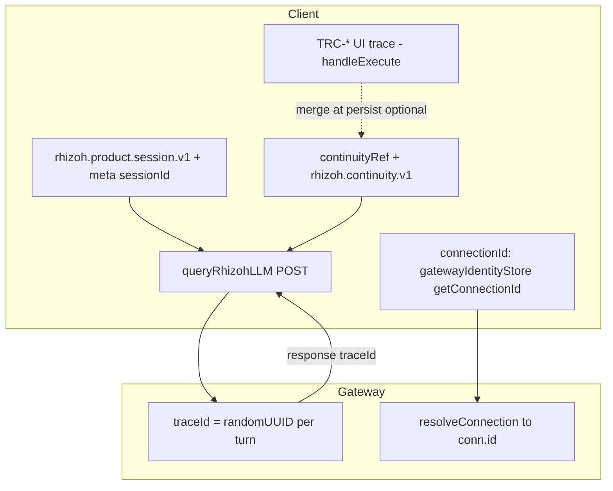

# Rhizoh Session Identity Layer — Inventory & Binding Map (V0)

**Durum:** mimari envanter (yürütme taahhüdü değil).  
**Kapsam:** `traceId`, `continuityRef` / client continuity disk, `connectionId`, ürün `sessionId`.  
**Amaç:** tek SSOT adayı, yayılım yönü, birleşme noktaları, çatışma yüzeylerini netleştirmek.  
**Post-SSOT canonical (freeze · identity · snapshot):** [`RHIZOH_FREEZE_IDENTITY_SNAPSHOT_SSOT_V0.md`](RHIZOH_FREEZE_IDENTITY_SNAPSHOT_SSOT_V0.md) — istemci `connectionId` sahipliği, freeze sınırı, snapshot’ın epistemik sınırı.  
**Politika (motor değil):** concern başına primary anchor, çatışma tetikleri, merge sınıfları — [`RHIZOH_SSOT_SELECTION_POLICY_V0.md`](RHIZOH_SSOT_SELECTION_POLICY_V0.md). **Runtime birleşme anları:** [`RHIZOH_RUNTIME_IDENTITY_RESOLUTION_FLOW_V0.md`](RHIZOH_RUNTIME_IDENTITY_RESOLUTION_FLOW_V0.md). **Studio ↔ Firebase contract:** [`RHIZOH_STUDIO_FIREBASE_INTEGRATION_STABILIZATION_V0.md`](RHIZOH_STUDIO_FIREBASE_INTEGRATION_STABILIZATION_V0.md).

---

## 1. Kimlik türleri ve SSOT adayları

| Kimlik | Rol | Root SSOT adayı? |
|--------|-----|-------------------|
| `rhizohProductSnap.sessionId` (`loadRhizohProductSession`) | Ürün konuşma oturumu; LLM gövdesinde `rhizohProductOrchestration.sessionId` | **Evet** — ürün “konuşma thread” ekseni |
| Gateway `traceId` (`rhizohGatewayTurn`) | Tek LLM turu (audit / OTEL / yanıt eşlemesi) | **Hayır** — per-turn; her POST’ta yeni UUID |
| İstemci `TRC-…` (`handleExecute` içinde) | Olay kartı / `eventPreview` / GreenRoom öncesi UI | **Hayır** — gateway `traceId` ile otomatik hizalı değil |
| `greenRoomLive.traceId` / sunucu GreenRoom | Yayın / replay rotası | **Ayrı aile** — ana sohbet thread’inden bağımsız |
| `continuityRef` + `rhizoh.continuity.v1` (localStorage) | Turn listesi + meta (konuşma hafızası) | **Evet** — istemci tarafı konuşma gerçeği |
| `connectionId` | Kullanıcı LLM API bağlantısı (Studio / gateway `resolveConnection`) | **Credential / provider routing** — konuşma session değil |
| `voiceTtsSessionIdRef` (sayı) | TTS / barge-in iptal korelasyonu | **Hayır** — yalnızca yerel ses oturumu |

**İki eksen özeti:** (A) `sessionId` = ürün konuşma thread’i; (B) `traceId` = sunucu turu / denetim. Birbirinin yerine geçmemeli; ilişki “session altında sıralı trace” olarak ileride netleştirilebilir.

---

## 2. Üretim noktaları

### `traceId`

- **Sunucu (asıl LLM turu):** `apps/gateway/src/rhizohGatewayTurn.js` — `rhizohGatewayTurn(input)` girişinde `randomUUID()`; tüm turn orchestration bu ID ile.
- **İstemci (UI / broadcast öncesi):** `apps/client/src/AppRhizoh528.jsx` — `handleExecute` içinde `TRC-${Date.now().toString(36)}-…` → `eventPreview` vb.
- **Persist birleştirme:** `persistContinuityTurn` çağrısında `traceId: traceId || out.traceId || ""` (metin yolu: UI TRC ile gateway dönüşü birleştirilebilir).
- **Başka alt sistem:** `apps/client/src/kernel/company/autonomySubstrateState.js` — görev `traceId`’leri; Rhizoh sohbet ailesiyle karıştırılmamalı.
- **Yerel stub:** `queryRhizohLLM` gateway yokken `traceId: ""`.

### `continuityRef` / disk

- **Disk:** `localStorage` anahtarı `rhizoh.continuity.v1` — `readClientContinuity` / `writeClientContinuity` (`AppRhizoh528.jsx`).
- **Ref:** `continuityRef` + `syncClientContinuityRef` (`apps/client/src/rhizoh/continuity/continuitySyncBridge.js`).
- **Turn üretimi:** `persistContinuityTurn` — `turns` dizisine append, `meta` güncellemesi, `rhizohProductSessionV1` snapshot.

### `connectionId`

- **Gateway:** `apps/gateway/src/server.js` — Rhizoh LLM route: `resolveConnection(auth.uid, payload.connectionId)`; yanıtta `connectionId: conn?.id || null`.
- **İstemci (Post-SSOT):** Tek aktif bağlantı **`gatewayIdentityStoreV0`** (`getConnectionId` / subscribe); UI’da **store dışında ayrı tutulan aktif bağlantı state’i kullanılmaz** — paralel gizli state (dual-write) regression sınıfı; repo’da CI ile yasaklı token taraması vardır. Ana sohbet ve paneller `getConnectionId()` ile hizalanır; bazı dar çağrı yolları (ör. seçili ses/HUD akışı) geçici olarak `connectionId: ""` gönderebilir — bilinçli tekilleştirme kuyruğu.

### `sessionId` (ürün)

- **Kaynak:** `apps/client/src/rhizoh/product/rhizohProductSessionPersistenceV1.js` — `createInitialRhizohProductSession()`, `loadRhizohProductSession` / `saveRhizohProductSession`; LS `rhizoh.product.session.v1` + `continuity.meta.rhizohProductSessionV1` birleşimi (`pickNewer`).

---

## 3. Tüketim ve yayılım

- **`buildContinuityPayload`:** `continuityRef.current` öncelikli, yoksa disk `turns` / `meta`.
- **`queryRhizohLLM`:** `readClientContinuity()` sık okuma; POST gövdesinde `continuity` (`contForLlm`) ve `rhizohProductOrchestration.sessionId`.
- **Gateway yanıtı:** `traceId` istemciye döner → `rhizohPersistTraceFromOut`, sağlık logları, epistemik yüzey event’leri.
- **`connectionId`:** yalnızca provider anahtarı çözümü ve faturalama bağlamı; LLM thread kimliği değil.

---

## 4. Birleşme (merge) noktaları

- **`persistContinuityTurn`:** disk + ref senkronu, identity graph hydrate — konuşma gerçeğinin tek yazım merkezi.
- **`loadRhizohProductSession`:** LS ile `continuity.meta.rhizohProductSessionV1` — `pickNewer`.
- **`handleExecute`:** persist sırasında `traceId: traceId || out.traceId || ""` — UI üretimi ile gateway turunun birleştirilmesi (yalnız bu path’te açık).

---

## 5. Çatışma / çiftleşme yüzeyleri

1. **İki `traceId` ailesi:** İstemci `TRC-*` vs gateway `randomUUID()`. Şema düzeyinde “parent session + child traces” tanımı yok.
2. **`connectionId`:** Store ile hizalanmayan **dar istemci yolları** hâlâ `""` veya satır-içi `it.connectionId` kullanabilir; tam tekilleştirme için tüm `queryRhizohLLM` / gateway POST yüzeylerinin `getConnectionId()` ile gözden geçirilmesi (bkz. canonical doc checklist).
3. **`continuityRef` vs disk:** Çok sekme / yarış durumunda disk ref’ten ileri gidebilir; kod içi yorum bu riski işaret eder.
4. **`sessionId` vs `traceId`:** Payload’da ikisi birlikte; gateway her turda yeni `traceId` — session altında sıralı trace protokolü opsiyonel ileri iş.
5. **`voiceTtsSessionIdRef`:** Bilinçli olarak konuşma `sessionId` / gateway `traceId` ile bağlı değil (yerel TTS oturumu).

---

## 6. Binding map (Mermaid)

---

## 7. Önerilen sonraki teknik adımlar (ürün)

1. **İki ekseni dokümante tut:** `sessionId` (thread) ve `traceId` (tur); birini diğerine indirgeme.
2. **`TRC-*` stratejisi:** Kaldırma, veya `sessionId + clientSeq` ile gateway audit satırına bağlama (gateway değişikliği gerekebilir).
3. **Ana sohbet / tüm LLM yüzeyleri:** Kalan `connectionId: ""` veya çift kaynaklı çağrıları `getConnectionId()` ile tekilleştirme (canonical drift checklist).
4. **Çok sekme:** `continuityRef` / disk birleşimi için explicit merge veya “leader tab” politikası.

---

## 8. Dosya referansları (repo)

| Konu | Dosya |
|------|--------|
| Gateway turn + `traceId` üretimi | `apps/gateway/src/rhizohGatewayTurn.js` |
| Rhizoh LLM route, `connectionId` | `apps/gateway/src/server.js` |
| `queryRhizohLLM`, continuity disk, `handleExecute` / voice | `apps/client/src/AppRhizoh528.jsx` |
| Gateway-owned `connectionId` store | `apps/client/src/rhizoh/runtime/gatewayIdentityStoreV0.js` |
| Ürün `sessionId` | `apps/client/src/rhizoh/product/rhizohProductSessionPersistenceV1.js` |
| Ref köprüsü | `apps/client/src/rhizoh/continuity/continuitySyncBridge.js` |
| Bilişsel çağrıda boş `connectionId` | `apps/client/src/studio/runtime/rhizohCognitiveInvoke.ts` |
| Freeze ↔ runtime import guard (CI) | `scripts/validateFreezeIdentityBoundary.mjs` |
| Snapshot şema / merge uyarıları (log-only) | `apps/client/src/rhizoh/runtime/runtimeSnapshotValidateV0.js` |

---

*V0 — Session Identity Layer envanteri; ürün ve gateway evrimiyle birlikte revize edilir.*
