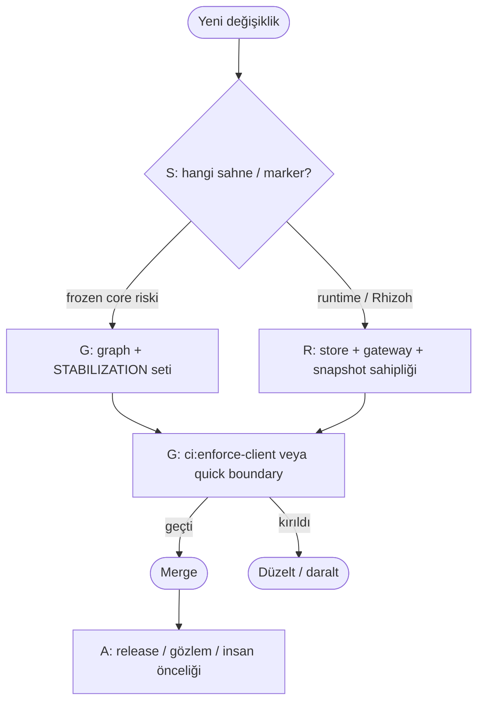

# SGRA Operational Map — nerede ne karar verilir? (V0)

**Amaç:** “Decision latency drift”i azaltmak — yani çok katman varken **hangi yüzeyde** karar verileceğini seçmek için zihinsel yükü düşürmek. Bu dosya **operasyonel UX / yönlendirme** içindir; yürütme motoru veya yeni SSOT değildir.

**SGRA (bu haritada):**

| Harf | Katman | Burada verilen kararlar (örnek) |
|------|--------|----------------------------------|
| **S** | **Spec / sprint sahnesi** | Ne inşa edilir, hangi marker (`SPECFLOW_MARKERS.md`), hangi habitat; akademik vs çekirdek ayrımı. |
| **G** | **Guarded CI + freeze sınırı** | Merge öncesi ne kanıtlanır: şema kilidi, stabilization graph, canonical drift paketi, freeze↔identity import yönü. “Kod girebilir mi?” |
| **R** | **Runtime sahipliği (kod)** | `connectionId` store, snapshot derleyici, gateway sözleşmesi; **davranış** ve tek yazım yüzeyleri. |
| **A** | **Ajan / insan operasyon ritmi** | PR öncesi hangi npm zinciri (`ci:enforce-client` vs `validate-client-boundaries-quick`), dokümanı nerede güncellersin; **yorum ve öncelik** (execution değil — bkz. observation fabric). |

**Tek cümle:** Karar önce **S**’de “ne tür iş” olduğuna, sonra **G**’de “geçebilir mi”ye, uygulamada **R**’de “hangi modül sahibi”ye, günlük işte **A**’da “hangi hafif komut / hangi doc”a bakılır.

---

## 1. Hızlı yönlendirme (“şunu yapmak istiyorum…”)

| Niyet | Önce bak |
|--------|-----------|
| Yeni özellik / ürün davranışı | **S** — `SPECFLOW_MARKERS.md`, ilgili habitat; frozen `phase*.js` dokunulacak mı? |
| PR’ı merge’a hazırlamak | **G** — `npm run ci:enforce-client`; iterasyonda `npm run stabilization:validate-client-boundaries-quick` |
| `connectionId` / kimlik / snapshot sınırı | **R** — [`RHIZOH_FREEZE_IDENTITY_SNAPSHOT_SSOT_V0.md`](RHIZOH_FREEZE_IDENTITY_SNAPSHOT_SSOT_V0.md) |
| `traceId` / session / continuity envanteri | **R** (detay) — [`RHIZOH_SESSION_IDENTITY_INVENTORY_V0.md`](RHIZOH_SESSION_IDENTITY_INVENTORY_V0.md) |
| “Bu log / snapshot gerçek mi?” | **A** — Hayır; gözlem yüzeyi. Karar **R**+**G** (kod + test), yorum **A** |
| Guard / canonical politikasını değiştirmek | **G** + **A** — `validateCanonicalDriftGuards.mjs` üstündeki policy notları; canonical §5.5–5.6; gereksiz genişleme yok |
| İstanbul / dünya presence / embodiment / “yaşayan habitat” | **S** — [`RHIZOH_LIVING_WORLD_AND_EMBODIMENT_ROADMAP_V0.md`](RHIZOH_LIVING_WORLD_AND_EMBODIMENT_ROADMAP_V0.md) (`RESEARCH-ONLY`); **projection sınırı** — [`RHIZOH_PROJECTION_DISCIPLINE_V0.md`](RHIZOH_PROJECTION_DISCIPLINE_V0.md); uygulama **R**’de `worldPresenceRuntime*` vb.; frozen `phase*.js` için **G** ayrı kapı |

---

## 2. Mermaid — karar akışı (özet)

---

## 3. Yanlış katmanda karar verme (anti-pattern)

| Yanlış | Doğru yön |
|--------|-----------|
| Snapshot’a bakıp “sistem böyle çalışıyor” demek | **R** kod + **G** test; snapshot yalnız gözlem |
| Her tartışmayı canonical V0 dosyasına yazmak | Detay **S** envanter / feature doc; canonical sınır + indeks |
| CI’ya yeni regex dizisi ekleyerek “güvenlik hissi” | **G** politikası: dar guard, review, §5.5 disiplini |
| Ajan önerisiyle frozen fazı değiştirmek | **S**/**G** insan + graph seti; ajan yorum **A**, execution değil |

---

## 4. İlişkili teknik referanslar

- [`RHIZOH_FREEZE_IDENTITY_SNAPSHOT_SSOT_V0.md`](RHIZOH_FREEZE_IDENTITY_SNAPSHOT_SSOT_V0.md) — freeze · identity · snapshot + operasyonel sıkışma notları  
- [`AGENTS.md`](../AGENTS.md) — agent bağlamı ve npm komut indeksi  
- [`STABILIZATION.md`](../STABILIZATION.md) — freeze graph taahhüdü  
- [`docs/OBSERVATION_FABRIC_V1.md`](OBSERVATION_FABRIC_V1.md) — *Agents may influence interpretation, never execution.*
- [`RHIZOH_LIVING_WORLD_AND_EMBODIMENT_ROADMAP_V0.md`](RHIZOH_LIVING_WORLD_AND_EMBODIMENT_ROADMAP_V0.md) — yaşayan dünya, presence, embodiment (`RESEARCH-ONLY`)

---

*V0 — SGRA operational map; karar yönlendirmesi netleştikçe hafif güncellenir.*
