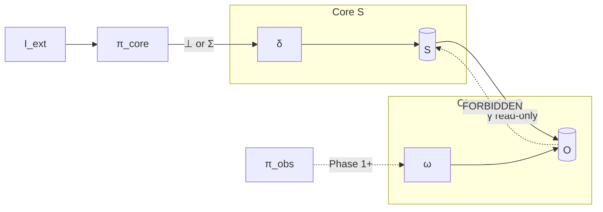
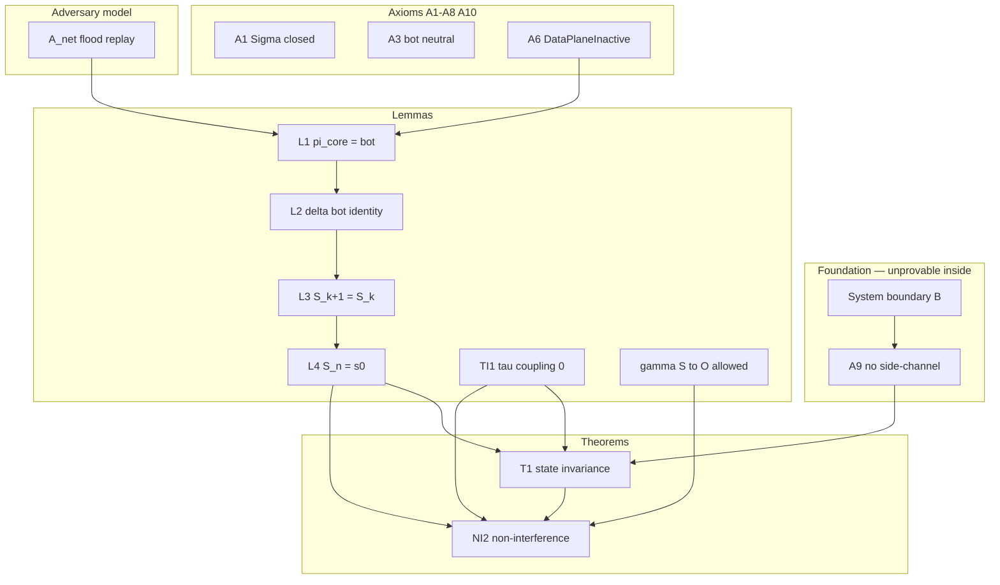

# Rhizoh System Non-Interference Theorem v2.0

**Status:** THEOREM SUITE (bidirectional closure map — **conditional** on foundation axioms)  
**Phase:** 0.5 primary · Phase 1+ extends observation leg only  
**Stack:** Spec → Adversary → Temporal (TI1) → **T1** → **NI2 (this doc)**

**Honest classification:**

| Class | Examples | Provable inside Rhizoh formalism? |
|-------|----------|-----------------------------------|
| **Theorem** | T1, TI1, NI2 (given axioms) | Inductive sketch only |
| **Foundation axiom** | **A9**, boundary \(\mathcal{B}\) | **No** — model boundary |
| **Implementation lemma** | P1, TI-P2, stress hash proxy | Empirical / CI |

> **Critical:** Theorem T1 is **conditional**. **A9 is the hidden foundation** — not a lemma. Over-formalization stops when new docs no longer change falsifiability or ops gates.

---

## 0. Guard — over-formalization risk zone

| Stop adding formal docs when | Continue when |
|------------------------------|---------------|
| No new falsification row | New adversary class or channel discovered |
| No ops/checklist change | READY/HOLD needs new evidence type |
| Re-stating T1 in new notation | Bidirectional flow or τ semantics **undefined** |

**This doc closes:** \(S \leftrightarrow O\) directionality · A9 prominence · proof closure graph · \(\tau\) non-degeneracy.

---

## 1. Bidirectional information flow (asymmetric — not symmetric isolation)

Rhizoh is a **one-way information flow system** (IFC), not mutual non-interaction.

| Edge | Allowed? | Formal |
|------|----------|--------|
| \(I_{\text{ext}} \to \pi_{\text{core}} \to \delta\) | Only \(\bot\) on \(S\) when inactive | T1 |
| **\(S \to O\)** | **Yes** — observational projection | \(\gamma: S \to \mathcal{O}(S)\) (read-only) |
| **\(O \to S\)** | **No** | \(\forall o \in O:\ \neg(o \to S)\) |
| \(O \to\) control-plane routing/admission | **No** (S4) | Side-channel forbidden |

**Reviewer-facing sentence:** *Observation may reflect core; core must not depend on observation content under inactive data-plane.*

---

## 2. Observation function \(\gamma\) (explicit \(S \to O\))

\[
\gamma:\ S \to \mathcal{O}(S)
\]

| Property | Requirement |
|----------|-------------|
| Read-only | \(\gamma\) does not invoke \(\delta\) |
| Non-authoritative | UI / audit may display \(\gamma(s)\); **must not** feed \(\Sigma\) |
| Phase 0.5 | \(\gamma\) may run on **invariant** \(s_0\) — observation is static snapshot of frozen core |

**Not leakage:** Publishing \(\gamma(S_t)\) while \(S_t \equiv s_0\) is **allowed** outward flow.

**Leakage (violation):** Any handler that sets \(\sigma \in \Sigma\) from a predicate on \(O\) (e.g. witness count → admission).

---

## 3. Observational leakage bounds (Phase 0.5 / Phase 1+)

Witness store \(O\) may **grow** without violating T1 on \(S\).

| Bound | Phase 0.5 | Phase 1+ (witness on) |
|-------|-----------|------------------------|
| **State** | \(S_t \equiv s_0\) | \(S_t \equiv s_0\) on core (S1) |
| **Observation size** | \(|O_t| = |O_0|\) (no \(\omega\)) | \(|O_t| \le |O_0| + N \cdot |\text{packets}|\) (append-only) |
| **Feedback** | \(\neg(O \to S)\) | \(\neg(O \to S)\) — **Theorem O1** |
| **Side-channel** | Volume of \(p_k\) must not alter routing | S4 enforcement |

**Observational leakage (information-theoretic sketch):**

\[
I(O_t;\ \text{decision}(S_{t+1})) = 0
\quad\text{under DataPlaneInactive}
\]

where \(\text{decision}(S_{t+1})\) is any control-plane branch keyed on L1/admission/routing.

**Practical bound:** Witness append rate \(\le \lambda_{\max}\) (gateway cap); **no** bound required on \(S\) size when T1 holds.

---

## 4. Logical clock \(\tau\) — non-degenerate refinement (TI1′)

**Problem:** If \(S\) is constant, \(\tau\) must not be confused with “frozen time” — baseline internal work still advances \(\tau\).

**Definition:**

\[
\tau:\ \mathbb{N} \to \mathbb{N}
\]

\[
\tau_{k+1} = \tau_k + \mathbb{1}[\text{execution\_step}_k]
\]

where \(\text{execution\_step}_k\) is true iff the core scheduler applies **any** scheduled internal transition (including epistemic tick loop), and is **false** when the only effect of step \(k\) is \(\delta(S_k, \bot)\) from external \(p_k\) processing.

**Independence (TI1′):**

\[
\frac{d I_{\text{ext}}}{d \tau} = 0
\quad\Longleftrightarrow\quad
\text{execution\_step from } p_k \text{ does not increment } \tau
\]

**T1 temporal claim (corrected):**

\[
\tau_{\text{adversary}}(t) = \tau_{\text{canonical}}(t)
\]

not \(\tau = \text{const}\). Baseline and adversary runs share the **same internal clock**; flood does not add extra logical steps.

*Detail:* [`RHIZOH_TEMPORAL_ISOLATION_LEMMA_V1.0.md`](RHIZOH_TEMPORAL_ISOLATION_LEMMA_V1.0.md) §2.1 (refined).

---

## 5. Foundation axiom A9 (meta — system carrier)

**A9 (No alternative channel):**

\[
\nexists\, C \neq \pi_{\text{core}}:\ C(I_{\text{ext}}) \text{ drives } \delta \implies \text{model breach}
\]

| Property | Value |
|----------|--------|
| Role | **Foundation axiom** — defines system boundary \(\mathcal{B}\) |
| Provable from T1? | **No** |
| Enforced by | Capability isolation · code review · CI (P1, A-P2) |
| If false | T1 void — falsified by any direct L1 write |

**Theorem dependency (explicit):**

\[
\text{A9} \land \text{DataPlaneInactive} \land \mathcal{A}_{\text{net}} \models \text{T1}
\]

**Do not list A9 as a lemma.** Label every T1 citation: *conditional on A9*.

---

## 6. Theorem NI2 (non-interference — bidirectional closure)

**Theorem NI2 (Phase 0.5).** Under A1–A10, A9, DataPlaneInactive, and \(\mathcal{A}_{\text{net}}\):

1. **Core invariance (T1):** \(S_t \equiv s_0\)
2. **Temporal coupling (TI1′):** \(\tau_{\text{adversary}}(t) = \tau_{\text{canonical}}(t)\), \(\frac{d I_{\text{ext}}}{d\tau} = 0\)
3. **Backward non-interference:** \(\forall o \in O:\ \neg(o \to S)\)
4. **Forward observation:** \(\gamma(S_t)\) permitted; \(\gamma\) does not affect \(\delta\)
5. **No control leakage:** \(I(O_t;\ \text{decision}(S_{t+1})) = 0\) on routing/admission/L1

**Phase 1+ extension (conditional on Theorem O1):**

\[
\pi_{\text{obs}}(p) = \sigma_{\text{obs}} \implies \omega(O, \sigma_{\text{obs}})
\quad\text{and still}\quad
\pi_{\text{core}}(p) = \bot,\ \neg(O \to S)
\]

---

## 7. Proof closure graph

**Closure rule:** No edge from **O** or **\(I_{\text{ext}}\)** to **\(\delta\)** except \(\pi_{\text{core}} \to \bot\) when inactive.

---

## 8. Falsification surface (executable)

| Violation | Witness |
|-----------|---------|
| T1 / NI2.1 | \(S_t \not\equiv s_0\) · hash proxy mismatch |
| TI1′ / NI2.2 | \(\tau_{\text{adversary}} \ne \tau_{\text{canonical}}\) |
| NI2.3 | Trace: \(O \to S\) write or \(\sigma \in \Sigma\) from \(O\) |
| NI2.5 | Routing changes with only packet rate change |
| A9 breach | Direct L1 mutation without \(\Sigma\) op |

---

## 9. Deferred — Theorem O1 (Phase 1+)

**O1 (witness non-feedback):** Under \(\mathcal{A}_{\text{adapt}}\),

\[
\forall o \in O:\ \neg(o \to S) \land \neg(o \to \Sigma_{\text{control}})
\]

Required before \(\pi_{\text{obs}} \ne \bot\) in production. **Not** part of NI2 proof until filed.

---

## 10. Document map (formal stack — closed at closure map)

| Layer | Doc |
|-------|-----|
| Spec | [`RHIZOH_STATE_ISOLATION_ASYNC_INPUT_PHASE0_5_V1.0.md`](RHIZOH_STATE_ISOLATION_ASYNC_INPUT_PHASE0_5_V1.0.md) |
| Adversary | [`RHIZOH_STATE_ISOLATION_ADVERSARY_MODEL_V1.0.md`](RHIZOH_STATE_ISOLATION_ADVERSARY_MODEL_V1.0.md) |
| Temporal | [`RHIZOH_TEMPORAL_ISOLATION_LEMMA_V1.0.md`](RHIZOH_TEMPORAL_ISOLATION_LEMMA_V1.0.md) |
| State T1 | [`RHIZOH_STATE_ISOLATION_THEOREM_V1.0.md`](RHIZOH_STATE_ISOLATION_THEOREM_V1.0.md) |
| **NI2** | **This doc** |
| **Closure** | [`RHIZOH_CONSTRAINT_CLOSURE_MAP_V1.0.md`](RHIZOH_CONSTRAINT_CLOSURE_MAP_V1.0.md) — DAG · cascade · theorem vs constraint |
| Ops | [`RHIZOH_PHASE_GATE_OPERATING_MODE_V1.0.md`](RHIZOH_PHASE_GATE_OPERATING_MODE_V1.0.md) |

**No further formal layers** until READY/HOLD or O1 thaw — only stress export (P2) and MANUAL checklist.

---

## 11. One-line system status

Rhizoh is a **formal epistemic boundary system**: correctness is **consistency under explicit unprovable assumptions (A9)**, with **falsifiable** runtime proxies — not a completed mechanical proof calculus.

*Non-interference v2.0 — 2026-05-19*
