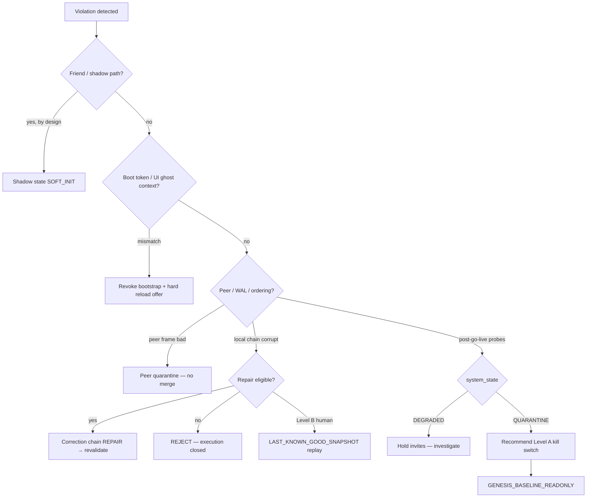

# Rhizoh Violation Response Playbook (V1)

**Status:** SECURED — operational closure for “when integrity breaks, what happens?”  
**Tag:** `CORE-ELIGIBLE` (maps to shipped modules) · captain actions where automation stops  
**Parent:** [`RHIZOH_OPERATIONAL_CONSTITUTION_V1.md`](RHIZOH_OPERATIONAL_CONSTITUTION_V1.md) (Articles I–III)

**This document answers:** On violation, does the system **revoke**, **quarantine**, hold **shadow state**, or start a **correction chain**?

---

## 0. Four response modes (not interchangeable)

| Mode | Meaning | Typical trigger | Execution authority |
|------|---------|-----------------|---------------------|
| **Shadow state** | Pre-seal / observation-only continuity | Friend onboarding, first anchor | **No** `bootValidityToken`; WAL tick 0 |
| **Revoke** | Strip illegitimate boot / living-world context | Token mismatch, sealer drift verdict | Bootstrap cleared; may **hard reload** |
| **Quarantine** | Isolate suspect input or pause expansion | Peer WAL bad frame; post-go-live `QUARANTINE`; substrate `QUARANTINE_ISOLATION` | **No new seals** / peer held / repair gate |
| **Correction chain** | Forward-only fix from canonical past | LKG truncation, repair kernel, seal forward-adopt | **Replay / repair** — never narrative-authored |

**Invariant (all modes):** Narrative and Derived **never** mint execution truth. Correction always anchors on **log + seal**, not story.

---

## 1. Master decision flow (captain view)

---

## 2. Violation class → response matrix

| Class | Example signal | Primary response | Auto today | Captain |
|-------|----------------|------------------|------------|---------|
| **TIME_INTEGRITY** | Graph hash ≠ lock | **Block merge** (CI/pre-deploy) | CI fails build | Fix in intentional stabilization change set only |
| **DATA_INTEGRITY** | `cursor_hash_segment_mismatch`, orphan narrative | **Quarantine** + probe fail | `postGoLiveIntegrityLoop` → `DEGRADED`/`QUARANTINE` | Level A if 2× `QUARANTINE`; audit provenance |
| **PERCEPTION_INTEGRITY** | `boot_validity_token_mismatch` | **Revoke** | `enforceRuntimeBootValidityTokenV0` | Confirm reload; verify `bootValidityTokenCreated: false` on friends |
| **CAUSAL_INTEGRITY** | `ordering_regression`, `chain_breach` | **Correction chain** or **Level B** | Repair kernel in `QUARANTINE_ISOLATION`; peer quarantine | Level B = human-only (worker truncate + replay) |
| **PEER_INGRESS** | stale / replay mismatch peer WAL | **Peer quarantine** | `peerWalConvergenceWireV0` disposition | Review `realityHealthMetricsV0` |
| **ONBOARDING (intended)** | First map pick | **Shadow state** | `initializeShadowContinuityBufferV0` | Archive `epi_sig_*`; no token |

---

## 3. Mode detail

### 3.1 Shadow state (not a failure mode)

**When:** Sovereign node onboarding before full living-world seal.

| Field | Expected |
|-------|----------|
| `state` | `SOFT_INIT` |
| `walTick` | `0` |
| `bootValidityTokenCreated` | **`false`** |

**What system does:** Writes local shadow segment (`sovereign_shadow_onboarding_v0`); exposes `window.__rhizoh_shadow_continuity`.

**What system does not do:** Promote shadow to execution token; show “sealed” UI for unverified boot.

**Captain:** [`CAPTAIN_BACKSTAGE_VERIFICATION_V0.1.md`](CAPTAIN_BACKSTAGE_VERIFICATION_V0.1.md)

---

### 3.2 Revoke (strip ghost authority)

**When:** Boot validity token no longer matches disk atomic seal; sealer `shouldRevokeBootstrap` (drift / audit / integrity verdict).

**What system does (`bootValidityTokenV0.js`):**

1. Append revoke log  
2. `revokeLivingWorldBootstrapV0`  
3. Clear `window.__rhizoh_boot_context` + seal runtime anchors  
4. Return `hardReload: true` for watchdog path  

**What system does not do:** Patch state from LLM narrative; silent continue with half-revoked context.

**Captain:** After reload, re-run Denetim A–E; if repeat mismatch → hold invites, inspect IDB / disk key.

---

### 3.3 Quarantine (isolate, do not merge lies)

**A — Post-go-live integrity (`postGoLiveIntegrityLoopV0.js`)**

| `system_state` | Meaning | Recommended action |
|----------------|---------|-------------------|
| `LIVE_OK` | All checks pass | Continue |
| `DEGRADED` | 1 check failed | **Hold** new Guardian invites; investigate |
| `QUARANTINE` | 2+ checks failed | **Recommend Level A** — onboarding off |

Auto: **recommend only** for Level A (2 consecutive `QUARANTINE` ticks per Stability Contract §4).  
No auto Level B without captain.

**B — Peer WAL (`peerWalConvergenceWireV0`)**

- Bad frame → `disposition: "quarantine"` — peer held in `quarantineByCastleId`  
- Does not corrupt local canonical chain  

**C — Substrate boot (`SUBSTRATE_BOOT_PHASE_V0.QUARANTINE_ISOLATION`)**

- Execution permission **closed** until recovery orchestrator **repair** or **reject**  
- Enters **correction chain** (§3.4), not shadow  

**D — Policy quarantine (soft)**

- `orphanNarrativeDetected` → block new companion suggestions (policy filter)  
- Not a full system halt  

---

### 3.4 Correction chain (forward-only law)

**When:** WAL breach repairable; stale boot seal **forward-adopt**; Level B after human trigger.

**Orchestrator:** `continuityRecoveryOrchestratorV0.js`

| Decision | Effect |
|----------|--------|
| `ACCEPT` | Chain valid — continue `RUN` |
| `REPAIR` | `replayRepairKernelV0` — rollback window / LKG truncation / hash reanchor (eligible only) |
| `REJECT` | **No execution** — past not safe to rehydrate |

**Repair eligibility:** Replay window must not dive below **last trusted checkpoint** (`assertRepairEligibilityV0`).

**Forward adopt (not revoke):** `assertBootValidityTokenV0` → `forwardAdopt` — commit new seal version when disk advanced legitimately.

**Level B (human):** Worker truncates append stream to last **verified** `SealedRuntimeSnapshot` → clients `replay_required` → recovery state **`LAST_KNOWN_GOOD_SNAPSHOT`**.

**Never:** Derived or Narrative scores rewrite genesis or mint boot token.

---

## 4. Kill switch ↔ response mode

| Level | Trigger | Resting state | Modes involved |
|-------|---------|---------------|----------------|
| **A — Soft** | Captain / 2× `QUARANTINE` | `GENESIS_BASELINE_READONLY` | Quarantine expansion; Real ingress may continue |
| **B — Hard** | WAL fork / causality split (human) | `LAST_KNOWN_GOOD_SNAPSHOT` | Correction chain + replay |

See [`RHIZOH_GO_LIVE_ACTIVATION_PROTOCOL_V1.md`](RHIZOH_GO_LIVE_ACTIVATION_PROTOCOL_V1.md) §4 · [`POST_GO_LIVE_AUTONOMOUS_STABILITY_CONTRACT_V1.md`](POST_GO_LIVE_AUTONOMOUS_STABILITY_CONTRACT_V1.md) §5.

---

## 5. What the system refuses to do on violation

| Forbidden | Why |
|-----------|-----|
| Narrative → boot / seal | §3 No boot token from story |
| Optimistic UI → fake sealed state | Article III perception integrity |
| Auto Level B without human | Protocol safety |
| Rewrite frozen `phase*.js` as “hotfix” | Article I time integrity |
| Merge quarantined peer WAL into canonical | Peer quarantine purpose |

---

## 6. Captain quick reference (surfaces)

| Surface | Use |
|---------|-----|
| `window.__rhizoh_shadow_continuity` | Shadow / SOFT_INIT |
| `window.__rhizoh_boot_validity_token` | Must be absent on friends |
| `window.__rhizoh.goLiveIntegrity.evaluate()` | `system_state` |
| `window.__rhizoh_go_live_integrity` | Loop snapshot |
| `window.__rhizoh.breachObservation.trace()` | Factual breach log (READ-ONLY) — [`RHIZOH_REALITY_BREACH_OBSERVABILITY_V0.1.md`](RHIZOH_REALITY_BREACH_OBSERVABILITY_V0.1.md) |
| `realityHealthMetricsV0` | Peer quarantine / replay mismatch counts |

**Log in:** [`docs/academic/SESSION_LOG.md`](academic/SESSION_LOG.md) — violation class, mode taken, final state.

---

## 7. Automation gaps (honest)

| Gap | Today | Target |
|-----|-------|--------|
| Gateway-side §7 loop | Client T+300s | Edge evaluator publishing `system_state` |
| Auto Level A flag push | Recommend only | Config push `sovereign_onboarding_enabled: false` |
| UI–log divergence HUD | Partial (boot revoke) | Explicit `PERCEPTION_INTEGRITY` banner |
| Unified violation bus | Scattered modules | Single `violationEnvelopeV0` schema (future) |

**Law stress (v0.1):** [`RHIZOH_VIOLATION_SIMULATION_SUITE_V0.1.md`](RHIZOH_VIOLATION_SIMULATION_SUITE_V0.1.md) — `npm run test -- src/rhizoh/runtime/__tests__/violationSimulationSuiteV0.test.js`

---

## 8. Related modules

| Module | Mode |
|--------|------|
| `shadowContinuityBufferV0.js` | Shadow |
| `bootValidityTokenV0.js` | Revoke / forward-adopt |
| `worldSealerV0.js` | Revoke triggers |
| `continuityRecoveryOrchestratorV0.js` | Correction chain |
| `postGoLiveIntegrityLoopV0.js` | Quarantine signal |
| `peerWalConvergenceWireV0.js` | Peer quarantine |
| `temporalOntologicalWatchdogV0.js` | Watchdog pass → revoke/repair hooks |

---

*Shadow is intentional. Revoke removes false authority. Quarantine stops spread. Correction chain heals only from canonical past.*
