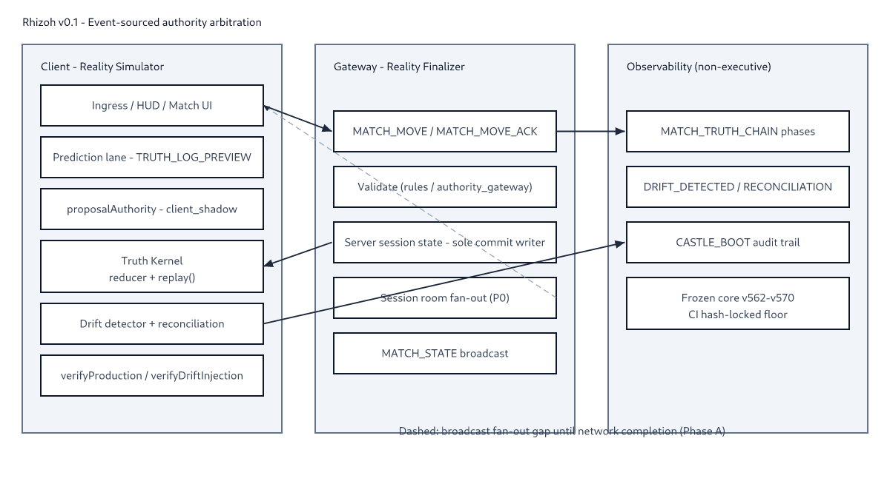
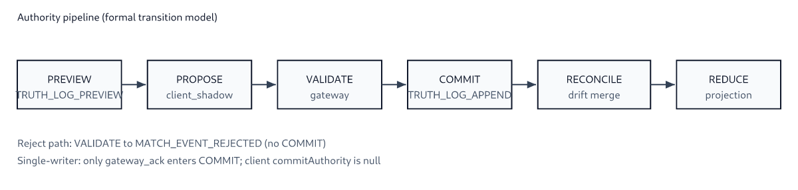
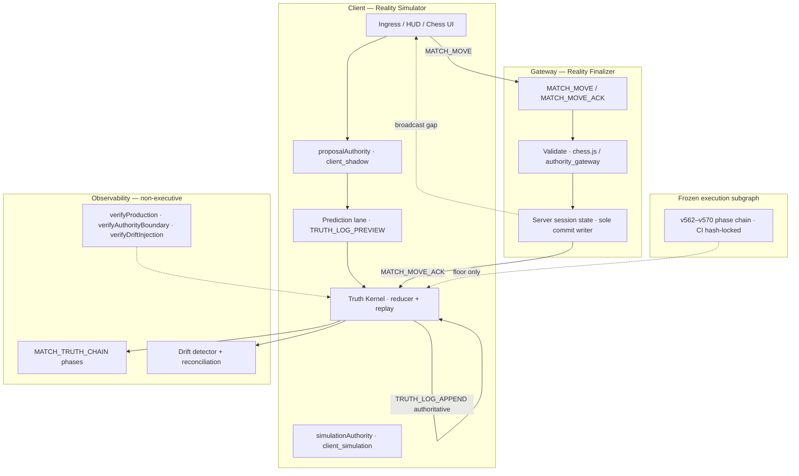

# Rhizoh: Event-Sourced Multi-Agent Epistemic Simulation for Distributed Reality Construction

**Tag:** `RESEARCH-ONLY`  
**Status:** arXiv-ready draft v0.1 (outline + abstract + architecture + measured results)  
**Parent:** [`OUTREACH_ACADEMIC_PAPER_PACK_V0.1.md`](../OUTREACH_ACADEMIC_PAPER_PACK_V0.1.md) · [`RHIZOH_HONEST_BASELINE_CHARTER_V1.md`](../RHIZOH_HONEST_BASELINE_CHARTER_V1.md)

**Authors:** [Founder] · Rhizoh Habitat (Castle / Rhizoh continuity protocol)  
**Keywords:** event sourcing, distributed systems, authority arbitration, reconciliation, observer-centric architecture, multiplayer consistency

---

## Final title (v0.1)

**Primary (distributed systems framing):**

> **Rhizoh: Event-Sourced Authority Arbitration for Reconciliation-Based Distributed Reality Construction**

**Subtitle (epistemic simulation layer):**

> *A Multi-Stage Proposal–Preview–Commit Model with Observer-Centric Nodes and Append-Only Truth Logs*

**Avoid as sole title:** metaphor-only phrases (“reality machine”, “epistemic OS”) without operational anchors — reviewers classify as speculative.

---

## Abstract

Modern real-time multiplayer systems typically enforce a **single centralized truth** through server-authoritative state and client-side prediction, treating divergence as a bug to be hidden. We describe **Rhizoh**, a prototype **event-sourced reality construction layer** that makes divergence **first-class**: clients operate as **reality simulators** (proposal, preview, and local simulation lanes) while a gateway **finalizes** authoritative state through a **single-writer commit rule**. Authoritative mutations append only to `truth_log_v0`; client proposals append to a separate **prediction lane** (`TRUTH_LOG_PREVIEW`) and cannot commit without gateway acknowledgment (`provenance=gateway_ack`).

The system implements a **multi-stage authority arbitration model** with explicit observability phases (`MATCH_EVENT_APPENDED`, `MATCH_EVENT_VALIDATED`, `MATCH_EVENT_COMMITTED`, `MATCH_STATE_REDUCED`) and a **drift–reconciliation engine** that classifies shadow vs. committed divergence (`DRIFT_DETECTED`, `RECONCILIATION_APPLIED`, `DRIFT_RESOLVED`) instead of silently overwriting candidate states. Users are modeled as **observer nodes** in an epistemic stack: interpretation layers may influence understanding but do not hold execution authority over sealed subgraphs (v562–v570).

We report **reproducible harness measurements** from the running prototype: deterministic replay equivalence (`produced state === replayed state`), successful single-writer boundary verification (`effectiveCommitWriter: server`, `commitAuthority: server` derived post-ack), and controlled drift injection with reconciliation recovery. We explicitly document **remaining product gaps**: live WebSocket fan-out (`broadcast_to_all_clients`), world/tower routing segmentation, and production-grade life-OS scheduling. **World Bridge Layer 2** (calendar, media, user-activity ingress with cross-space fusion and life-shadow counterfactuals) is implemented as an **interpretation-only** stub — not authoritative daily-life OS integration.

**Contribution:** (1) a testable **proposal–preview–commit** authority split with derived commit metadata; (2) an append-only **truth kernel** with reconciliation-tolerant simulation lanes; (3) operational verification hooks suitable for distributed-systems evaluation. **Not claimed:** solved consensus, production-grade C2C mesh, or general-purpose daily-life OS readiness.

---

## 1. Introduction

### 1.1 Problem

Classical multiplayer architectures optimize for **one truth, fast prediction, hidden rollback**. This works for games but encodes an implicit assumption: *reality is centralized and immediately enforced*. Agentic and multi-device systems increasingly require:

- Multiple **candidate realities** (devices, AI shadows, rehearsal lanes)
- **Auditable** transitions between candidates and authoritative state
- **Observer-safe** interpretation layers that cannot mutate sealed execution

Rhizoh asks: *what if we engineer for reconciliation rather than pretending divergence never exists?*

### 1.2 Contribution (falsifiable)

| Claim | Evidence hook |
|-------|----------------|
| Event-sourced authoritative truth | `truth_log_v0`, `replay()` determinism |
| Client never presents as commit authority | `commitAuthority: null` on client; `clientIsCommitAuthority: false` |
| Server single-writer finalization | `MATCH_MOVE_ACK` → `TRUTH_LOG_APPEND` |
| Drift is measurable and recoverable | `verifyDriftInjection()`, reconciliation phases |
| Observation ≠ execution | Frozen core + membrane CI; interpreter agents non-executive |

### 1.3 Non-claims

- Not a replacement for Raft/PBFT consensus
- Not proof of “multi-truth” in the philosophical sense — **one authoritative log** after arbitration
- Not production-grade daily-life OS — **World Bridge v0** provides interpretation-only calendar/media/user-activity ingress, shadow timelines, and fusion lanes (`ingestCalendarEvent`, `ingestMediaEvent`, `ingestUserActivity`); external calendar/media sync and executive scheduling remain future work

---

## 2. Related work

Rhizoh sits at the intersection of **event-sourced systems**, **multiplayer authority models**, and **reconciliation-based consistency** — not as a replacement for consensus protocols or CRDT merge algorithms, but as an **explicit arbitration layer** that makes candidate vs. authoritative state legible.

### 2.1 Event sourcing and logs as truth

Event sourcing treats an append-only log as the system of record; projections are derived and replayable [Young, 2010; Fowler, 2014]. Rhizoh's `truth_log_v0` follows this pattern: `dispatch → TRUTH_LOG_APPEND → reduce → projection`, with `verifyProduction()` proving `replay(truth_log) === projection`. Helland [2007] and Kleppmann [2017] emphasize immutability and log-centric reconciliation at scale — Rhizoh applies this locally with an explicit **prediction lane** (`TRUTH_LOG_PREVIEW`) that never masquerades as authoritative.

### 2.2 Operational transformation and CRDTs

OT [Ellis & Gibbs, 1999; Bernstein & Goodman, 1996] and CRDTs [Shapiro et al., 2011] solve **automatic convergence** under concurrent edits. Rhizoh **does not** claim always-merge semantics. Instead, the gateway **validates and rejects** illegal transitions (`MATCH_EVENT_REJECTED`); drift is **classified** (`noise | pattern | conflict | fork`) and **reconciled** through server arbitration rather than silent merge. This is closer to **optimistic replication with explicit finalization** than to OT/CRDT text editing.

### 2.3 Game server authority and rollback netcode

Commercial multiplayer systems use **authoritative servers** with client prediction and rollback [Gabriel, 2015]. GGPO-style rollback [Berkelaar, 2001] hides divergence for responsiveness. Rhizoh inverts the visibility model: **preview is explicit**, rollback is **logged** (`DRIFT_DETECTED`, `RECONCILIATION_APPLIED`), and the client **never** holds `commitAuthority`. The contribution is **forensic legibility**, not lower input latency.

### 2.4 Distributed consistency (positioning, not equivalence)

Byzantine fault tolerance [Lamport et al., 1982] and wide-area consistency trade-offs [Ford et al., 2010; Glendenning et al., 2011] address **multi-replica agreement**. Rhizoh maintains **one authoritative log** after gateway finalization — a **single-writer rule** (`effectiveCommitWriter: server`), not multi-leader consensus. We document this boundary to prevent category error in review.

### 2.5 Summary positioning

| Area | Prior art | Rhizoh difference |
|------|-----------|-------------------|
| Event sourcing | Append-only log + projections | Separate prediction lane; derived commit metadata |
| OT / CRDT | Automatic merge | Validate/reject + reconcile; no silent merge |
| Game authority | Hidden prediction/rollback | Explicit `MATCH_TRUTH_CHAIN` phases |
| Consensus | Multi-replica agreement | Single-writer finalization after proposal |

**References:** see `docs/academic/references.bib` and preprint bibliography.

---

## 3. Formal authority state machine

Figure 2 (see preprint `figures/authority-state-machine.png`) defines the **transition model**:

```text
PREVIEW (TRUTH_LOG_PREVIEW)
  → PROPOSE (client_shadow, MATCH_MOVE transport)
  → VALIDATE (gateway rules)
      ├─ reject → MATCH_EVENT_REJECTED (terminal)
      └─ accept → COMMIT (TRUTH_LOG_APPEND, gateway_ack only)
            → RECONCILE (if shadow ≠ committed)
            → REDUCE (MATCH_STATE_REDUCED, projection snapshot)
```

**Invariants:**

1. `commitAuthority` on client is always `null`.
2. Only `provenance=gateway_ack` may append to authoritative `truth_log_v0`.
3. `replay(truth_log) === reduce(state)` (harness-verified).

---

## 4. System model

### 4.1 Event-sourced reality layer

```text
truth_log_v0 (authoritative, append-only)
  → dispatch(event)
  → TRUTH_LOG_APPEND
  → reduce(state, event)
  → projection snapshot

prediction_log_v0 (client simulation)
  → TRUTH_LOG_PREVIEW
  → shadow lane update only
```

**Invariant:** `replay(truth_log) === projection` (verified by `verifyProduction()`).

### 4.2 Authority model (three client lanes + one server writer)

| Role | Authority field | Meaning |
|------|-----------------|---------|
| Client | `proposalAuthority` | `client_shadow` — intent emission |
| Client | `previewAuthority` | `client_preview` — prediction lane |
| Client | `simulationAuthority` | `client_simulation` — local rehearsal |
| Client | `commitAuthority` | **always `null`** — never real commit |
| SSOT | `effectiveCommitWriter` | `pending_server` → `server` |
| Server | `commitAuthority` | **derived** `server` only after `gateway_ack` |

**Identity contract:** Client = Reality Simulator · Server = Reality Finalizer.

### 4.3 Drift and reconciliation

When shadow and committed lanes diverge:

```text
DRIFT_DETECTED (classification: noise | pattern | conflict | fork)
  → RECONCILE_STATE (optional)
  → RECONCILIATION_APPLIED
  → DRIFT_RESOLVED (when score < noise threshold)
```

The system **tolerates** divergence in simulation, then **arbitrates** — it does not deny that clients produced alternate candidates.

### 4.4 Observer node model

- **User** = observer node + proposal emitter, not sole truth holder
- **AI / shadow agents** = simulation lane producers (`interpretationOnly: true`)
- **Gateway** = validation + commit finalization (`validationSource: authority_gateway`)

---




*Figure 1. Client simulator, gateway finalizer, observability split.*



*Figure 2. Formal transition model: preview, propose, validate, commit, reconcile, reduce.*


## 5. Architecture

### 5.1 End-to-end diagram (current prototype)



**Dashed gap:** `broadcast_to_all_clients` — commit finalizes locally; **fan-out guarantee not yet productized**.

### 5.2 C2C (Castle-to-Castle) maturity

| Layer | Status |
|-------|--------|
| Session-based real-time game | ✓ prototype |
| Server-authoritative commit | ✓ (`singleWriterRule`) |
| WebSocket gateway ack | ✓ handler exists |
| Replay determinism | ✓ harness-verified |
| Shadow simulation layer | ✓ |
| **Live broadcast fan-out** | ◐ missing (`phasesMissingUntilLive`) |
| **World / tower routing** | ✗ not implemented |
| **Presence role model** (player / observer / AI node) | ◐ partial |

### 5.3 Product layer gaps (honest)

| Subsystem | Today | Target |
|-----------|-------|--------|
| **World Bridge (Layer 2)** | Interpretation-only ingress: calendar · media · user activity → Fox-axis fusion + life-shadow Day A/B | External sync + executive scheduling |
| Media / YouTube | UI embed + `ingestMediaEvent` shadow timeline | Full `video_play` / `seek` / `pause` as truth events on `truth_log_v0` |
| Scheduler | Game/simulation tasks | Game + learning + real-life + AI delegation |
| Daily OS | Shadow counterfactuals only (`lifeShadowDayBranches`) | Life-OS scheduler v2 + external world sync |

**Productization order (do not reorder):**

1. **Broadcast layer** — `live_gateway_ws_transport`, multi-client sync, fan-out  
2. **World router** — tower isolation, session mesh, identity routing  
3. **Scheduler v2** — real-world tasks, AI assistant layer  
4. **Media → event system** — playback as state machine on truth log  

---

## 6. Implementation evidence

### 6.1 Verification harnesses (reproducible)

Single entry point:

```bash
npm run academic:reproduce-paper
```

Browser (running client):

```javascript
await window.__rhizoh.matchmaking.verifyProduction({ reset: true })
await window.__rhizoh.matchmaking.verifyAuthorityBoundary({ reset: true })
await window.__rhizoh.matchmaking.verifyDriftInjection({ reset: true })
```

See `REPRODUCIBILITY.md` at repository root.

### 6.2 Sample measured outcomes (lab harness)

| Metric | Observed |
|--------|----------|
| Replay equivalence | `moveCount === replayMoveCount` |
| Single-writer boundary | `clientIsCommitAuthority: false`, `effectiveCommitWriter: server` |
| Preview vs authoritative split | `TRUTH_LOG_PREVIEW` + `TRUTH_LOG_APPEND` |
| Drift injection recovery | `driftDetected: true` → `reconciliationApplied: true` |
| Illegal move rejection | `MATCH_EVENT_REJECTED` |

### 6.3 Log vocabulary (audit trail)

```text
TRUTH_LOG_PREVIEW | TRUTH_LOG_APPEND
MATCH_EVENT_APPENDED | MATCH_EVENT_VALIDATED | MATCH_EVENT_REJECTED
MATCH_EVENT_COMMITTED | MATCH_STATE_REDUCED
DRIFT_DETECTED | RECONCILIATION_APPLIED | DRIFT_RESOLVED
```

---

## 7. Discussion

### 7.1 Reconciliation vs. enforcement

Rhizoh does **not** claim multiple concurrent authoritative truths. It maintains **multiple candidate realities** in simulation lanes and **reconciles** them into one append-only authoritative log through server arbitration. This is closer to **optimistic replication with explicit arbitration** than to CRDT-style always-merge.

### 7.2 Why logs matter for science

The `MATCH_TRUTH_CHAIN` vocabulary turns epistemic transitions into **inspectable events** — suitable for distributed-systems forensics, not only UX debugging.

### 7.3 Limitations

- Broadcast not production-guaranteed
- No cross-tower isolation proof
- Media and scheduler not event-sourced
- Phase gate: data-plane READY required for live deployment claims

---

## 8. Conclusion

Rhizoh is best classified as an **epistemic simulation and reality-finalization layer** — not merely a game engine or a generic multiplayer framework. Its engineering center of gravity is **event-sourced authority arbitration** with **observer-centric** client nodes and **reconciliation-aware** drift handling.

The prototype demonstrates that **wrong production is not the failure mode**; **unreconciled divergence** is — and the system is built to detect and repair that class of failure.

**Next engineering phase:** network completion (broadcast fan-out), not feature sprawl.  
**Next academic phase:** formalize arbitration as a state machine; publish harness datasets from `verify*` exports.

---

## Appendix A — Mapping to codebase (reviewer audit)

| Paper concept | Code / doc anchor |
|---------------|-------------------|
| Truth kernel | `matchmakingTruthKernelV0.js` |
| Single-writer policy | `matchmakingSingleWriterPolicyV0.js` |
| Authority observability | `matchmakingTruthAuthorityObservabilityV0.js` |
| Gateway commit | `apps/gateway/src/rhizoh/matchMoveAuthorityV0.js` |
| Roadmap / gaps | `RHIZOH_MATCH_COMMIT_AUTHORITY_ROADMAP_V1.md` |
| Frozen core | v562–v570, `STABILIZATION_GRAPH.md` |

---

## Appendix B — Preprint release (v0.1)

| Artifact | Path |
|----------|------|
| Paper (source) | `docs/academic/RHIZOH_DISTRIBUTED_REALITY_CONSTRUCTION_PAPER_V0.1.md` |
| PDF export | `docs/academic/preprint/paper-v0.1.pdf` |
| Figures | `docs/academic/figures/architecture.png` |
| Reproducibility | `REPRODUCIBILITY.md` |
| Release tag | `v0.1-preprint` |

## Appendix C — arXiv checklist (v0.1 → v0.2)

- [x] Related work with citation set (12 refs in `references.bib`)
- [x] Formal state machine diagram
- [x] Single reproducibility script (`npm run academic:reproduce-paper`)
- [x] Preprint PDF export script
- [ ] Author affiliations + ORCID
- [ ] Latency / fan-out measurements post-broadcast layer
- [ ] Threat model (fork injection, gateway impersonation)
- [ ] Reproducibility bundle export (`runEpistemicAuditBundleV0` cross-link)
- [ ] Figure 1 PDF (architecture diagram export)
- [ ] Strip habitat-internal persona names from any public PDF

---

*Draft v0.1 — RESEARCH-ONLY. Does not extend execution authority. Claims bind to harness output, not marketing narrative.*
