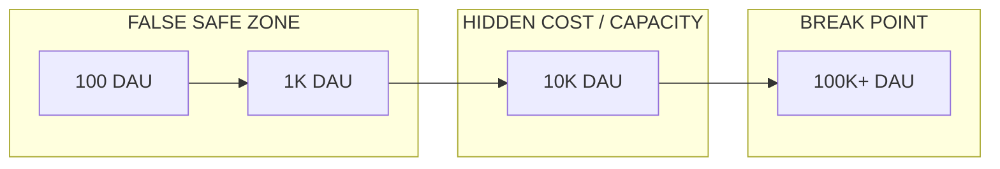

# B Phase — 10K / 100K Capacity Reality Curve v1.0

**Status:** PLANNING + executable model  
**Code:** `apps/gateway/src/ops/capacityRealityCurveV0.js`  
**Export:** `docs/exports/ops/capacity_10k_100k_reality_curve_LATEST.json`  
**Prerequisite:** [GCL v1.0](GLOBAL_COST_LEDGER_V1.0.md) (A phase complete)

---

## Purpose

A fixed **financial truth** (GCL) does not imply fixed **scale behavior**.  
B phase answers: *under load, where does the system break first?*

This is **capacity engineering**, not product economics.

---

## Run the model

```bash
cd apps/gateway
# optional: CASTLE_PHASED_ROLLOUT_TIER=200 GATEWAY_INSTANCES=2
node src/ops/runCapacityRealityCurveV0.mjs
```

---

## 1. Throughput ceiling

| Layer | Mechanism | Scope | Default |
|-------|-----------|-------|---------|
| HTTP rate limit | `CASTLE_RL_RHIZOH_LLM_PER_MIN` | **Per process** | 40 / min / principal |
| Phased rollout | `CASTLE_PHASED_ROLLOUT_TIER` | **Per process** | off → 50…5000 concurrent |
| Agent timeout | `CASTLE_AGENT_TURN_TIMEOUT_MS` | Per session | 120s |
| Provider tail | OpenAI latency | External | collapse ~45s+ |

**Cluster turns/sec (planning):**

\[
\text{turns/sec} \approx \frac{\text{instances} \times \text{concurrentCap}}{\text{avgTurnDurationSec}}
\]

Example: `tier200`, 2 instances, 8s avg turn → ~50 turns/sec **in-flight ceiling** (not sustained provider throughput).

**Per-user ceiling:** 40 turns/min ≈ **0.67 turns/sec** per uid/ip — often binds before cluster concurrency at low DAU.

### Provider latency collapse point

When p95 turn latency > ~14s and queueing starts, effective throughput drops **below** phased rollout math.  
Treat **provider tail** as first external collapse, not Redis.

---

## 2. Cost spike topology

| Pattern | Behavior with GCL (Redis required) |
|---------|-------------------------------------|
| **Viral burst** (5m ×8 steady) | Global `CASTLE_LLM_DAILY_SPEND_LIMIT_USD` → **cluster hard stop** |
| **Session clustering** (40 users, 1 room) | `agentContainment` session token ceiling + iteration cap **before** GCL |
| **Estimate blind window** | 10–30m until `ingestProviderTruthV0` — drift audit visible, enforce optional |

**10K DAU planning (defaults):** ~32k turns/hour peak ≈ **9 turns/sec** cluster demand.  
**100K DAU:** ~320 turns/sec peak demand — **not viable on single instance**; requires horizontal scale **and** cluster-wide concurrency counters.

---

## 3. Redis saturation (GCL)

| Key | Growth | 10K DAU order | 100K DAU order |
|-----|--------|---------------|----------------|
| `principal:{id}` hash | ~220 B × DAU | ~1 MB | ~10 MB |
| `audit:day:*` LIST | trim **4096** | ~2 MB/day | **history loss** without archive |
| `global` hash | fixed | negligible | negligible |

**Risk:** audit trim at 4096 events/day → accounting stream **truncates** under heavy traffic.  
**B recommendation:** daily audit archive (S3 / Firestore) before 50k turns/day.

Memory pressure on Redis is **low** vs network/command rate (RPUSH per turn).

---

## 4. Phased rollout stability

| DAU | Peak turns/sec (model) | tier200 × 2 inst. | Verdict |
|-----|------------------------|-------------------|---------|
| 100 | ~0.1 | ample | Trivial |
| 1,000 | ~0.9 | ample | OK |
| 10,000 | ~9 | headroom ~1–2× | **Borderline** — tune tier/instances |
| 100,000 | ~90+ | insufficient | **Requires cluster rollout counter + N instances** |

### Tier drift — B2 implemented

| Control | Cluster-wide? |
|---------|---------------|
| GCL token/USD | **Yes** (Redis required) |
| Phased rollout | **Yes** (`phasedRolloutClusterV0`) |
| HTTP RL | **No** (still per-process) |

See [PHASED_ROLLOUT_CLUSTER_V1.0.md](PHASED_ROLLOUT_CLUSTER_V1.0.md).

---

## 5. Reality curve (honest)



| Zone | What breaks first |
|------|-------------------|
| 100 / 1K | Nothing material |
| 10K | Per-instance rollout drift; provider tail; audit trim |
| 100K | Rollout + rate limit fragmentation; ledger correctness = system correctness |

---

## 6. Recommended production posture (10K target)

| Knob | Suggested |
|------|-----------|
| `GATEWAY_INSTANCES` | 2–4 |
| `CASTLE_PHASED_ROLLOUT_TIER` | `200` → `1000` after load test |
| `CASTLE_RL_RHIZOH_LLM_PER_MIN` | 30–40 (abuse guard) |
| `CASTLE_LLM_DAILY_SPEND_LIMIT_USD` | 15–50 (cohort) |
| Redis | Required (GCL) |
| Load test | Mandatory before open cohort |

---

## 7. Verdict

| Question | Answer |
|----------|--------|
| Wrong money after A? | **Mitigated** (GCL fail-closed) |
| Wrong scale behavior? | **Still possible** (B gaps) |
| 10K predictable? | **Yes, with tier + 2+ instances + load test** |
| 100K predictable? | **No** until cluster rollout + audit archive |

**B mühür cümlesi:** Scale problemi artık “para hesabı” değil, **ölçek altında dağıtık sınır katmanlarının** (rollout, RL) cluster truth ile hizalanmasıdır.

---

*Capacity 10K/100K v1.0 — planning model; validate with load test.*
