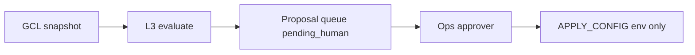

# Economic Strategy Engine (L3) v1.0

**Status:** IMPLEMENTED (v0) · **Schema:** `rhizoh.economic_strategy_engine.l3.v0`  
**Code:** `economicStrategyEngineL3V0.js` · **Queue:** `economicStrategyProposalQueueV0.js`

---

## Role

Rhizoh **does not auto-manage economic growth** — it makes the **possibility space visible**:

- Utilization bands (token / global USD)
- Provider vs estimate drift
- Proposal kinds for human review

**`feedsExecution: false`** always. Execution firewall (Phase 3 control / observation) unchanged.

---

## Flow

L3 **never** calls `rhizohGatewayTurn` or changes runtime gates directly.

---

## Proposal kinds

| Kind | Typical trigger |
|------|-----------------|
| `global_usd_cap_tighten` | Global USD util ≥ 0.85 |
| `principal_token_cap_review` | Principal token util ≥ 0.9 |
| `global_degrade_mode` | Global USD util 0.7–0.85 |
| `provider_reconcile_hold` | GCL drift detected |
| `monitoring_hold` | In band |

---

## Ops surface

`GET /rhizoh/ops/hardening/status` → `economicStrategyL3` (visibility + `proposalQueue`).

---

*L3 v1.0 — strategy visibility + human approval; not financial truth (GCL).*
