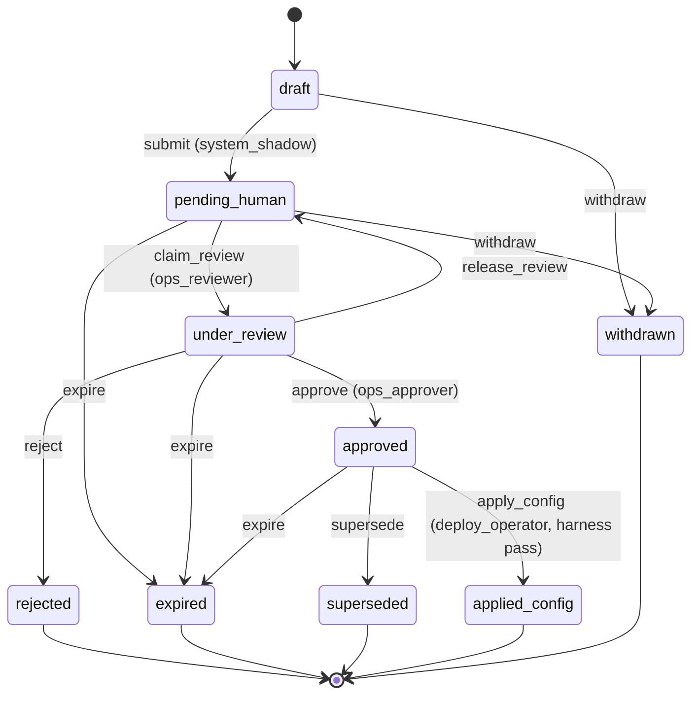

# Phase 3D — Human Approval Governance State Machine v1.0

**Status:** FROZEN · **Code:** `HUMAN_APPROVAL_GOVERNANCE_MACHINE_V0`, `transitionProposalGovernanceV0`

---

## States



| State | Terminal? | Meaning |
|-------|-------------|---------|
| `draft` | no | Shadow generated |
| `pending_human` | no | Awaiting reviewer |
| `under_review` | no | Claimed |
| `approved` | no | Human yes — not yet in config |
| `applied_config` | **yes** | Config bump + control harness pass |
| `rejected` | yes | Human no |
| `expired` | yes | TTL / stale |
| `superseded` | yes | Replaced by newer proposal |
| `withdrawn` | yes | Pulled back |

---

## Events & roles

| Event | Typical role |
|-------|----------------|
| `submit` | `system_shadow` |
| `claim_review` | `ops_reviewer` |
| `release_review` | `ops_reviewer` |
| `approve` | `ops_approver` |
| `reject` | `ops_approver` |
| `withdraw` | `system_shadow` / `ops_reviewer` |
| `expire` | `system_shadow` |
| `supersede` | `ops_approver` |
| `apply_config` | `deploy_operator` |

---

## Hard rules (illegal)

- `pending_human` → `applied_config` (skip approve)  
- Auto-approve on attractor / fragility / influence score  
- `apply_config` without `harnessPass === true` on control harness  
- Any transition that sets `feedsExecution: true`  

**Only** `applied_config` authorizes a **human-driven** `rhizoh.phase3.config.v0.x` publish — not automatic runtime mutation.

---

## Closure loop (Mode B)

1. Shadow export builds queue (`pending_human` proposals)  
2. Ops: `claim_review` → `approve` / `reject`  
3. Deploy: edit config version offline → `apply_config` with harness evidence  
4. Control path unchanged until config is published  

---

## Code

```javascript
import {
  transitionProposalGovernanceV0,
  GOVERNANCE_EVENT_V0,
  GOVERNANCE_ACTOR_ROLE_V0
} from "./phase3DProposalQueueV0.js";
```

---

*Governance v1.0 — official state machine for human-approved semi-actuator.*
