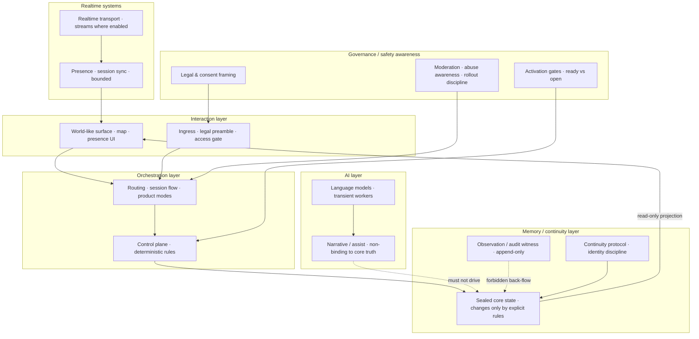

# High-Level Architecture (One Page)

**Purpose:** Show that the effort has a **thought-through architecture**, not only a narrative.  
**Detail level:** Blocks only — no API lists, no repository map.

---

## Layered view

---

## How to read this (30 seconds)

| Layer | Role in one line |
|-------|------------------|
| **Interaction** | What people see and enter through (including legal boundary screens). |
| **Orchestration** | How modes, routes, and control decisions are sequenced — **not** free-form scripting. |
| **AI** | Models assist and narrate; they **do not** silently become the authority for sealed state. |
| **Memory / continuity** | Three ideas kept apart: **core truth**, **observation logs**, and **display**. |
| **Realtime** | Live transport where the experiment requires it — always under orchestration and policy. |
| **Governance / safety** | Law, activation switches, moderation mindset, and operational responsibility. |

**Critical design choice (today):** arrows from **observation** back into **core** are **forbidden** by policy and contract. External signals, when eventually allowed, are designed to **verify presence**, not to rewrite the world’s sealed ledger.

---

## Current phase (one line)

**Surface and control path:** active and testable. **Live world signal ingestion:** off until explicit readiness and legal alignment.

*Architecture one-pager v1.0 — May 2026*
